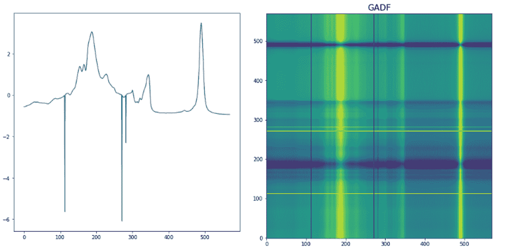
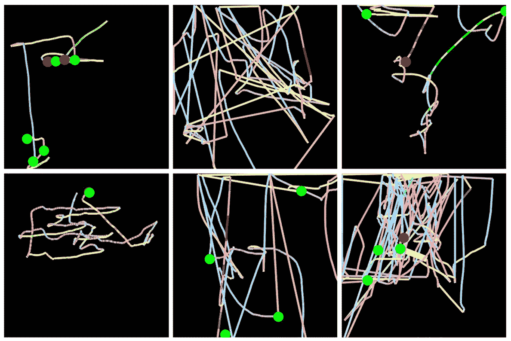
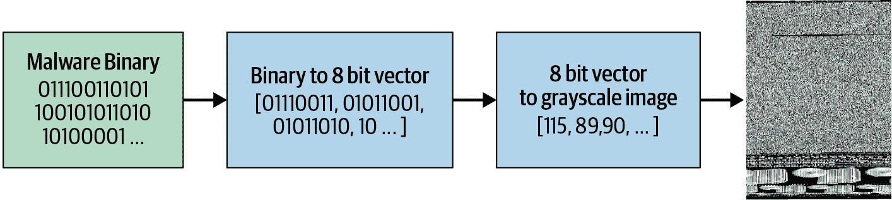
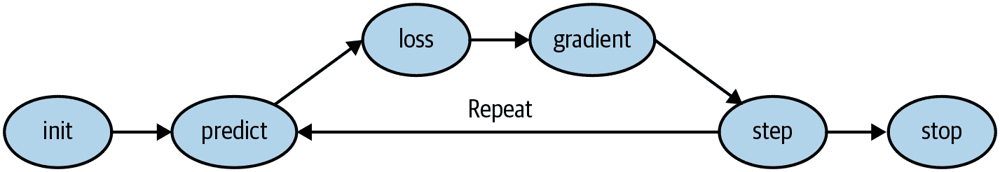

**<font size=8>fast.ai</font>**

## 0

| 标题 | 日期 | 笔记 |
| :--: | :--: | :--: |
|[官网](https://www.fast.ai/)|-|-|
|[论坛](https://forums.fast.ai/)|-|包含针对各版本课程的模块|
|[Practical Deep Learning for Coders 2022](https://course.fast.ai/)|2022|2022版，2 parts|
|Practical Deep Learning for Coders 2020|2020|2020版，已经被替代|
|[Practical Deep Learning for Coders 2019](https://course19.fast.ai/ )|2019|2019版，2 parts；[hiromis的notes (github.com)](https://github.com/hiromis/notes/tree/master)|
|Practical Deep Learning for Coders 2018|2018|2018版，已经被替代|
|[fast.ai](https://docs.fast.ai/)|-|fastai的documentation|
|[Deep Learning for Coders with fastai and PyTorch: AI Applications Without a PhD]([Deep Learning for Coders with fastai and PyTorch: AI Applications Without a PhD: Howard, Jeremy, Gugger, Sylvain: 9781492045526: Amazon.com: Books](https://www.amazon.com/Deep-Learning-Coders-fastai-PyTorch/dp/1492045527))|-|一本书，[免费]([Practical Deep Learning for Coders - The book](https://course.fast.ai/Resources/book.html))|
|[new fast.ai course: A Code-First Introduction to Natural Language Processing – fast.ai](https://www.fast.ai/posts/2019-07-08-fastai-nlp.html)|-|其他类型课程|

## [Practical Deep Learning 2022](https://course.fast.ai/) & [Fastbook](https://github.com/fastai/fastbook)
### 1: Getting started (PDL2022)

#### *Is it a bird? Creating a model from your own data*

*   流程

  1. 下载库，准备好
  2. 生成训练集和验证集
  3. 训练
  4. 验证
* 一些初学

  ```python
  from fastcore.all import * 
  '尽管fastai可以自动处理对fastcore的依赖，使fastai可以使用fastcore的部分功能，但是为了代码更简洁，依然显式地导入了fastcore'
  
  L #转换成fastcore中的唯一一个类L
  dest = (path/o) #path/o
  failed = verify_images(get_image_files(path)) #failed是L类
  ```
  ```python
  from fastai.vision.all import *
  
  Image.open('path').to_thumb(200,200) #Image.open().to_thumb()等比例放大
  download_images(dest, urls=search_images(f'{o} photo')) #download_images
  resize_images(path/o, max_size=200, dest=path/o) #resize_images
  get_image_files(path) #get_image_files
  verify_images(get_image_files(path)) #verify_images
  failed.map(Path.unlink) #failed.map
  dls = DataBlock( #DataBlock
    blocks = (ImageBlock, CategoryBlock), #ImageBlock, CategoryBlock
    get_items = get_image_files, #get_image_files
    splitter = RandomSplitter(valid_pct = 0.2, seed = 42), #RandomSplitter
    get_y = parent_label, #parent_label
    item_tfms = [Resize(200, method = 'squish')] #Resize
  ).dataloaders(path, bs = 32) #dataloaders
  dls.show_batch(max_n=6) #show_batch
  learn = vision_learner(dls, resnet18, metrics = error_rate) #vision_learner
  learn.fine_tune(5) #fine_tune
  cat_or_dog,_,pros_cat = learn.predict(PILImage.create('dog.jpg')) #predict; PILImage.create也可属于fastai，只是它有自己的底层依赖库
  ```

  ```python
  from duckduckgo_search import DDGS '导入库'
  from fastdownload import download_url '用于下载库'
  import time '鉴于效率非常重要，因此要记录time'
  ```

### 1: intro (fastbook)

#### 1.1 初学

```python
#图像识别
path = untar_data(URLs.PETS)/'images' 
#untar_data()从fastai内置的数据库中下载解压数据并进入'images'的文件夹中
#untar_data(URLs.PETS)返回了一个Path对象，是fastai内置库PETS的路径

def is_cat(x): return x[0].isupper() #这个数据集中，Cat是大写，dog是小写，以此来区分猫和狗
dls = ImageDataLoaders.from_name_func( 
    path, 
    get_image_files(path),  #获得所有图像文件
    valid_pct=0.2, seed=42,
    label_func=is_cat,  #返回True或False
    item_tfms=Resize(224) #缩放到224*224像素
)
#ImageDataLoaders.from_name_func是fastai的高级封装，创建数据加载器更加简洁，专门用于从文件名提取标签的任务
#如果使用DataBlock👇
dls = DataBlock(
    blocks=(ImageBlock, CategoryBlock),
    get_items=get_image_files,
    splitter=RandomSplitter(valid_pct=0.2, seed=42),
    get_y=is_cat,
    item_tfms=Resize(224)
).dataloaders(path)
#`item_tfms`应用于每个项目（在本例中，每个项目都被调整为 224 像素的正方形），而`batch_tfms`应用于一次处理一批项目的 GPU

learn = vision_learner(dls, resnet34, metrics=error_rate) #error_rate & accuracy
learn.fine_tune(1)
```

```python
from types import SimpleNamespace
uploader = SimpleNamespace(data = ['images/chapter1_cat_example.jpg'])
#相当于uploader = {'data':['images/chapter1_cat_example.jpg']}
```

```python
#Image Classification
#segmentation
path = untar_data(URLs.CAMVID_TINY) #内置库
dls = SegmentationDataLoaders.from_label_func(
    path, bs=8, fnames = get_image_files(path/"images"),
    label_func = lambda o: path/'labels'/f'{o.stem}_P{o.suffix}',
    codes = np.loadtxt(path/'codes.txt', dtype=str) #这个是储存了分割任务中的类别的文件，比如道路、建筑、汽车等，o就是fnames中的一个元素，o.stem是文件名，o.suffix是扩展名
)
#label_func = lambda o: path/'labels'/f'{o.stem}_P{o.suffix}' #若o是images/cat.jpg，则返回labels/cat_P.jpg

learn = unet_learner(dls, resnet34)
learn.fine_tune(8)

learn.show_results(max_n=6, figsize=(7,8))
```

```python
#NLP
from fastai.text.all import *

dls = TextDataLoaders.from_folder(untar_data(URLs.IMDB), valid='test')
learn = text_classifier_learner(dls, AWD_LSTM, drop_mult=0.5, metrics=accuracy)
learn.fine_tune(4, 1e-2)

learn.predict("I really liked that movie!")
#结果：('pos', tensor(1), tensor([0.0041, 0.9959]))
```

```python
#Tabular
from fastai.tabular.all import *
path = untar_data(URLs.ADULT_SAMPLE)

dls = TabularDataLoaders.from_csv(path/'adult.csv', #这是指定数据文件
                                  path=path, #这是指定数据文件所在的路径
                                  y_names="salary",
    cat_names = ['workclass', 'education', 'marital-status', 'occupation',
                 'relationship', 'race'],
    cont_names = ['age', 'fnlwgt', 'education-num'],
    procs = [Categorify, FillMissing, Normalize]) #这是一个列表，包含对数据进行预处理的步骤。fastai 会自动应用这些预处理步骤。在这个例子中，预处理步骤包括：Categorify: 将分类变量转换为类别类型（通常是整数编码）；FillMissing: 填充缺失值（如果有的话）；Normalize: 对连续变量进行标准化处理（通常是减去均值并除以标准差）。

learn = tabular_learner(dls, metrics=accuracy) #salary是分类是否为高收入者，所以metrics仍用accuracy或error_rate如果是连续变量，则不能使用这个metrics
learn.fit_one_cycle(3) #没有预训练模型，所以不用fine_tune
```

```python
#Collaborative Filtering，协调过滤的结构一般比较简单
#根据用户以前的观影习惯，预测用户可能喜欢的电影
from fastai.collab import *
path = untar_data(URLs.ML_SAMPLE)
dls = CollabDataLoaders.from_csv(path/'ratings.csv') #这是用了默认设置，csv中最后一列是因变量；协同过滤的特征通常也都是离散的分类参数，如果有连续参数，就不能用CollabDataLoaders类简单预测
learn = collab_learner(dls, y_range=(0.5,5.5))
learn.fine_tune(10) #这里使用了fine_tune而不是fit_one_cycle
learn.show_results()
```

#### 1.2 **怎样快速获取fastai中方法的解释-doc**

```python
doc(learn.predict)
'''返回learn.predict方法的解释'''
```

#### 1.3 过拟合

即使您的模型尚未完全记住所有数据，在训练的早期阶段可能已经记住了其中的某些部分。因此，您训练的时间越长，您在训练集上的准确性就会越好；验证集的准确性也会在一段时间内提高，但最终会开始变差，因为模型开始记住训练集而不是在数据中找到可泛化的潜在模式。当这种情况发生时，我们说模型*过拟合*。

我们有很多避免过拟合的办法，但只有真的出现过拟合了才会用这些办法。我们经常看到一些人训练模型，他们有充足的数据，但是过早地使用了避免过拟合的办法，结果导致模型的准确性不好，还不如过拟合了的模型准确性高。

#### 1.4 架构

* CNN：创建计算机视觉模型的当前最先进方法

  ResNet，一种标准架构，有18、34、50、101和152

#### 1.5 预训练/迁移学习

使用预训练模型是我们训练更准确、更快速、使用更少数据和更少时间和金钱的最重要方法。您可能会认为使用预训练模型将是学术深度学习中最研究的领域...但您会非常、非常错误！预训练模型的重要性通常在大多数课程、书籍或软件库功能中**没有**得到认可或讨论，并且在学术论文中很少被考虑。当我们在 2020 年初写这篇文章时，事情刚刚开始改变，但这可能需要一段时间。因此要小心：您与之交谈的大多数人可能会严重低估您可以在深度学习中使用少量资源做些什么，因为他们可能不会深入了解如何使用预训练模型。

使用一个预训练模型来执行一个与其最初训练目的不同的任务被称为***迁移学习***。不幸的是，**由于迁移学习研究不足，很少有领域提供预训练模型**。例如，目前在医学领域很少有预训练模型可用，这使得在该领域使用迁移学习具有挑战性。此外，目前还不清楚如何将迁移学习应用于诸如时间序列分析之类的任务。

#### 1.6 head

When using a pretrained model, `vision_learner` will remove the last layer, since that is always specifically customized to the original training task (i.e. ImageNet dataset classification), and replace it with one or more new layers with randomized weights, of an appropriate size for the dataset you are working with. This last part of the model is known as the *head*.

#### 1.7 训练集、验证集、测试集

在用训练集训练后，我们用验证集查看训练效果，根据验证集的效果，调整超参数hyperparameter，因此，验证集仍然半暴露在训练模型中。为了能更好地评估模型的效果，用验证集显然是不理想的，所以我们还会隔绝出一个完全没有用过的测试集。

当然如果数据量不够，测试集并不一定是必须的，但是当然有是最好的。

在我们实际的训练中，验证集和测试集的选择很有讲究。比如我们预测时间序列，最好的划分是把最近的一段时间作为验证集/测试集，这样我们可以评估模型对未来的预测效果；比如我们识别驾驶员的行为，最好的划分是把一个驾驶员完全隔绝成验证集/测试集，这样我们可以评估模型对不同的人是不是都有很好的识别效果。

#### 1.8 其他

* 时间序列转换成图像

  时间序列数据有各种转换方法。例如，fast.ai 学生 Ignacio Oguiza 使用一种称为**Gramian Angular Difference Field（GADF）**的技术，从一个时间序列数据集中为橄榄油分类创建图像，你可以在图 1-15 中看到结果。然后，他将这些图像输入到一个图像分类模型中，就像你在本章中看到的那样。尽管只有 30 个训练集图像，但他的结果准确率超过 90%，接近最先进水平。

  

  另一个有趣的 fast.ai 学生项目示例来自 Gleb Esman。他在 Splunk 上进行欺诈检测，使用了用户鼠标移动和鼠标点击的数据集。他通过绘制显示鼠标指针位置、速度和加速度的图像，使用彩色线条，并使用[小彩色圆圈](https://oreil.ly/6-I_X)显示点击，将这些转换为图片，如图 1-16 所示。他将这些输入到一个图像识别模型中，就像我们在本章中使用的那样，效果非常好，导致了这种方法在欺诈分析方面的专利！

  

  另一个例子来自 Mahmoud Kalash 等人的论文“使用深度卷积神经网络进行恶意软件分类”，解释了“恶意软件二进制文件被分成 8 位序列，然后转换为等效的十进制值。这个十进制向量被重塑，生成了一个代表恶意软件样本的灰度图像”，如图 1-17 所示。

  

#### 1.9 术语

  | Term             | Meaning                                                      |
  | ---------------- | ------------------------------------------------------------ |
  | Label            | The data that we're trying to predict, such as "dog" or "cat" |
  | Architecture     | The _template_ of the model that we're trying to fit; the actual mathematical function that we're passing the input data and parameters to |
  | Model            | The combination of the architecture with a particular set of parameters |
  | Parameters       | The values in the model that change what task it can do, and are updated through model training |
  | Fit/拟合         | Update the parameters of the model such that the predictions of the model using the input data match the target labels |
  | Train            | A synonym for _fit_                                          |
  | Pretrained model | A model that has already been trained, generally using a large dataset, and will be fine-tuned |
  | Fine-tune        | Update a pretrained model for a different task               |
  | Epoch            | One complete pass through the input data                     |
  | Loss             | A measure of how good the model is, chosen to drive training via SGD |
  | Metric           | A measurement of how good the model is, using the validation set, chosen for human consumption |
  | Validation set   | A set of data held out from training, used only for measuring how good the model is |
  | Training set     | The data used for fitting the model; does not include any data from the validation set |
  | Overfitting      | Training a model in such a way that it _remembers_ specific features of the input data, rather than generalizing well to data not seen during training |
  | CNN              | Convolutional neural network; a type of neural network that works particularly well for computer vision tasks |

### 2：Deployment (PDL2022)-暂时跳过

### 2: Production (fastbook)-暂时跳过

### 3: Neural net foundations (PDL2022)

#### *How does a neural net really work?*

paperspace

### 3: mnist_basics (fastbook4)

#### 3.1 像素：计算机视觉的基础

```python
from fastcore.all import *
from fastai.vision.all import *

path = untar_data(URLs.MNIST_SAMPLE)
path.ls()  #L类
(path/'train').ls()

threes = (path/'train'/'3').ls().sorted()
sevens = (path/'train'/'7').ls().sorted()
threes

im3 = Image.open(threes[1]) #PIL打开image
im3

im3_t = tensor(im3)[4:12,4:10]
print(im3_t)
len(im3_t)
df = pd.DataFrame(im3_t)
df.style.set_properties(**{'font-size':'6pt'}).background_gradient('Greys')

seven_tensors = [tensor(Image.open(o)) for o in sevens]
three_tensors = [tensor(Image.open(o)) for o in threes]
len(three_tensors), len(seven_tensors) #‘6265’文件夹7转换为seven_tensors，这大概可以算作是一个张量的list（L类）
show_image(three_tensors[1]) #不用PIL打开image，用fasiai中的show_image打开tensor代表的image，也是个图片

stacked_sevens = torch.stack(seven_tensors).float()/255 #把这个tensor的L用torch.stack方法堆叠成一个3-rank张量
stacked_threes = torch.stack(three_tensors).float()/255
stacked_threes.shape #torch.Size([6131, 28, 28])
len(stacked_sevens.shape) #张量的秩，也就是张量的维度

mean3 = stacked_threes.mean(0) #沿着维度0求平均值
show_image(mean3)
mean7 = stacked_sevens.mean(0)

a_3 = stacked_threes[1] #float
F.l1_loss(a_3, mean7) #l1是标准数学术语平均绝对值的缩写（在数学中称为L1 范数）
F.mse_loss(a_3, mean7).sqrt() #mse均方误差，sqrt()开根，RMSE是L2范数
#MSE相比L1范数来说会更狠地惩罚大的误差，而对小误差更加宽容
```

#### 3.2 NumPy 数组和 PyTorch 张量

* [NumPy](https://numpy.org) 是 Python 中用于科学和数值编程最广泛使用的库。它提供了类似的功能和类似的 API，与 PyTorch 提供的功能相似；然而，它不支持使用 GPU 或计算梯度，这两者对于深度学习都是至关重要的。

| #    | Numpy                                          | Pytorch                               |
| ---- | ---------------------------------------------- | ------------------------------------- |
| 1    | 不规则数组：可以是数组的数组，内部数组大小不同 | 不可以是不规则的                      |
| 2    | 不能存在GPU上                                  | 可以存储在GPU上，后续训练更快         |
| 3    | 不能计算导数                                   | 可以自动计算导数，可以进行SGD梯度计算 |

```py
data = [[1,2,3],[4,5,6]]
arr = array (data)
tns = tensor(data)
tns[1]  #tensor([4, 5, 6])
tns[:, 1] #tensor([2, 5])
tns +1 # tensor([[2, 3, 4],[5, 6, 7]])
```

#### 3.3 使用Broadcasting计算Metrics

* 可以使用MSE或L1范数作为metrcs，但是有时候不太好理解，所以一般情况下使用**accuracy**作为metrics

```python
valid_3_tens = torch.stack([tensor(Image.open(o)) for o in (path/'valid'/'3').ls()]).float()/255
valid_7_tens = torch.stack([tensor(Image.open(o)) for o in (path/'valid'/'7').ls()]).float()/255
valid_3_tens.shape, valid_7_tens.shape #valid中的图片转换成一个rank-3的归一化tensor

def mnist_distance(a,b):    return (a-b).abs().mean((-1,-2)) #定义一个方法计算L1范数，-1/-2是告诉tensor要对最后两个轴进行平均
mnist_distance(a_3, mean3)
valid_3_dist = mnist_distance(valid_3_tens, mean3) #这里自动使用了broadcasting将valid_3_tens宽展了一个秩-1
valid_3_dist.shape, valid_3_dist #(torch.Size([1010])

def is_3(x): return mnist_distance(x, mean3) < mnist_distance(x, mean7) #不是3就是7

accuracy_3s = is_3(valid_3_tens).float().mean()
```

#### 3.4 SGD随机梯度下降



注意特殊方法`requires_grad_`？这是我们告诉 PyTorch 我们想要计算梯度的神奇咒语。这实质上是给变量打上标记，这样 PyTorch 就会记住如何计算您要求的其他直接计算的梯度。

```python
xt = tensor(3.).requires_grad_() #让pytorch知道我们后面会要求计算这个tensor的梯度
yt = f(xt)
yt.backward() #backward,其实就是calculates_grad
xt.grad #计算梯度，tensor(6.)
```

#### 3.5 学习率

```python
w -= w.grad * lr #lr学习率
```

#### 3.6 实例

```python
time = torch.arange(0,20).float()
speed = torch.randn(20)*3 + 0.75*(time-9.5)**2+1 #在y中添加了噪声
plt.scatter(time,speed)

#定义了一个函数，用它来拟合(time,speed)
def f(t,params): 
    a,b,c = params
    return a*(t**2)+b*t+c

#计算loss
def mse(preds, targets): return ((preds-targets)**2).mean()

#初始化随机parameters
params = torch.randn(3).requires_grad_()

#定义学习率
lr = 1e-5

#定义一个函数来拟合
def apply_step(params, prn=True):
    preds = f(time,params)
    loss = mse(preds, speed)
    loss.backward()
    params.data -= lr*params.grad.data #这个必须得加.data方法，否则会报错
    params.grad = None
    if prn: print(loss.item()) #loss.item()不再是tensor
    return params

#循环
while loss<3:
    apply_step(params)
```

#### 3.7 MNIST codes

* sigmoid：我们预测这个predctions总是在0~1，但实际上它可能在这个范围之外，就需要采用一种方法把它放进来

```python
import matplotlib.pyplot as plt
def plot_function(f, title=None, min=-1, max=1):
    x = torch.arange(min, max, 0.1)
    y = tensor([f(xi) for xi in x])
    plt.plot(x, y)
    if title:
        plt.title(title)
    plt.show()
plot_function(torch.sigmoid, title='sigmoid',min=-4, max=4)
```

* 小批次：为整个数据集计算将需要很长时间。为单个数据项计算将不会使用太多信息，因此会导致不精确和不稳定的梯度。您将费力更新权重，但只考虑这将如何改善模型在该单个数据项上的性能。因此，我们做出妥协：我们一次计算几个数据项的平均损失。这被称为*小批次* **mini-batch**。选择一个好的批次大小是您作为深度学习从业者需要做出的决定之一，以便快速准确地训练您的模型。
* 比如有2000组数据分为4*500的mini-batch，在一个epoch中就会4次更新parameters

```python
coll = range(15)
dl = DataLoader(coll, batch_size=5, shuffle=True)
list(dl)
'''[tensor([11,  4,  3,  0,  2]),
 tensor([ 8,  7, 13, 14,  5]),
 tensor([12,  9,  6, 10,  1])]'''
ds = L(enumerate(string.ascii_lowercase))
dl = DataLoader(ds, batch_size=6, shuffle=True)
list(dl)
'''[(tensor([20,  7, 12, 24, 22,  9]), ('u', 'h', 'm', 'y', 'w', 'j')),
 (tensor([ 1, 25, 17, 19,  3,  6]), ('b', 'z', 'r', 't', 'd', 'g')),
 (tensor([13,  0,  5, 10, 18,  2]), ('n', 'a', 'f', 'k', 's', 'c')),
 (tensor([ 8,  4, 21, 15, 23, 16]), ('i', 'e', 'v', 'p', 'x', 'q')),
 (tensor([14, 11]), ('o', 'l'))]'''
```

##### nn.Linear：做的事情如下

```python
#初始化参数
def init_params(size, std=1.0): return (torch.randn(size)*std).requires_grad_()
weights = init_params((28*28,1)) # torch.Size([784,1])
bias = init_params(1) # torch.Size(1)
#计算preds的函数
def linear1(xb): return xb@weights+bias

#可以简化为
linear_model = nn.Linear(28*28,1)
w,b=linear_model.parameters()
'''上面的linear1就变成了linear_model'''
```

##### SGD：下面一共三版，慢慢简化后用到SGD()类

```python
'第一版：全部自己定义函数'
#定义计算梯度的函数
def calc_grad(xb,yb,model):
    preds = model(xb)
    loss = mnist_loss(preds, yb)
    loss.backward()
#计算准确率的函数
def batch_accuracy(xb,yb):
    preds = xb.sigmoid()
    correct = (preds>0.5)==yb
    return correct.float().mean()
#计算验证集的准确率
def valid_epoch(model):
    accs = [batch_accuracy(model(xb),yb) for i in valid_dl]
    return round(torch.stack(accs).mean().item(),4)
#更新梯度的函数-------------------------主要是这一步变成了第二版的类+更新梯度的函数
def train_epoch(model, lr, params):
    for xb,yb in dl:
        calc_grad(xb,yb,model)
        for p in params:
            p.data -= p.grad*lr
            p.grad.zero_()
#跑起来
lr = 1.
params = weights,bias
for i in range(20):
    train_epoch(linear1,lr,params)
    print(valid_epoch(linear1))
------------------------------------------------------------------------------------------------------------
'第二版：创建了一个类，把一些函数整合进类里面'
#定义计算梯度的函数
def calc_grad(xb,yb,model):
    preds = model(xb)
    loss = mnist_loss(preds, yb)
    loss.backward()
#计算准确率的函数
def batch_accuracy(xb,yb):
    preds = xb.sigmoid()
    correct = (preds>0.5)==yb
    return correct.float().mean()
#计算验证集的准确率
def valid_epoch(model):
    accs = [batch_accuracy(model(xb),yb) for i in valid_dl]
    return round(torch.stack(accs).mean().item(),4)
#创建一个优化器的类，把更新梯度和归零梯度作为方法放进了类中--------------------------这一步变成了第三版的SGD()
class BasicOptim:
    def __init__(self,params,lr):
        self.params = list(params)
        self.lr = lr
    def step(self, *args, **kwargs):
        for p in self.params:
            p.data -= p.grad.data*self.lr
    def zero_grad(self, *args, **kwargs):
        for p in self.params:
            p.grad = None
lr=1.
opt = BasicOptim(linear_model.parameters(),lr)
#更新梯度的函数-----------------------------
def train_epoch(model):
    for xb,yb in dl:
        cal_grad(xb,yb,model)
        opt.step()
        opt.zero_grad()
#跑起来
def train_model(model,epochs):
    for i in range(epochs):
        train_epoch(model)
        print(valid_epoch(model))
train_model(linear_model,20)
------------------------------------------------------------------------------------------------------------
'第三版：用了现成的SGD类'
#定义计算梯度的函数
def calc_grad(xb,yb,model):
    preds = model(xb)
    loss = mnist_loss(preds, yb)
    loss.backward()
#计算准确率的函数
def batch_accuracy(xb,yb):
    preds = xb.sigmoid()
    correct = (preds>0.5)==yb
    return correct.float().mean()
#计算验证集的准确率
def valid_epoch(model):
    accs = [batch_accuracy(model(xb),yb) for i in valid_dl]
    return round(torch.stack(accs).mean().item(),4)
#实例化一个类-------------------------------------------------------
lr=1.
opt=SGD(linear_model.parameters(),lr)
#更新梯度的函数-----------------------------------------------------
def train_epoch(model):
    for xb,yb in dl:
        cal_grad(xb,yb,model)
        opt.step()
        opt.zero_grad()
#跑起来
def train_model(model,epochs):
    for i in range(epochs):
        train_epoch(model)
        print(valid_epoch(model))
train_model(linear_model,20)
```

##### Learn.fit：

```python
'第一版'
#初始化参数&实例化计算preds的函数
linear_model = nn.Linear(28*28,1)
'见上nn.Linear'
#定义计算loss的函数
def mnist_loss(predictions, targets):
    predictions = predictions.sigmoid()
    return torch.where(targets==1, 1-predictions, predictions).mean()
#优化步骤optimization step
#定义计算梯度的函数
def calc_grad(xb,yb,model):
    preds = model(xb)
    loss = mnist_loss(preds, yb)
    loss.backward()
#实例化类+更新梯度的函数-----------------------------------------------------
lr=1.
opt=SGD(linear_model.parameters(),lr)
#更新梯度的函数
def train_epoch(model):
    for xb,yb in dl:
        cal_grad(xb,yb,model)
        opt.step()
        opt.zero_grad()
'见上SGD'
#计算准确率的函数
def batch_accuracy(xb,yb):
    preds = xb.sigmoid()
    correct = (preds>0.5)==yb
    return correct.float().mean()
#计算验证集的准确率
def valid_epoch(model):
    accs = [batch_accuracy(model(xb),yb) for i in valid_dl]
    return round(torch.stack(accs).mean().item(),4)
#跑起来----------------------------------------------------------------------
def train_model(model,epochs):
    for i in range(epochs):
        train_epoch(model)
        print(valid_epoch(model))
train_model(linear_model,10)

------------------------------------------------------------------------------------------------------------
'简化版：不用train_model了'
#初始化参数&实例化计算preds的函数
linear_model = nn.Linear(28*28,1)
'见上nn.Linear'
#定义计算loss的函数
def mnist_loss(predictions, targets):
    predictions = predictions.sigmoid()
    return torch.where(targets==1, 1-predictions, predictions).mean()
#计算准确率的函数
def batch_accuracy(xb,yb):
    preds = xb.sigmoid()
    correct = (preds>0.5)==yb
    return correct.float().mean()
#跑起来
learn = Learner(dls,nn.Linear(28*28,1),opt_func=SGD,loss_func=mnist_loss,metrics=batch_accuracy)
lr=1.
learn.fit(10,lr=lr)
```

##### 实例


```python
train_x = torch.cat([stacked_threes, stacked_sevens]).view(-1,28*28) #把stacked_threes和stacked_sevens组合成1个tensor，并且每张图片的数据28*28首尾相连成一个rank-1的tensor
#train_x.shape # torch.Size([12396,784])

train_y = tensor([1]*len(threes)+[0]*len(sevens)).unsqueeze(1) #unsqueeze(1)是将它扩展为rank-2，否则size是([12396])
#train_y.shape # torch.Size([12396,1])

dset = list(zip(train_x, train_y)) #list(zip())可以把两个tensor组合成1个元组
#x,y = dset[0] #就可以这样索引了

valid_x = torch.cat([valid_3_tens, valid_7_tens]).view(-1,28*28)
valid_y = tensor([1]*len(valid_3_tens)+[0]*len(valid_7_tens)).unsqueeze(1)
valid_dset = list(zip(valid_x,valid_y))

#准备好dataloader
dl = DataLoader(dset, batch_size=256)
valid_dl = DataLoader(valid_dset, batch_size=256)
dls = DataLoaders(dl,valid_dl)

#计算准确率
#corrects = (preds>0.0).float() == train_y
#corrects.float().mean().item()
#如果用准确率做loss就会导致loss的变化不明显（只有从0跳到1的时候才变化），这样会导致backward计算的grad很多时候为0，无法拟合.它不能有大的平坦部分和大的跳跃，而必须是相当平滑的.

#定义计算loss的函数
def mnist_loss(predictions, targets):
    predictions = predictions.sigmoid()
    return torch.where(targets==1, 1-predictions, predictions).mean()
#计算准确率的函数
def batch_accuracy(xb,yb):
    preds = xb.sigmoid()
    correct = (preds>0.5)==yb
    return correct.float().mean()
#跑起来
learn = Learner(dls,nn.Linear(28*28,1),opt_func=SGD,loss_func=mnist_loss,metrics=batch_accuracy)
lr=1.
learn.fit(10,lr=lr) 
```

##### **汇总codes**

```python
from fastcore.all import *
from fastai.vision.all import *
path = untar_data(URLs.MNIST_SAMPLE)
threes = (path/'train'/'3').ls().sorted()
sevens = (path/'train'/'7').ls().sorted()
seven_tensors = [tensor(Image.open(o)) for o in sevens]
three_tensors = [tensor(Image.open(o)) for o in threes]
stacked_sevens = torch.stack(seven_tensors).float()/255 #把这个tensor的L用torch.stack方法堆叠成一个3-rank张量
stacked_threes = torch.stack(three_tensors).float()/255
train_x = torch.cat([stacked_threes, stacked_sevens]).view(-1,28*28) 
train_y = tensor([1]*len(threes)+[0]*len(sevens)).unsqueeze(1)
dset = list(zip(train_x, train_y))
valid_3_tens = torch.stack([tensor(Image.open(o)) for o in (path/'valid'/'3').ls()]).float()/255
valid_7_tens = torch.stack([tensor(Image.open(o)) for o in (path/'valid'/'7').ls()]).float()/255
valid_x = torch.cat([valid_3_tens, valid_7_tens]).view(-1,28*28)
valid_y = tensor([1]*len(valid_3_tens)+[0]*len(valid_7_tens)).unsqueeze(1)
valid_dset = list(zip(valid_x,valid_y))
dl = DataLoader(dset, batch_size=256)
valid_dl = DataLoader(valid_dset, batch_size=256)
dls = DataLoaders(dl,valid_dl)
def mnist_loss(predictions, targets):
    predictions = predictions.sigmoid()
    return torch.where(targets==1, 1-predictions, predictions).mean()
def batch_accuracy(xb,yb):
    preds = xb.sigmoid()
    correct = (preds>0.5)==yb
    return correct.float().mean()
learn = Learner(dls,nn.Linear(28*28,1),opt_func=SGD,loss_func=mnist_loss,metrics=batch_accuracy)
lr=1.
learn.fit(10,lr=lr) 
```

#### 3.8 添加非线性

*rectified linear unit*

##### Activation Function

* F.relu


* F.sigmoid

##### 实例

```python
#前面如上一个实例
#构建一个多层神经网络
simple_net = nn.Sequential(
    nn.Linear(28*28,30),
    nn.ReLU(),
    nn.Linear(30,1)
)
#定义计算loss的函数
def mnist_loss(predictions, targets):
    predictions = predictions.sigmoid()
    return torch.where(targets==1, 1-predictions, predictions).mean()
#计算准确率的函数
def batch_accuracy(xb,yb):
    preds = xb.sigmoid()
    correct = (preds>0.5)==yb
    return correct.float().mean()
#实例化
learn = Learner(dls, simple_net, opt_func=SGD, loss_func=mnist_loss, metrics=batch_accuracy)
#训练
learn.fit(30,0.1)
```


训练过程记录在`learn.recorder`中，输出表存储在`values`属性中，因此我们可以绘制训练过程中的准确性

```python
plt.plot(L(learn.recorder.values).itemgot(2))
'''train_loss:L(learn.recorder.values).itemgot(0)
valid_loss:L(learn.recorder.values).itemgot(1)
batch_accuracy:L(learn.recorder.values).itemgot(2)'''
```

#### 3.9 术语

| Term | Meaning|
|:---|---|
|ReLU | Function that returns 0 for negative numbers and doesn't change positive numbers.|
|Mini-batch | A small group of inputs and labels gathered together in two arrays. A gradient descent step is updated on this batch (rather than a whole epoch).|
|Forward pass | Applying the model to some input and computing the predictions.|
|Loss | A value that represents how well (or badly) our model is doing.|
|Gradient | The derivative of the loss with respect to some parameter of the model.|
|Backward pass | Computing the gradients of the loss with respect to all model parameters.|
|Gradient descent | Taking a step in the directions opposite to the gradients to make the model parameters a little bit better.|
|Learning rate | The size of the step we take when applying SGD to update the parameters of the model.|
|Activations | Numbers that are calculated (both by linear and nonlinear layers) |
|Parameters | Numbers that are randomly initialized, and optimized (that is, the numbers that define the model) |
|Special Tensors | Rank zero: scalar / Rank one: vector / Rank two: matrix |

### 4: Natural Language (NLP) (PDL2022)

#### 4.1 发展

（1）**ULMFit** (用的RNN): Wikitext(103)Language Model (30%准确率) → IMDb Language Model → IMDb Classifier

（2）**Transformers** (掩码语言建模): 用于机器阅读理解、句子分类、命名实体识别、机器翻译和文本摘要等

（3）...

可以看到似乎Transformer要比ULMFit高级，实际上两者的用途不同；另外，ULMFit能够阅读更长的句子，如果一个document包含超过2000个单词，那么就更推荐使用ULMFit进行分类。

#### 4.2 最重要的package

1/ pandas

2/ numpy

3/ matplotlib

4/ pytorch

##### 参考书：[Python for Data Analysis, 3E About the Open Edition]([Python for Data Analysis, 3E](https://wesmckinney.com/book/))

#### 4.3 Tokenization

A deep learning model expects numbers as inputs, not English sentences! So we need to do two things:

- *Tokenization*: Split each text up into words (or actually, as we'll see, into *tokens*)
- *Numericalization*: Convert each word (or token) into a number.

The details about how this is done actually depend on the particular model we use. So first we'll need to pick a model. There are thousands of models available, but a reasonable starting point for nearly any NLP problem is to use this：

`microsoft/deberta-v3-small`

```python
tokz.tokenize("A platypus is an ornithorhynchus anatinus.")
'''
['▁A',
 '▁platypus',
 '▁is',
 '▁an',
 '▁or',
 'ni',
 'tho',
 'rhynch',
 'us',
 '▁an',
 'at',
 'inus',
 '.']
'''
```

#### 4.4 训练集与验证集的划分

Training set & Validation set

In practice, a random split like we've used here might not be a good idea -- here's what Dr Rachel Thomas has to say about it:

> "*One of the most likely culprits for this disconnect between results in development vs results in production is a poorly chosen validation set (or even worse, no validation set at all). Depending on the nature of your data, choosing a validation set can be the most important step. Although sklearn offers a `train_test_split` method, this method takes a random subset of the data, which is a poor choice for many real-world problems.*"

I strongly recommend reading her article [How (and why) to create a good validation set](https://www.fast.ai/2017/11/13/validation-sets/) to more fully understand this critical topic.

* 随机划分数据集不适用的情况：时间序列、新人脸、新的船等等；
* cross-validation比较危险，除非用到的case是那种可以随机洗牌的情况（随机分ABC三组数据集，AB合并做训练集-C做验证集，三组循环，最后求平均值作为模型的performance）；
* 所以用一个test set测试集去最终确认一下模型的好坏也蛮重要的。

#### 4.5 Metrics

In real life, outside of Kaggle, things not easy... As my partner Dr Rachel Thomas notes in [The problem with metrics is a big problem for AI](https://www.fast.ai/2019/09/24/metrics/):

> At their heart, what most current AI approaches do is to optimize metrics. The practice of optimizing metrics is not new nor unique to AI, yet AI can be particularly efficient (even too efficient!) at doing so. This is important to understand, because any risks of optimizing metrics are heightened by AI. While metrics can be useful in their proper place, there are harms when they are unthinkingly applied. Some of the scariest instances of algorithms run amok all result from over-emphasizing metrics. We have to understand this dynamic in order to understand the urgent risks we are facing due to misuse of AI.

* Metrics很多时候并不是*我们真正关心的事情*，它只是*我们关心的事情*的一个代理，如我们关心老师的教学效果，metrics是学生的分数；
* Metrics会被故意地、作弊地拉高，使它失去了衡量*我们关心的事情*的能力，如老师人为拉高学生的分数，它不再能反映老师的教学效果；
* Metrics会更短视，比如银行一旦将cross-selling这个metrics作为目标，就会催生出各种虚假开户，而实际上银行的目标是维护良好的客户关系，后者才是长远的战略，比如*我们关心的事情*是提高视频影响力，用了点击率作为Metrics，就没有考虑到一些视频长期来看对读者的帮助和塑造；
* 很多Metrics是在一个高度成瘾的环境收集数据的，比如数据收集到小朋友喜欢吃甜食，算法会让食物越来越甜，永远不可能output出有营养的食物；
* 尽管如此Metrics依然很有用，需要考虑多个metrics来避免上述问题，但最终我们要努力将它们整合；
* Metrics通过定量方式衡量结果，但我们依然需要定性的信息才能获得好的metrics；
* 去询问已在此山中的人永远可以foresee一些不良后果，如老师可以很容易地知道，用学生分数作为唯一衡量标准会导致什么糟糕的结果。

#### 4.6 codes

```python
# 检查是否为kaggle环境
import os
iskaggle = os.environ.get('KAGGLE_KERNEL_RUN_TYPE', '')
iskaggle

# 下载datasets
from pathlib import Path
if iskaggle:
    path = Path('../input/us-patent-phrase-to-phrase-matching')
    ! pip install -q datasets #只需要跑一次就到了页面中了
    
# ！表示后面的不是python命令，是shell命令，但是如果想利用到python中的参数，就用{}框起来
!ls {path}
```

```python
#数据的预处理工作
# 定义一个训练集的dataframe
import pandas as pd
df = pd.read_csv(path/'train.csv')
df.describe(include='object') #一个非常重要的dataframe方法

# 构建一个df
df['input'] = 'TEXT1: ' + df.context + '; TEXT2: ' + df.target + '; ANC1: ' + df.anchor
df.input.head()
'''
0    TEXT1: A47; TEXT2: abatement of pollution; ANC...
1    TEXT1: A47; TEXT2: act of abating; ANC1: abate...
2    TEXT1: A47; TEXT2: active catalyst; ANC1: abat...
3    TEXT1: A47; TEXT2: eliminating process; ANC1: ...
4    TEXT1: A47; TEXT2: forest region; ANC1: abatement
Name: input, dtype: object
'''
df['input'][0], df.input[0]
''TEXT1: A47; TEXT2: abatement of pollution; ANC1: abatement''
            
# 实例化一个训练集的Dataset
from datasets import Dataset,DatasetDict
ds = Dataset.from_pandas(df)
'''
Dataset({
    features: ['id', 'anchor', 'target', 'context', 'score', 'input'],
    num_rows: 36473
})
其中input是整个string句子
'''

# 选择一个model,就有了和这个model对应的vocabulary，然后实例化它的tokz工具
model_nm = 'microsoft/deberta-v3-small'
from transformers import AutoModelForSequenceClassification,AutoTokenizer
tokz = AutoTokenizer.from_pretrained(model_nm)

# 定义一个用来tokz某段文字的函数，并应用
def tok_func(x): return tokz(x["input"])
toknum_ds = ds.map(tok_func, batched=True) #来自HuggingFace的datasets库,这使得它不再只有'input'还有'input_ids'
'''
.map(tok_func, batched=True)：对 ds 中的数据应用 tok_func 进行映射（map），并且启用批处理（batched=True），以提高效率。
tok_ds：返回一个新的 Dataset，其中每个文本已经被 tok_func 处理过（通常是 Tokenizer）
'''
#row = toknum_ds[0]
#row['input'], row['input_ids'] '①第一句话string，②一串数字'
#tokz.vocab['▁of'] #这里有一个vocabulary，tocken→数字
#'265'

# 准备一个lables，transformer一向都认为labels就说有一列叫做labels，所以得改名字
toknum_ds = toknum_ds.rename_columns({'score':'labels'})

# 把之前已经数字化了的Dataset分一下，分成一个训练集一个验证集
dds = toknum_ds.train_test_split(0.25, seed=42)

# 定义Metrics
import numpy as np
def corr(x,y): return np.corrcoef(x,y)[0][1]
def corr_d(eval_pred): return {'pearson': corr(*eval_pred)} #eval_pred通常是包含预测值和实际值的元组或列表，*表示将预测值和实际值拆解成位置参数传递给corr() [另外，这个'pearson'标签最后会出现在训练结果里]
```

```python
#训练
from transformers import TrainingArguments,Trainer
bs = 128
epochs = 4
lr = 8e-5
args = TrainingArguments(
    'outputs',                # 输出目录：训练过程中模型和日志将保存在此目录中
    learning_rate=lr,         # 学习率：模型优化的步长（lr 是事先定义好的变量）
    warmup_ratio=0.1,         # 预热比例：学习率从 0 线性增加到初始学习率的比例（0.1 表示 10% 的训练步数作为预热阶段）
    lr_scheduler_type='cosine',  # 学习率调度器类型：使用余弦退火（Cosine Annealing）策略来逐步降低学习率
    fp16=True,                # 是否使用半精度训练：将训练过程中的浮点数精度降为 16 位，可以提高训练速度并减少显存占用
    evaluation_strategy="epoch",  # 评估策略：每个训练轮（epoch）结束后进行评估
    per_device_train_batch_size=bs,  # 每个设备（GPU）上训练的批量大小（`bs` 是事先定义的变量）
    per_device_eval_batch_size=bs*2,  # 每个设备上评估的批量大小，通常评估时批量可以稍大一些
    num_train_epochs=epochs,  # 训练轮数：训练过程中会进行的完整数据集迭代次数（`epochs` 是事先定义的变量）
    weight_decay=0.01,        # 权重衰减：L2 正则化的强度，用于防止过拟合
    report_to='none' # 禁用报告（如不报告到 TensorBoard 或 WandB），如果需要报告，可以设置为 'tensorboard' 或 'wandb'
)
model = AutoModelForSequenceClassification.from_pretrained(model_nm, num_labels=1) #将用的模型
trainer = Trainer(model, args, train_dataset=dds['train'], eval_dataset=dds['test'], tokenizer=tokz,
                  compute_metrics=corr_d) #将model、超参数们、data整合在一起的类

trainer.train()
```

```python
#测试集
# 定义一个测试集的dataframe，构建一个eval_df，基于这实例化一个eval_ds并将它tokenization
eval_df = pd.read_csv(path/'test.csv')
eval_df.describe()
eval_df['input'] = 'TEXT1: ' + eval_df.context + '; TEXT2: ' + eval_df.target + '; ANC1: ' + eval_df.anchor
eval_ds = Dataset.from_pandas(eval_df).map(tok_func, batched=True)

# 预测测试集
preds = trainer.predict(eval_ds).predictions.astype(float)
preds = np.clip(preds, 0, 1) #将<0>1的数值规整到0~1

#将结果导出到csv
import datasets
submission = datasets.Dataset.from_dict({
    'id': eval_ds['id'],
    'score': preds
})
submission.to_csv('submission.csv', index=False)
```

#### 4.7 超参数：权重衰减weight_decay

L2 正则化通过在损失函数中加入一个与模型权重的平方和成正比的项来实现惩罚。具体来说，假设我们有一个损失函数 `L(w)`，表示模型的损失，其中 `w` 是模型的权重参数，那么加入 L2 正则化后的损失函数 `L2(w)` 就是：
$$
L2(w)=L(w) + \lambda \sum_{i} w_i^2
$$
其中：

- `L(w)` 是原始的损失函数（如交叉熵、均方误差等）。
- `w_i` 是模型的第 `i` 个权重。
- `λ` 是正则化强度的超参数，控制 L2 正则化的影响。较大的 `λ` 会对模型的训练产生较大的影响。

**作用**

- **限制权重的大小**：L2 正则化鼓励模型的权重 `w` 尽可能小，避免出现过大的权重值，这样可以减少模型的复杂度，防止过拟合。
- **平滑模型**：通过抑制大权重，L2 正则化促使模型学习到更加平滑的函数，而非过于复杂的、过拟合训练数据的函数。
- **改进泛化能力**：通过防止过拟合，L2 正则化使得模型在未见过的数据（测试集）上的表现更加稳定。

### 4: nlp (fastbook10)

#### 4.1 自监督学习

使用嵌入在自变量中的标签来训练模型，而不是需要外部标签。例如，训练一个模型来预测文本中的下一个单词。自监督学习也可以用于其他领域；例如，参见[“自监督学习和计算机视觉”](https://oreil.ly/ECjfJ)以了解视觉应用。

> 只要有可能，尽可能使用一个已经训练过的模型。即便是该模型在特定领域没有经过训练，只是通用范围内训练了，用它的早期几个层依然可以提高新模型训练的效率和效果。
>
> 自监督学习：model用的labels来自于inputs。
>
> Pretrained model在预训练时的那个任务叫做pretext task，而我们要将它用在特定领域的那个任务叫做downstream tasks。
>
> Autoencoder：将一张图压缩，之后再将它尽可能地还原成原图。但如果你的downstream task是生成一张比原图更高清的图片，这个模型就不适合做你的pretrained model。可见，pretext task和downstream task要好好地对应作用。
>
> 别花太多时间在创建pretrained model上，只要它合理地快和简单就行。Note also that you can do multiple rounds of self-supervised pretraining and regular pretraining. For instance, you could use one of the above approaches for initial pretraining, and then do segmentation for additional pretraining, and then finally train your downstream task. You could also do multiple tasks at once (multi-task learning) at either or both stages. But of course, do the simplest thing first, and then add complexity only if you determine you really need it!
>
> **Consistency Loss** 
>
> 举例：我们本来需要10万条数据训练模型，现在用1万条数据，并对这个数据进行处理（翻转、旋转、裁剪等、同义词替换、回译等）做数据增强，然后用这1万条+增强数据进行训练。在训练中，除了正常训练，还会去看源数据和增强数据的预测结果是不是一样，我们需要它们一样，量化它就引入Consistency Loss
>
> 

自监督学习通常不用于直接训练的模型，而是用于预训练用于迁移学习的模型。

* 通用语言模型微调（ULMFiT）方法：有一个基于维基百科语料库的预训练模型，用IMDb的语料库进行微调，再进行情感分类


* 分词方法：基于单词的、基于子词的和基于字符的

#### 4.2 Tokenization & Numericalization

由分词过程创建的列表的一个元素。它可以是一个单词*word tokenization*，一个单词的一部分（一个*子词*）*subword tokenization*，或一个单个字符。

##### 4.2.1 Word Tokenization

```python
from fastai.text.all import *
path = untar_data(URLs.IMDB)
path.ls()
# 获取path中指定folders中的files
files = get_text_files(path, folders=['train', 'test', 'unsup'])
txt = files[0].open().read()
txt[:100]
```

```python
# WordTokenizer是一个分词器类，实例化WordTokenizer类
spacy = WordTokenizer()
# first()作用是返回列表的第一个元素。这里它取的是spacy([txt])处理后返回的第一个Doc对象的token列表。分词器接受文档集合，所以用[txt]
toks = first(spacy([txt]))
# 显示`collection`的前`n`个项目，以及完整的大小——这是`L`默认使用的
print(coll_repr(toks,30))
```

```python
# 通过Tokenizer类增加额外的功能
tkn = Tokenizer(spacy)
print(coll_repr(tkn(txt),30))
'''
(#207) ['xxbos','xxmaj','once','again','xxmaj','mr','.','xxmaj','costner','has','dragged','out','a','movie','for','far','longer','than','necessary','.','xxmaj','aside','from','the','terrific','sea','rescue','sequences',',','of','which'...]
'''
```

👆一些特殊标记：

| 主要特殊标记 | 代表                                                         |
| ------------ | ------------------------------------------------------------ |
| xxbos        | 指示文本的开始，意思是“流的开始”）。通过识别这个开始标记，模型将能够学习需要“忘记”先前说过的内容，专注于即将出现的单词。 |
| xxmaj        | 指示下一个单词以大写字母开头（因为减小vocabulary的体量，节省计算和内存资源，我们将所有字母转换为小写） |
| xxunk        | 指示下一个单词是未知的                                       |

##### 4.2.2 Subword Tokenization

```python
# 读取200个files中的句子txts
txts = L(o.open().read() for o in files[:200])
# 将句子txts拆分成sz个vocabulary，并tokenize txt
def subword(sz):
    sp = SubwordTokenizer(vocab_sz=sz)
    sp.setup(txts)
    return ' '.join(first(sp([txt]))[:40])
# 分成1000个vocabulary
subword(1000)
'▁ J ian g ▁ X ian ▁us es ▁the ▁comp le x ▁back st or y ▁of ▁L ing ▁L ing ▁and ▁Ma o ▁D a o b ing ▁to ▁st ud y ▁Ma o \' s ▁" c'
# 分成100个vocabulary，为了能拆分，好多都拆成字母了
subword(100)
'▁ J i a n g ▁ X i a n ▁ u s e s ▁the ▁ c o m p l e x ▁ b a c k s t o r y ▁ o f ▁ L'
```

##### 4.2.3 Numericalization

```python
# 将txts前200条text都Word Tokenization（也可以subword tokenization，本例用了前者）
toks200 = txts[:200].map(tkn)
toks200[0]
'''
获得了一个分词后的列表，列表长度为200
(#158) ['xxbos','xxmaj','jiang','xxmaj','xian','uses','the','complex','backstory','of','xxmaj','ling','xxmaj','ling','and','xxmaj','mao','xxmaj','daobing','to'...]
'''

# 类比上面的subword(),因为要手动建立个vocabulary，这个实例化后也要setup一下
num = Numericalize()
num.setup(toks200) #基于分词后的结果设置数字映射
nums = num(toks)[:20]
'''
TensorText([   0,    0, 1269,    9, 1270,    0,   14,    0,    0,   12,    0,
               0,   15, 1271,    0,   22,   24,    0,  795,   24])
'''
# 将数字化的句子再映射回tokens
' '.join(num.vocab[o] for o in nums)
'''
'xxunk xxunk uses the complex xxunk of xxunk xxunk and xxunk xxunk to study xxunk \'s " xxunk revolution "'
'''
```

`Numericalize`的默认值为`min_freq=3`和`max_vocab=60000`。`max_vocab=60000`导致 fastai 用特殊的*未知单词*标记`xxunk`替换除最常见的 60,000 个单词之外的所有单词。这有助于避免过大的嵌入矩阵，因为这可能会减慢训练速度并占用太多内存，并且还可能意味着没有足够的数据来训练稀有单词的有用表示。然而，通过设置`min_freq`来处理最后一个问题更好；默认值`min_freq=3`意味着出现少于三次的任何单词都将被替换为`xxunk`。

##### 4.2.4 将这些txt放进batches里面，形成DataLoader


```python
# toks200是200条txt分词后的，num200就是200条分词句子映射成数字的
num200 = toks200.map(num)
# DataLoader
dl = LMDataLoader(num200)
x,y = first(dl)
x.shape, y.shape
'(torch.Size([64, 72]), torch.Size([64, 72]))，可见DataLoader将stream拆成了64个mini-stream，每个mini-stream有72个tokens'
# x和y只是相差一个token
' '.join(num.vocab[o] for o in x[0][:15])
'xxbos xxmaj xxunk xxmaj xxunk uses the complex xxunk of xxmaj xxunk xxmaj xxunk and'
' '.join(num.vocab[o] for o in y[0][:15])
'xxmaj xxunk xxmaj xxunk uses the complex xxunk of xxmaj xxunk xxmaj xxunk and xxmaj'
```

#### 4.3 训练文本分类器

* 使用迁移学习训练最先进的文本分类器有两个步骤：首先，我们需要微调在 Wikipedia 上预训练的语言模型以适应 IMDb 评论的语料库，然后我们可以使用该模型来训练分类器。

##### 4.3.1 语言识别-数据加载器DataBlock

* **实例方法**，需要实例化类，然后才能调用的方法，MyClass.instance_method()会报错；**类方法**就不需要实例化类，直接调用MyClass.class_method()不会报错，而且可以访问类变量；**静态方法**也不需要实例化类，直接调用MyClass.static_method()也不会报错，但没办法访问类变量。

```python
from fastai.text.all import *
path = untar_data(URLs.IMDB)
# 这是上面全部手动代码的汇总--------------------------------------------------------------------------------
files = get_text_files(path, folders=['train', 'test', 'unsup'])
#txt = files[0].open().read()
spacy = WordTokenizer()
#toks = first(spacy([txt]))
tkn = Tokenizer(spacy)
# 读取200个files中的句子txts
txts = L(o.open().read() for o in files[:200])
# 将句子txts拆分成sz个vocabulary，并tokenize txt
#def subword(sz):
#    sp = SubwordTokenizer(vocab_sz=sz)
#    sp.setup(txts)
#    return ' '.join(first(sp([txt]))[:40])
#tks = tkn(txt)
toks = txts.map(tkn)
num = Numericalize()
num.setup(toks)
#nums = num(toks)[:20]
num = toks.map(num)
dl = LMDataLoader(num) #没法指定batch_size
x,y = first(dl)
# fastai有现成的方法---------------------------------------------------------------------------------------
get_imdb = partial(get_text_files, folders=['train','test','unsup'])
# 语言模型的数据加载器
dls_lm = DataBlock(
    blocks = TextBlock.from_folder(path,is_lm=True),
    get_items = get_imdb,
    splitter = RandomSplitter(0.1)
).dataloaders(path, path=path, bs=128, seq_len=80)
dls_lm.show_batch(max_n=3)
```

|      | text                                                         | text_                                                        |
| ---- | ------------------------------------------------------------ | ------------------------------------------------------------ |
| 0    | xxbos xxmaj it ’s awesome ! xxmaj in xxmaj story xxmaj mode , your going from punk to pro . xxmaj you have to complete goals that involve skating , driving , and walking . xxmaj you create your own skater and give it a name , and you can make it look stupid or realistic . xxmaj you are with your friend xxmaj eric throughout the game until he betrays you and gets you kicked off of the skateboard | xxmaj it ’s awesome ! xxmaj in xxmaj story xxmaj mode , your going from punk to pro . xxmaj you have to complete goals that involve skating , driving , and walking . xxmaj you create your own skater and give it a name , and you can make it look stupid or realistic . xxmaj you are with your friend xxmaj eric throughout the game until he betrays you and gets you kicked off of the skateboard xxunk |
| 1    | what xxmaj i ‘ve read , xxmaj death xxmaj bed is based on an actual dream , xxmaj george xxmaj barry , the director , successfully transferred dream to film , only a genius could accomplish such a task . \n\n xxmaj old mansions make for good quality horror , as do portraits , not sure what to make of the killer bed with its killer yellow liquid , quite a bizarre dream , indeed . xxmaj also , this | xxmaj i ‘ve read , xxmaj death xxmaj bed is based on an actual dream , xxmaj george xxmaj barry , the director , successfully transferred dream to film , only a genius could accomplish such a task . \n\n xxmaj old mansions make for good quality horror , as do portraits , not sure what to make of the killer bed with its killer yellow liquid , quite a bizarre dream , indeed . xxmaj also , this is |

##### 4.3.2 语言识别-Fine-tune

* **Embedding**：嵌入是把文字转换成计算机能理解的数字，而且这种转换不是简单的 1 对 1 映射，而是让语义相近的词在数值空间里也靠得更近。常见的 NLP 任务都会用到 Embedding，比如：**Word2Vec**（Google 开发的词向量模型）、**GloVe**（斯坦福开发的词向量）、**FastText**（Facebook 开发的词向量）、**BERT / GPT**（现代 NLP 模型的底层都会用更高级的 Embedding）。

```python
learn = language_model_learner(
    dls_lm,
    AWD_LSTM,
    drop_mult=0.3,      # Dropout 乘数（控制正则化的程度）
    metrics=[accuracy, Perplexity()]     # 评估指标：准确率 + 困惑度（Perplexity）
).to_fp16()      # 将模型转换为半精度（FP16），提升训练速度
```

* **损失函数**：交叉熵损失
* **Perplexity** metrics常用在NLP中，它是损失函数的指数（即torch.exp(cross_entropy)）

* **Dropout**是一种防止神经网络过拟合的方法。它的基本思想是：在训练过程中，随机“丢弃”（设为 0）一部分神经元的输出，防止模型过度依赖某些特定的特征。

###### ①**Dropout vs. Weight Decay：区别对比**

| 特性        | Dropout                                              | Weight Decay (L2 正则化)             |
| ---------------- | -------------------------------------------------------- | ---------------------------------------- |
| 作用方式       | 随机丢弃部分神经元，让网络学会不同的特征             | 限制权重大小，防止过拟合             |
| 适用范围    | 更适用于深度神经网络（尤其是 CNN、RNN、Transformer） | 适用于几乎所有机器学习模型           |
| 训练与测试   | 只在训练时生效，测试时关闭                           | 训练和测试时都生效                   |
| 数学公式     | 让部分神经元的输出设为 0                                 | 给损失函数增加 λ∑w^2 惩罚项              |
| 直观理解     | 让神经网络变成一个小型集成学习                       | 减少大权重，防止模型过度拟合特定数据 |
| 对计算的影响 | 增加计算量，因为每次训练都要随机丢弃不同神经元       | 不会增加计算量                       |

###### ②**什么时候用 Dropout？什么时候用 Weight Decay？**

虽然它们的实现方式不同，但目的都是 防止模型对训练数据过拟合，提高泛化能力。

✔ 可以一起使用！

- Dropout 主要作用在 网络结构 层面（丢弃神经元）
- Weight Decay 主要作用在 参数优化 层面（约束权重大小）
- 现代深度学习模型通常 两者都用

| 情况                                   | 更适合 Dropout    | 更适合 Weight Decay |
| ------------------------------------------ | --------------------- | ----------------------- |
| 数据量小，容易过拟合                   | ✅                     | ✅                       |
| 神经网络很深（CNN、LSTM、Transformer） | ✅                     | ✅                       |
| 参数量少（小型模型，如线性回归）       | ❌                     | ✅                       |
| 过拟合严重                             | ✅（提高 Dropout 率）  | ✅（增大 Weight Decay）  |
| 梯度消失问题（RNN）                    | ✅（Dropout 也能帮忙） | ❌                       |

💡 经验法则：

- 大模型（CNN/RNN） → 两者都用，dropout=0.3~0.5 + wd=1e-4
- 小模型（线性回归） → 主要用 Weight Decay
- 数据量特别小 → Dropout 可以少用，但 Weight Decay 仍然有效

**训练**：

像`vision_learner`一样，当使用预训练模型（这是默认设置）时，`language_model_learner`在使用时会自动调用`freeze`。因此这将仅训练嵌入层，其他部分的权重是被冻结的。之所以只训练嵌入层，是因为在 IMDb 语料库中，可能会有一些词汇在预训练模型的词表中找不到，这些词的嵌入（embeddings）需要随机初始化，并在训练过程中进行优化，而预训练模型的其他部分已经有了较好的参数，因此暂时不会被调整。

fine_tune不会保存半成品模型结果，所以我们用了fit_one_cycle

```python
learn.fit_one_cycle(1, 2e-2)
```

###### ③**fit vs. fit_one_cycle 对比**

| 对比项     | fit                      | fit_one_cycle               |
| ---------- | ------------------------ | --------------------------- |
| 学习率调度 | 固定学习率               | 动态调整（warm-up + decay） |
| 动量调度   | 不变                     | 自适应调整                  |
| 适用场景   | 小规模训练、简单任务     | 深度学习、大规模训练        |
| 优点       | 简单、稳定               | 提高泛化能力、收敛更快      |
| 缺点       | 可能训练慢，泛化能力不佳 | 需要调整参数，稍复杂        |

##### 4.3.3 语言识别-保存模型

```python
# 保存经历1次epoch的模型状态
learn.save('1epoch')
# 加载模型
learn = learn.load('1epoch')
# 初始训练完成，解冻后继续微调模型
learn.unfreeze()
learn.fit_one_cycle(10,2e-3)
# 保存编码器encoder：编码器就是我们训练的所有模型，除了最后一层（它将activations转换成预测token的概率）
learn.save_encoder('finetuned')
```

此时已经完成第二阶段：


```python
# Kaggle中将训练好的模型下载下来
path1 = Path('/kaggle/working/')
learn.save(path1/'mymodel')  # 保存模型
learn.load(path1/'mymodel') #加载模型

path2 = Path('/kaggle/working/')
learn.save_encoder(path2/'finetuned')
learn.load_encoder(path2/'finetuned')
```

###### fastai的快捷构造器learn

不同任务有不同的快捷构造器：

| 任务                 | 快捷方法                                            | 底层类    |
| -------------------- | --------------------------------------------------- | --------- |
| 计算机视觉           | `vision_learner`                                    | `Learner` |
| 自然语言处理         | `language_model_learner`、`text_classifier_learner` | `Learner` |
| 表格数据             | `tabular_learner`                                   | `Learner` |
| 协同过滤（推荐系统） | `collab_learner`                                    | `Learner` |

##### 4.3.4 文本生成（不在阶段中）

```python
TEXT = "I liked this movie because"
N_WORDS = 40
N_SENTENCES = 2
# temperature=0.75：控制随机性。>1更随机更有创造力但可能没意义；<1更确定更合理但可能较无聊
preds = [learn.predict(TEXT, N_WORDS, temperature=0.75)
         for _ in range(N_SENTENCES)]
print("\n".join(preds))
```

##### 4.3.5 文本分类-数据加载器DataBlock

```python
# 创建数据加载器
dls_clas = DataBlock(
    blocks=(TextBlock.from_folder(path,vocab=dls_lm.vocab),CategoryBlock),
    '''使用 dls_lm.vocab 的词汇表对文本进行数值化，以保持和 dls_lm 相同的词索引编号，这个词汇表用于将文本转换为模型可处理的数字序列，1 token→1 integer
    通过传递 `is_lm=False`（或者根本不传递 `is_lm`，因为它默认为 `False`），我们告诉 `TextBlock` 我们有常规标记的数据，而不是将下一个标记作为标签'''
    get_y=parent_label,
    get_items=partial(get_text_files,folders=['train','test']),
    splitter=GrandparentSplitter(valid_name='test')
).dataloaders(path,path=path,bs=128,seq_len=72)
dls_clas.show_batch(max_n=4)
```

```python
# 只为了说明怎么处理在分类算法中text长短不一的问题
files = get_text_files(path, folders=['train','test','unsup'])
txts = L(o.open().read() for o in files[:200])
spacy = WordTokenizer()
tkn = Tokenizer(spacy)
toks200 = txts.map(tkn)
num = Numericalize()
num.setup(toks200)
nums_samp = toks200[:10].map(num)
nums_samp.map(len)
'(#10) [158,319,181,193,114,145,260,146,252,295]：可见L类每条大小不等'
```

但是，PyTorch 的 DataLoader需要将批次中的所有项目整合到一个张量中，而一个张量具有固定的形状（即，每个轴上都有特定的长度，并且所有项目必须一致），为了让它们相等，就得填充。

* 填充：我们将扩展最短的文本以使它们都具有相同的大小。为此，我们使用一个特殊的填充标记，该标记将被我们的模型忽略。此外，为了避免内存问题并提高性能，我们将大致相同长度的文本批量处理在一起。我们在每个epoch前（对于训练集）按长度对文档进行排序，分成几个batches，使用每个batch中最大文档的大小作为这个batch的目标大小。

* 使用DataBlock+is_lm=False时，它会自动帮我们操作。

###### DataBlock & DataLoaders

| **组件**         | **作用**                            |
| ---------------- | ----------------------------------- |
| `DataBlock`      | 只是 数据处理的模板，不包含数据     |
| `.dataloaders()` | 将 `DataBlock` 转为 `DataLoaders`   |
| `DataLoaders`    | 真正的数据加载器，包含训练/验证数据 |

###### DataLoaders的主要变种

| 变种名称                  | 适用任务                                |
| ------------------------- | --------------------------------------- |
| `ImageDataLoaders`        | 图像分类（自动从文件夹加载图像）        |
| `TextDataLoaders`         | 自然语言处理（NLP）（自动处理文本数据） |
| `TabularDataLoaders`      | 表格数据（用于结构化数据，如 CSV）      |
| `SegmentationDataLoaders` | 图像分割（像素级分类任务）              |
| `DataLoaders`（基类）     | 通用数据加载器，适用于自定义数据        |

##### 4.3.6 文本分类-Fine-tune

```python
learn = text_classifier_learner(dls_clas, AWD_LSTM, drop_mult=0.5,metrics=accuracy).to_fp16()
learn = learn.load_encoder('/kaggle/input/finetuned/pytorch/default/1/finetuned')
```

* 逐层解冻gradual unfreezing：冻结模型的部分层，先训练模型的最后一层，然后逐渐解冻前面的层。从最后一层开始训练，因为这些层已经包含了大部分的特征信息。随着训练的进行，逐渐解冻前面的层，使得模型能够学习更复杂的特征。
* 逐层解冻的原因：①预训练的特征提取层-在大规模数据集上预训练的深度神经网络通常已经学到了通用的特征。我们不需要从头开始训练这些层，而是冻结它们，专注于训练新任务的最后几层。②避免过拟合-如果一次性解冻所有层，模型可能会快速过拟合，因为较小的数据集无法支持所有层的训练。逐层解冻有助于逐渐适应新任务，减少过拟合的风险。③训练效率-冻结前面几层后，计算量减少，训练速度加快。

```python
learn.fit_one_cycle(1,2e-2) #默认模型会冻结，因此只是训练最后一层
# 训练倒数2层
learn.freeze_to(-2)
learn.fit_one_cycle(1,slice(1e-2/(2.6**4),1e-2))
# 训练倒数3层
learn.freeze_to(-3)
learn.fit_one_cycle(1, slice(5e-3/(2.6**4),5e-3))
# 训练所有层
learn.unfreeze()
learn.fit_one_cycle(2, slice(1e-3/(2.6**4),1e-3))
```

#### 4.4 总流程codes

```python
# 准备
from fastai.text.all import *
path = untar_data(URLs.IMDB)
# 语言识别数据加载器
get_imdb = partial(get_text_files, folders=['train','test','unsup'])
dls_lm = DataBlock(
    blocks = TextBlock.from_folder(path,is_lm=True),
    get_items = get_imdb,
    splitter = RandomSplitter(0.1)
).dataloaders(path, path=path, bs=128, seq_len=80)
dls_lm.show_batch(max_n=3)
# 语言识别learn
learn = language_model_learner(
    dls_lm,
    AWD_LSTM,
    drop_mult=0.3,
    metrics=[accuracy, Perplexity()]
).to_fp16()
# 语言识别fine-tune和保存编码器
learn.fit_one_cycle(1, 2e-2)
learn.save('1epoch')
learn.unfreeze()
learn.fit_one_cycle(1,2e-3)
learn.save_encoder('finetuned')
# 文本分类数据加载器
dls_clas = DataBlock(
    blocks=(TextBlock.from_folder(path,vocab=dls_lm.vocab),CategoryBlock),
    get_y=parent_label,
    get_items=partial(get_text_files,folders=['train','test']),
    splitter=GrandparentSplitter(valid_name='test')
).dataloaders(path,path=path,bs=128,seq_len=72)
# 文本分类learn
learn = text_classifier_learner(dls_clas, AWD_LSTM, drop_mult=0.5,metrics=accuracy).to_fp16()
learn = learn.load_encoder('/kaggle/input/finetuned/pytorch/default/1/finetuned')
# 文本生成fine-tune
learn.fit_one_cycle(1,2e-2) 
learn.freeze_to(-2)
learn.fit_one_cycle(1,slice(1e-2/(2.6**4),1e-2))
learn.freeze_to(-3)
learn.fit_one_cycle(1, slice(5e-3/(2.6**4),5e-3))
learn.unfreeze()
learn.fit_one_cycle(2, slice(1e-3/(2.6**4),1e-3))
```

