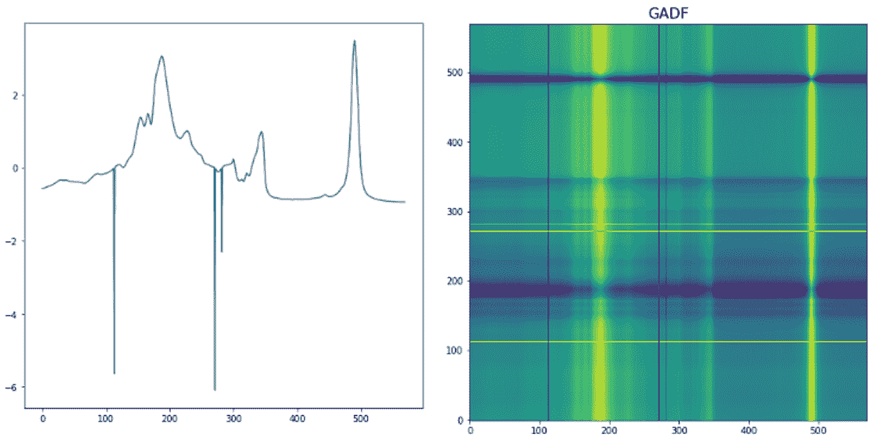
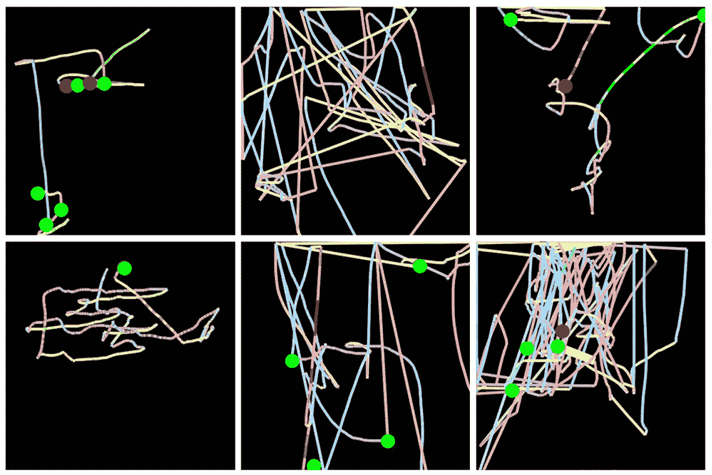
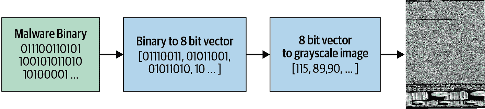
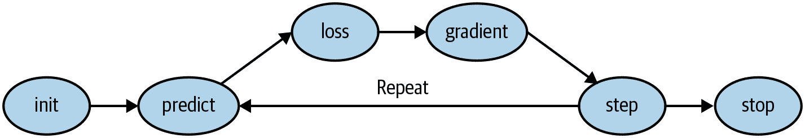
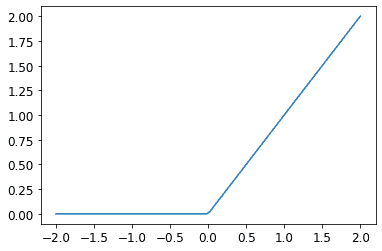

**<font size=8>fast.ai</font>**

## 总

| 标题 | 日期 | 笔记 |
| :--: | :--: | :--: |
|[官网](https://www.fast.ai/)|-|-|
|[论坛](https://forums.fast.ai/)|-|包含针对各版本课程的模块|
|[Practical Deep Learning for Coders 2022](https://course.fast.ai/)|2022|2022版，2 parts|
|Practical Deep Learning for Coders 2020|2020|2020版，已经被替代|
|[Practical Deep Learning for Coders 2019](https://course19.fast.ai/ )|2019|2019版，2 parts；[hiromis的notes (github.com)](https://github.com/hiromis/notes/tree/master)|
|Practical Deep Learning for Coders 2018|2018|2018版，已经被替代|
|[fast.ai](https://docs.fast.ai/)|-|fastai的documentation|
|[Deep Learning for Coders with fastai and PyTorch: AI Applications Without a PhD]([Deep Learning for Coders with fastai and PyTorch: AI Applications Without a PhD: Howard, Jeremy, Gugger, Sylvain: 9781492045526: Amazon.com: Books](https://www.amazon.com/Deep-Learning-Coders-fastai-PyTorch/dp/1492045527))|-|一本书，[免费]([Practical Deep Learning for Coders - The book](https://course.fast.ai/Resources/book.html))|
|[new fast.ai course: A Code-First Introduction to Natural Language Processing – fast.ai](https://www.fast.ai/posts/2019-07-08-fastai-nlp.html)|-|其他类型课程|


## [Practical Deep Learning 2022](https://course.fast.ai/) & [Fastbook](https://github.com/fastai/fastbook)

### 1: Getting started (PDL2022)

#### *Is it a bird? Creating a model from your own data*

*   流程

  1. 下载库，准备好
  2. 生成训练集和验证集
  3. 训练
  4. 验证
* 一些初学

  ```python
  from fastcore.all import * 
  '尽管fastai可以自动处理对fastcore的依赖，使fastai可以使用fastcore的部分功能，但是为了代码更简洁，依然显式地导入了fastcore'
  
  L #转换成fastcore中的唯一一个类L
  dest = (path/o) #path/o
  failed = verify_images(get_image_files(path)) #failed是L类
  ```
  ```python
  from fastai.vision.all import *
  
  Image.open('path').to_thumb(200,200) #Image.open().to_thumb()等比例放大
  download_images(dest, urls=search_images(f'{o} photo')) #download_images
  resize_images(path/o, max_size=200, dest=path/o) #resize_images
  get_image_files(path) #get_image_files
  verify_images(get_image_files(path)) #verify_images
  failed.map(Path.unlink) #failed.map
  dls = DataBlock( #DataBlock
    blocks = (ImageBlock, CategoryBlock), #ImageBlock, CategoryBlock
    get_items = get_image_files, #get_image_files
    splitter = RandomSplitter(valid_pct = 0.2, seed = 42), #RandomSplitter
    get_y = parent_label, #parent_label
    item_tfms = [Resize(200, method = 'squish')] #Resize
  ).dataloaders(path, bs = 32) #dataloaders
  dls.show_batch(max_n=6) #show_batch
  learn = vision_learner(dls, resnet18, metrics = error_rate) #vision_learner
  learn.fine_tune(5) #fine_tune
  cat_or_dog,_,pros_cat = learn.predict(PILImage.create('dog.jpg')) #predict; PILImage.create也可属于fastai，只是它有自己的底层依赖库
  ```

  ```python
  from duckduckgo_search import DDGS '导入库'
  from fastdownload import download_url '用于下载库'
  import time '鉴于效率非常重要，因此要记录time'
  ```

### 1: intro (fastbook1)

#### 1.1 初学

```python
#图像识别
path = untar_data(URLs.PETS)/'images' 
#untar_data()从fastai内置的数据库中下载解压数据并进入'images'的文件夹中
#untar_data(URLs.PETS)返回了一个Path对象，是fastai内置库PETS的路径

def is_cat(x): return x[0].isupper() #这个数据集中，Cat是大写，dog是小写，以此来区分猫和狗
dls = ImageDataLoaders.from_name_func( 
    path, 
    get_image_files(path),  #获得所有图像文件
    valid_pct=0.2, seed=42,
    label_func=is_cat,  #返回True或False
    item_tfms=Resize(224) #缩放到224*224像素
)
#ImageDataLoaders.from_name_func是fastai的高级封装，创建数据加载器更加简洁，专门用于从文件名提取标签的任务
#如果使用DataBlock👇
dls = DataBlock(
    blocks=(ImageBlock, CategoryBlock),
    get_items=get_image_files,
    splitter=RandomSplitter(valid_pct=0.2, seed=42),
    get_y=is_cat,
    item_tfms=Resize(224)
).dataloaders(path)
#`item_tfms`应用于每个项目（在本例中，每个项目都被调整为 224 像素的正方形），而`batch_tfms`应用于一次处理一批项目的 GPU

learn = vision_learner(dls, resnet34, metrics=error_rate) #error_rate & accuracy
learn.fine_tune(1)
```

```python
from types import SimpleNamespace
uploader = SimpleNamespace(data = ['images/chapter1_cat_example.jpg'])
#相当于uploader = {'data':['images/chapter1_cat_example.jpg']}
```

```python
#Image Classification
#segmentation
path = untar_data(URLs.CAMVID_TINY) #内置库
dls = SegmentationDataLoaders.from_label_func(
    path, bs=8, fnames = get_image_files(path/"images"),
    label_func = lambda o: path/'labels'/f'{o.stem}_P{o.suffix}',
    codes = np.loadtxt(path/'codes.txt', dtype=str) #这个是储存了分割任务中的类别的文件，比如道路、建筑、汽车等，o就是fnames中的一个元素，o.stem是文件名，o.suffix是扩展名
)
#label_func = lambda o: path/'labels'/f'{o.stem}_P{o.suffix}' #若o是images/cat.jpg，则返回labels/cat_P.jpg

learn = unet_learner(dls, resnet34)
learn.fine_tune(8)

learn.show_results(max_n=6, figsize=(7,8))
```

```python
#NLP
from fastai.text.all import *

dls = TextDataLoaders.from_folder(untar_data(URLs.IMDB), valid='test')
learn = text_classifier_learner(dls, AWD_LSTM, drop_mult=0.5, metrics=accuracy)
learn.fine_tune(4, 1e-2)

learn.predict("I really liked that movie!")
#结果：('pos', tensor(1), tensor([0.0041, 0.9959]))
```

```python
#Tabular
from fastai.tabular.all import *
path = untar_data(URLs.ADULT_SAMPLE)

dls = TabularDataLoaders.from_csv(path/'adult.csv', #这是指定数据文件
                                  path=path, #这是指定数据文件所在的路径
                                  y_names="salary",
    cat_names = ['workclass', 'education', 'marital-status', 'occupation',
                 'relationship', 'race'],
    cont_names = ['age', 'fnlwgt', 'education-num'],
    procs = [Categorify, FillMissing, Normalize]) #这是一个列表，包含对数据进行预处理的步骤。fastai 会自动应用这些预处理步骤。在这个例子中，预处理步骤包括：Categorify: 将分类变量转换为类别类型（通常是整数编码）；FillMissing: 填充缺失值（如果有的话）；Normalize: 对连续变量进行标准化处理（通常是减去均值并除以标准差）。

learn = tabular_learner(dls, metrics=accuracy) #salary是分类是否为高收入者，所以metrics仍用accuracy或error_rate如果是连续变量，则不能使用这个metrics
learn.fit_one_cycle(3) #没有预训练模型，所以不用fine_tune
```

```python
#Collaborative Filtering，协调过滤的结构一般比较简单
#根据用户以前的观影习惯，预测用户可能喜欢的电影
from fastai.collab import *
path = untar_data(URLs.ML_SAMPLE)
dls = CollabDataLoaders.from_csv(path/'ratings.csv') #这是用了默认设置，csv中最后一列是因变量；协同过滤的特征通常也都是离散的分类参数，如果有连续参数，就不能用CollabDataLoaders类简单预测
learn = collab_learner(dls, y_range=(0.5,5.5))
learn.fine_tune(10) #这里使用了fine_tune而不是fit_one_cycle
learn.show_results()
```

#### 1.2 **怎样快速获取fastai中方法的解释-doc**

```python
doc(learn.predict)
'''返回learn.predict方法的解释'''
```

#### 1.3 过拟合

即使您的模型尚未完全记住所有数据，在训练的早期阶段可能已经记住了其中的某些部分。因此，您训练的时间越长，您在训练集上的准确性就会越好；验证集的准确性也会在一段时间内提高，但最终会开始变差，因为模型开始记住训练集而不是在数据中找到可泛化的潜在模式。当这种情况发生时，我们说模型*过拟合*。

我们有很多避免过拟合的办法，但只有真的出现过拟合了才会用这些办法。我们经常看到一些人训练模型，他们有充足的数据，但是过早地使用了避免过拟合的办法，结果导致模型的准确性不好，还不如过拟合了的模型准确性高。

#### 1.4 架构

* CNN：创建计算机视觉模型的当前最先进方法

  ResNet，一种标准架构，有18、34、50、101和152

#### 1.5 预训练/迁移学习

使用预训练模型是我们训练更准确、更快速、使用更少数据和更少时间和金钱的最重要方法。您可能会认为使用预训练模型将是学术深度学习中最研究的领域...但您会非常、非常错误！预训练模型的重要性通常在大多数课程、书籍或软件库功能中**没有**得到认可或讨论，并且在学术论文中很少被考虑。当我们在 2020 年初写这篇文章时，事情刚刚开始改变，但这可能需要一段时间。因此要小心：您与之交谈的大多数人可能会严重低估您可以在深度学习中使用少量资源做些什么，因为他们可能不会深入了解如何使用预训练模型。

使用一个预训练模型来执行一个与其最初训练目的不同的任务被称为***迁移学习***。不幸的是，**由于迁移学习研究不足，很少有领域提供预训练模型**。例如，目前在医学领域很少有预训练模型可用，这使得在该领域使用迁移学习具有挑战性。此外，目前还不清楚如何将迁移学习应用于诸如时间序列分析之类的任务。

#### 1.6 head

When using a pretrained model, `vision_learner` will remove the last layer, since that is always specifically customized to the original training task (i.e. ImageNet dataset classification), and replace it with one or more new layers with randomized weights, of an appropriate size for the dataset you are working with. This last part of the model is known as the *head*.

#### 1.7 训练集、验证集、测试集

在用训练集训练后，我们用验证集查看训练效果，根据验证集的效果，调整超参数hyperparameter，因此，验证集仍然半暴露在训练模型中。为了能更好地评估模型的效果，用验证集显然是不理想的，所以我们还会隔绝出一个完全没有用过的测试集。

当然如果数据量不够，测试集并不一定是必须的，但是当然有是最好的。

在我们实际的训练中，验证集和测试集的选择很有讲究。比如我们预测时间序列，最好的划分是把最近的一段时间作为验证集/测试集，这样我们可以评估模型对未来的预测效果；比如我们识别驾驶员的行为，最好的划分是把一个驾驶员完全隔绝成验证集/测试集，这样我们可以评估模型对不同的人是不是都有很好的识别效果。

#### 1.8 其他

* 时间序列转换成图像

  时间序列数据有各种转换方法。例如，fast.ai 学生 Ignacio Oguiza 使用一种称为**Gramian Angular Difference Field（GADF）**的技术，从一个时间序列数据集中为橄榄油分类创建图像，你可以在图 1-15 中看到结果。然后，他将这些图像输入到一个图像分类模型中，就像你在本章中看到的那样。尽管只有 30 个训练集图像，但他的结果准确率超过 90%，接近最先进水平。

  

  另一个有趣的 fast.ai 学生项目示例来自 Gleb Esman。他在 Splunk 上进行欺诈检测，使用了用户鼠标移动和鼠标点击的数据集。他通过绘制显示鼠标指针位置、速度和加速度的图像，使用彩色线条，并使用[小彩色圆圈](https://oreil.ly/6-I_X)显示点击，将这些转换为图片，如图 1-16 所示。他将这些输入到一个图像识别模型中，就像我们在本章中使用的那样，效果非常好，导致了这种方法在欺诈分析方面的专利！

  

  另一个例子来自 Mahmoud Kalash 等人的论文“使用深度卷积神经网络进行恶意软件分类”，解释了“恶意软件二进制文件被分成 8 位序列，然后转换为等效的十进制值。这个十进制向量被重塑，生成了一个代表恶意软件样本的灰度图像”，如图 1-17 所示。

  

#### 1.9 术语

  | Term             | Meaning                                                      |
  | ---------------- | ------------------------------------------------------------ |
  | Label            | The data that we're trying to predict, such as "dog" or "cat" |
  | Architecture     | The _template_ of the model that we're trying to fit; the actual mathematical function that we're passing the input data and parameters to |
  | Model            | The combination of the architecture with a particular set of parameters |
  | Parameters       | The values in the model that change what task it can do, and are updated through model training |
  | Fit/拟合         | Update the parameters of the model such that the predictions of the model using the input data match the target labels |
  | Train            | A synonym for _fit_                                          |
  | Pretrained model | A model that has already been trained, generally using a large dataset, and will be fine-tuned |
  | Fine-tune        | Update a pretrained model for a different task               |
  | Epoch            | One complete pass through the input data                     |
  | Loss             | A measure of how good the model is, chosen to drive training via SGD |
  | Metric           | A measurement of how good the model is, using the validation set, chosen for human consumption |
  | Validation set   | A set of data held out from training, used only for measuring how good the model is |
  | Training set     | The data used for fitting the model; does not include any data from the validation set |
  | Overfitting      | Training a model in such a way that it _remembers_ specific features of the input data, rather than generalizing well to data not seen during training |
  | CNN              | Convolutional neural network; a type of neural network that works particularly well for computer vision tasks |

### 2：Deployment (PDL2022)-暂时跳过

### 2: Production (fastbook)-暂时跳过

### 3: Neural net foundations (PDL2022)

#### *How does a neural net really work?*

paperspace

### 3: mnist_basics (fastbook4)

#### 3.1 像素：计算机视觉的基础

```python
from fastcore.all import *
from fastai.vision.all import *

path = untar_data(URLs.MNIST_SAMPLE)
path.ls()  #L类
(path/'train').ls()

threes = (path/'train'/'3').ls().sorted()
sevens = (path/'train'/'7').ls().sorted()
threes

im3 = Image.open(threes[1]) #PIL打开image
im3

im3_t = tensor(im3)[4:12,4:10]
print(im3_t)
len(im3_t)
df = pd.DataFrame(im3_t)
df.style.set_properties(**{'font-size':'6pt'}).background_gradient('Greys')

seven_tensors = [tensor(Image.open(o)) for o in sevens]
three_tensors = [tensor(Image.open(o)) for o in threes]
len(three_tensors), len(seven_tensors) #‘6265’文件夹7转换为seven_tensors，这大概可以算作是一个张量的list（L类）
show_image(three_tensors[1]) #不用PIL打开image，用fasiai中的show_image打开tensor代表的image，也是个图片

stacked_sevens = torch.stack(seven_tensors).float()/255 #把这个tensor的L用torch.stack方法堆叠成一个3-rank张量
stacked_threes = torch.stack(three_tensors).float()/255
stacked_threes.shape #torch.Size([6131, 28, 28])
len(stacked_sevens.shape) #张量的秩，也就是张量的维度

mean3 = stacked_threes.mean(0) #沿着维度0求平均值，变成2-rank
show_image(mean3)
mean7 = stacked_sevens.mean(0)

a_3 = stacked_threes[1] #float，第一张图
F.l1_loss(a_3, mean7) #l1是标准数学术语平均绝对值的缩写（在数学中称为L1 范数）
F.mse_loss(a_3, mean7).sqrt() #mse均方误差，sqrt()开根，RMSE均方根误差是L2范数
#MSE相比L1范数来说会更狠地惩罚大的误差，而对小误差更加宽容
```

#### 3.2 NumPy 数组和 PyTorch 张量

* [NumPy](https://numpy.org) 是 Python 中用于科学和数值编程最广泛使用的库。它提供了类似的功能和类似的 API，与 PyTorch 提供的功能相似；然而，它不支持使用 GPU 或计算梯度，这两者对于深度学习都是至关重要的。

| #    | Numpy                                          | Pytorch Tensor                        |
| ---- | ---------------------------------------------- | ------------------------------------- |
| 1    | 不规则数组：可以是数组的数组，内部数组大小不同 | 不可以是不规则的                      |
| 2    | 不能存在GPU上                                  | 可以存储在GPU上，后续训练更快         |
| 3    | 不能计算导数                                   | 可以自动计算导数，可以进行SGD梯度计算 |

```py
data = [[1,2,3],[4,5,6]]
arr = array (data)
tns = tensor(data)
tns[1]  #tensor([4, 5, 6])
tns[:, 1] #tensor([2, 5])
tns +1 # tensor([[2, 3, 4],[5, 6, 7]])
```

#### 3.3 使用Broadcasting计算Metrics

* 可以使用MSE或L1范数作为metrcs，但是有时候不太好理解，所以一般情况下使用**accuracy**作为metrics

```python
valid_3_tens = torch.stack([tensor(Image.open(o)) for o in (path/'valid'/'3').ls()]).float()/255
valid_7_tens = torch.stack([tensor(Image.open(o)) for o in (path/'valid'/'7').ls()]).float()/255
valid_3_tens.shape, valid_7_tens.shape #valid中的图片转换成一个rank-3的归一化tensor

def mnist_distance(a,b):    return (a-b).abs().mean((-1,-2)) #定义一个方法计算L1范数，-1/-2是告诉tensor要对最后两个轴进行平均
mnist_distance(a_3, mean3)
valid_3_dist = mnist_distance(valid_3_tens, mean3) #这里自动使用了broadcasting将valid_3_tens宽展了一个秩-1
valid_3_dist.shape, valid_3_dist #(torch.Size([1010])

def is_3(x): return mnist_distance(x, mean3) < mnist_distance(x, mean7) #不是3就是7

accuracy_3s = is_3(valid_3_tens).float().mean()
```

#### 3.4 SGD随机梯度下降



注意特殊方法`requires_grad_`？这是我们告诉 PyTorch 我们想要计算梯度的神奇咒语。这实质上是给变量打上标记，这样 PyTorch 就会记住如何计算您要求的其他直接计算的梯度。

```python
xt = tensor(3.).requires_grad_() #让pytorch知道我们后面会要求计算这个tensor的梯度
yt = f(xt)
yt.backward() #backward,其实就是calculates_grad
xt.grad #计算梯度，tensor(6.)
```

#### 3.5 学习率

```python
w -= w.grad * lr #lr学习率
```

#### 3.6 实例

```python
time = torch.arange(0,20).float()
speed = torch.randn(20)*3 + 0.75*(time-9.5)**2+1 #在y中添加了噪声
plt.scatter(time,speed)

#定义了一个函数，用它来拟合(time,speed)
def f(t,params): 
    a,b,c = params
    return a*(t**2)+b*t+c

#计算loss
def mse(preds, targets): return ((preds-targets)**2).mean()

#初始化随机parameters
params = torch.randn(3).requires_grad_()

#定义学习率
lr = 1e-5

#定义一个函数来拟合
def apply_step(params, prn=True):
    preds = f(time,params)
    loss = mse(preds, speed)
    loss.backward()
    params.data -= lr*params.grad.data #这个必须得加.data方法，否则会报错
    params.grad = None
    if prn: print(loss.item()) #loss.item()不再是tensor
    return params

#循环
while loss>3:
    apply_step(params)
```

#### 3.7 MNIST codes

* sigmoid：我们预测这个predctions总是在0~1，但实际上它可能在这个范围之外，就需要采用一种方法把它放进来

```python
import matplotlib.pyplot as plt
def plot_function(f, title=None, min=-1, max=1):
    x = torch.arange(min, max, 0.1)
    y = tensor([f(xi) for xi in x])
    plt.plot(x, y)
    if title:
        plt.title(title)
    plt.show()
plot_function(torch.sigmoid, title='sigmoid',min=-4, max=4)
```

* 小批次：为整个数据集计算将需要很长时间。为单个数据项计算将不会使用太多信息，因此会导致不精确和不稳定的梯度。您将费力更新权重，但只考虑这将如何改善模型在该单个数据项上的性能。因此，我们做出妥协：我们一次计算几个数据项的平均损失。这被称为*小批次* **mini-batch**。选择一个好的批次大小是您作为深度学习从业者需要做出的决定之一，以便快速准确地训练您的模型。
* 比如有2000组数据分为4*500的mini-batch，在一个epoch中就会4次更新parameters

```python
coll = range(15)
dl = DataLoader(coll, batch_size=5, shuffle=True)
list(dl)
'''[tensor([11,  4,  3,  0,  2]),
 tensor([ 8,  7, 13, 14,  5]),
 tensor([12,  9,  6, 10,  1])]'''
ds = L(enumerate(string.ascii_lowercase))
dl = DataLoader(ds, batch_size=6, shuffle=True)
list(dl)
'''[(tensor([20,  7, 12, 24, 22,  9]), ('u', 'h', 'm', 'y', 'w', 'j')),
 (tensor([ 1, 25, 17, 19,  3,  6]), ('b', 'z', 'r', 't', 'd', 'g')),
 (tensor([13,  0,  5, 10, 18,  2]), ('n', 'a', 'f', 'k', 's', 'c')),
 (tensor([ 8,  4, 21, 15, 23, 16]), ('i', 'e', 'v', 'p', 'x', 'q')),
 (tensor([14, 11]), ('o', 'l'))]'''
```

##### nn.Linear：做的事情如下

```python
#初始化参数
def init_params(size, std=1.0): return (torch.randn(size)*std).requires_grad_()
weights = init_params((28*28,1)) # torch.Size([784,1])
bias = init_params(1) # torch.Size(1)
#计算preds的函数
def linear1(xb): return xb@weights+bias

#可以简化为
linear_model = nn.Linear(28*28,1)
w,b=linear_model.parameters()
'''上面的linear1就变成了linear_model'''
```

##### SGD：下面一共三版，慢慢简化后用到SGD()类

```python
'第一版：全部自己定义函数'
#定义计算梯度的函数
def calc_grad(xb,yb,model):
    preds = model(xb)
    loss = mnist_loss(preds, yb)
    loss.backward()
#计算准确率的函数
def batch_accuracy(xb,yb):
    preds = xb.sigmoid()
    correct = (preds>0.5)==yb
    return correct.float().mean()
#计算验证集的准确率
def valid_epoch(model):
    accs = [batch_accuracy(model(xb),yb) for i in valid_dl]
    return round(torch.stack(accs).mean().item(),4)
#更新梯度的函数-------------------------主要是这一步变成了第二版的类+更新梯度的函数
def train_epoch(model, lr, params):
    for xb,yb in dl:
        calc_grad(xb,yb,model)
        for p in params:
            p.data -= p.grad*lr
            p.grad.zero_()
#跑起来
lr = 1.
params = weights,bias
for i in range(20):
    train_epoch(linear1,lr,params)
    print(valid_epoch(linear1))
------------------------------------------------------------------------------------------------------------
'第二版：创建了一个类，把一些函数整合进类里面'
#定义计算梯度的函数
def calc_grad(xb,yb,model):
    preds = model(xb)
    loss = mnist_loss(preds, yb)
    loss.backward()
#计算准确率的函数
def batch_accuracy(xb,yb):
    preds = xb.sigmoid()
    correct = (preds>0.5)==yb
    return correct.float().mean()
#计算验证集的准确率
def valid_epoch(model):
    accs = [batch_accuracy(model(xb),yb) for i in valid_dl]
    return round(torch.stack(accs).mean().item(),4)
#创建一个优化器的类，把更新梯度和归零梯度作为方法放进了类中--------------------------这一步变成了第三版的SGD()
class BasicOptim:
    def __init__(self,params,lr):
        self.params = list(params)
        self.lr = lr
    def step(self, *args, **kwargs):
        for p in self.params:
            p.data -= p.grad.data*self.lr
    def zero_grad(self, *args, **kwargs):
        for p in self.params:
            p.grad = None
lr=1.
opt = BasicOptim(linear_model.parameters(),lr)
#更新梯度的函数-----------------------------
def train_epoch(model):
    for xb,yb in dl:
        cal_grad(xb,yb,model)
        opt.step()
        opt.zero_grad()
#跑起来
def train_model(model,epochs):
    for i in range(epochs):
        train_epoch(model)
        print(valid_epoch(model))
train_model(linear_model,20)
------------------------------------------------------------------------------------------------------------
'第三版：用了现成的SGD类'
#定义计算梯度的函数
def calc_grad(xb,yb,model):
    preds = model(xb)
    loss = mnist_loss(preds, yb)
    loss.backward()
#计算准确率的函数
def batch_accuracy(xb,yb):
    preds = xb.sigmoid()
    correct = (preds>0.5)==yb
    return correct.float().mean()
#计算验证集的准确率
def valid_epoch(model):
    accs = [batch_accuracy(model(xb),yb) for i in valid_dl]
    return round(torch.stack(accs).mean().item(),4)
#实例化一个类-------------------------------------------------------
lr=1.
opt=SGD(linear_model.parameters(),lr)
#更新梯度的函数-----------------------------------------------------
def train_epoch(model):
    for xb,yb in dl:
        cal_grad(xb,yb,model)
        opt.step()
        opt.zero_grad()
#跑起来
def train_model(model,epochs):
    for i in range(epochs):
        train_epoch(model)
        print(valid_epoch(model))
train_model(linear_model,20)
```

##### Learn.fit：

```python
'第一版'
#初始化参数&实例化计算preds的函数
linear_model = nn.Linear(28*28,1)
'见上nn.Linear'
#定义计算loss的函数
def mnist_loss(predictions, targets):
    predictions = predictions.sigmoid()
    return torch.where(targets==1, 1-predictions, predictions).mean()
#优化步骤optimization step
#定义计算梯度的函数
def calc_grad(xb,yb,model):
    preds = model(xb)
    loss = mnist_loss(preds, yb)
    loss.backward()
#实例化类+更新梯度的函数-----------------------------------------------------
lr=1.
opt=SGD(linear_model.parameters(),lr)
#更新梯度的函数
def train_epoch(model):
    for xb,yb in dl:
        cal_grad(xb,yb,model)
        opt.step()
        opt.zero_grad()
'见上SGD'
#计算准确率的函数
def batch_accuracy(xb,yb):
    preds = xb.sigmoid()
    correct = (preds>0.5)==yb
    return correct.float().mean()
#计算验证集的准确率
def valid_epoch(model):
    accs = [batch_accuracy(model(xb),yb) for i in valid_dl]
    return round(torch.stack(accs).mean().item(),4)
#跑起来----------------------------------------------------------------------
def train_model(model,epochs):
    for i in range(epochs):
        train_epoch(model)
        print(valid_epoch(model))
train_model(linear_model,10)

------------------------------------------------------------------------------------------------------------
'简化版：不用train_model了'
#初始化参数&实例化计算preds的函数
linear_model = nn.Linear(28*28,1)
'见上nn.Linear'
#定义计算loss的函数
def mnist_loss(predictions, targets):
    predictions = predictions.sigmoid()
    return torch.where(targets==1, 1-predictions, predictions).mean()
#计算准确率的函数
def batch_accuracy(xb,yb):
    preds = xb.sigmoid()
    correct = (preds>0.5)==yb
    return correct.float().mean()
#跑起来
learn = Learner(dls,nn.Linear(28*28,1),opt_func=SGD,loss_func=mnist_loss,metrics=batch_accuracy)
lr=1.
learn.fit(10,lr=lr)
```

##### 实例


```python
train_x = torch.cat([stacked_threes, stacked_sevens]).view(-1,28*28) #把stacked_threes和stacked_sevens组合成1个tensor，并且每张图片的数据28*28首尾相连成一个rank-1的tensor
#train_x.shape # torch.Size([12396,784])

train_y = tensor([1]*len(threes)+[0]*len(sevens)).unsqueeze(1) #unsqueeze(1)是将它扩展为rank-2，否则size是([12396])
#train_y.shape # torch.Size([12396,1])

dset = list(zip(train_x, train_y)) #list(zip())可以把两个tensor组合成1个元组
#x,y = dset[0] #就可以这样索引了

valid_x = torch.cat([valid_3_tens, valid_7_tens]).view(-1,28*28)
valid_y = tensor([1]*len(valid_3_tens)+[0]*len(valid_7_tens)).unsqueeze(1)
valid_dset = list(zip(valid_x,valid_y))

#准备好dataloader
dl = DataLoader(dset, batch_size=256)
valid_dl = DataLoader(valid_dset, batch_size=256)
dls = DataLoaders(dl,valid_dl)

#计算准确率
#corrects = (preds>0.0).float() == train_y
#corrects.float().mean().item()
#如果用准确率做loss就会导致loss的变化不明显（只有从0跳到1的时候才变化），这样会导致backward计算的grad很多时候为0，无法拟合.它不能有大的平坦部分和大的跳跃，而必须是相当平滑的.

#定义计算loss的函数
def mnist_loss(predictions, targets):
    predictions = predictions.sigmoid()
    return torch.where(targets==1, 1-predictions, predictions).mean()
#计算准确率的函数
def batch_accuracy(xb,yb):
    preds = xb.sigmoid()
    correct = (preds>0.5)==yb
    return correct.float().mean()
#跑起来
learn = Learner(dls,nn.Linear(28*28,1),opt_func=SGD,loss_func=mnist_loss,metrics=batch_accuracy)
lr=1.
learn.fit(10,lr=lr) 
```

##### **汇总codes**

```python
from fastcore.all import *
from fastai.vision.all import *
path = untar_data(URLs.MNIST_SAMPLE)
threes = (path/'train'/'3').ls().sorted()
sevens = (path/'train'/'7').ls().sorted()
seven_tensors = [tensor(Image.open(o)) for o in sevens]
three_tensors = [tensor(Image.open(o)) for o in threes]
stacked_sevens = torch.stack(seven_tensors).float()/255 #把这个tensor的L用torch.stack方法堆叠成一个3-rank张量
stacked_threes = torch.stack(three_tensors).float()/255
train_x = torch.cat([stacked_threes, stacked_sevens]).view(-1,28*28) 
train_y = tensor([1]*len(threes)+[0]*len(sevens)).unsqueeze(1)
dset = list(zip(train_x, train_y))
valid_3_tens = torch.stack([tensor(Image.open(o)) for o in (path/'valid'/'3').ls()]).float()/255
valid_7_tens = torch.stack([tensor(Image.open(o)) for o in (path/'valid'/'7').ls()]).float()/255
valid_x = torch.cat([valid_3_tens, valid_7_tens]).view(-1,28*28)
valid_y = tensor([1]*len(valid_3_tens)+[0]*len(valid_7_tens)).unsqueeze(1)
valid_dset = list(zip(valid_x,valid_y))
dl = DataLoader(dset, batch_size=256)
valid_dl = DataLoader(valid_dset, batch_size=256)
dls = DataLoaders(dl,valid_dl)
def mnist_loss(predictions, targets):
    predictions = predictions.sigmoid()
    return torch.where(targets==1, 1-predictions, predictions).mean()
def batch_accuracy(xb,yb):
    preds = xb.sigmoid()
    correct = (preds>0.5)==yb
    return correct.float().mean()
learn = Learner(dls,nn.Linear(28*28,1),opt_func=SGD,loss_func=mnist_loss,metrics=batch_accuracy)
lr=1.
learn.fit(10,lr=lr) 
```

#### 3.8 添加非线性

*rectified linear unit*

##### Activation Function

* F.relu



* F.sigmoid

##### 实例

```python
#前面如上一个实例
#构建一个多层神经网络（2层=1个隐藏层+1个全连接层）
simple_net = nn.Sequential(
    nn.Linear(28*28,30),
    nn.ReLU(),
    nn.Linear(30,1)
)
#定义计算loss的函数
def mnist_loss(predictions, targets):
    predictions = predictions.sigmoid()
    return torch.where(targets==1, 1-predictions, predictions).mean()
#计算准确率的函数
def batch_accuracy(xb,yb):
    preds = xb.sigmoid()
    correct = (preds>0.5)==yb
    return correct.float().mean()
#实例化
learn = Learner(dls, simple_net, opt_func=SGD, loss_func=mnist_loss, metrics=batch_accuracy)
#训练
learn.fit(30,0.1)
```


训练过程记录在`learn.recorder`中，输出表存储在`values`属性中，因此我们可以绘制训练过程中的准确性

```python
plt.plot(L(learn.recorder.values).itemgot(2))
'''train_loss:L(learn.recorder.values).itemgot(0)
valid_loss:L(learn.recorder.values).itemgot(1)
batch_accuracy:L(learn.recorder.values).itemgot(2)'''
```

#### 3.9 术语

| Term | Meaning|
|:---|---|
|ReLU | Function that returns 0 for negative numbers and doesn't change positive numbers.|
|Mini-batch | A small group of inputs and labels gathered together in two arrays. A gradient descent step is updated on this batch (rather than a whole epoch).|
|Forward pass | Applying the model to some input and computing the predictions.|
|Loss | A value that represents how well (or badly) our model is doing.|
|Gradient | The derivative of the loss with respect to some parameter of the model.|
|Backward pass | Computing the gradients of the loss with respect to all model parameters.|
|Gradient descent | Taking a step in the directions opposite to the gradients to make the model parameters a little bit better.|
|Learning rate | The size of the step we take when applying SGD to update the parameters of the model.|
|Activations | Numbers that are calculated (both by linear and nonlinear layers) |
|Parameters | Numbers that are randomly initialized, and optimized (that is, the numbers that define the model) |
|Special Tensors | Rank zero: scalar / Rank one: vector / Rank two: matrix |

### 4: Natural Language (NLP) (PDL2022)

#### 4.1 发展

（1）**ULMFit** (用的RNN): Wikitext(103)Language Model (30%准确率) → IMDb Language Model → IMDb Classifier

（2）**Transformers** (掩码语言建模): 用于机器阅读理解、句子分类、命名实体识别、机器翻译和文本摘要等

（3）...

可以看到似乎Transformer要比ULMFit高级，实际上两者的用途不同；另外，ULMFit能够阅读更长的句子，如果一个document包含超过2000个单词，那么就更推荐使用ULMFit进行分类。

#### 4.2 最重要的package

1/ pandas

2/ numpy

3/ matplotlib

4/ pytorch

##### 参考书：[Python for Data Analysis, 3E About the Open Edition]([Python for Data Analysis, 3E](https://wesmckinney.com/book/))

#### 4.3 Tokenization

A deep learning model expects numbers as inputs, not English sentences! So we need to do two things:

- *Tokenization*: Split each text up into words (or actually, as we'll see, into *tokens*)
- *Numericalization*: Convert each word (or token) into a number.

The details about how this is done actually depend on the particular model we use. So first we'll need to pick a model. There are thousands of models available, but a reasonable starting point for nearly any NLP problem is to use this：

`microsoft/deberta-v3-small`

```python
tokz.tokenize("A platypus is an ornithorhynchus anatinus.")
'''
['▁A',
 '▁platypus',
 '▁is',
 '▁an',
 '▁or',
 'ni',
 'tho',
 'rhynch',
 'us',
 '▁an',
 'at',
 'inus',
 '.']
'''
```

#### 4.4 训练集与验证集的划分

Training set & Validation set

In practice, a random split like we've used here might not be a good idea -- here's what Dr Rachel Thomas has to say about it:

> "*One of the most likely culprits for this disconnect between results in development vs results in production is a poorly chosen validation set (or even worse, no validation set at all). Depending on the nature of your data, choosing a validation set can be the most important step. Although sklearn offers a `train_test_split` method, this method takes a random subset of the data, which is a poor choice for many real-world problems.*"

I strongly recommend reading her article [How (and why) to create a good validation set](https://www.fast.ai/2017/11/13/validation-sets/) to more fully understand this critical topic.

* 随机划分数据集不适用的情况：时间序列、新人脸、新的船等等；
* cross-validation比较危险，除非用到的case是那种可以随机洗牌的情况（随机分ABC三组数据集，AB合并做训练集-C做验证集，三组循环，最后求平均值作为模型的performance）；
* 所以用一个test set测试集去最终确认一下模型的好坏也蛮重要的。

#### 4.5 Metrics

In real life, outside of Kaggle, things not easy... As my partner Dr Rachel Thomas notes in [The problem with metrics is a big problem for AI](https://www.fast.ai/2019/09/24/metrics/):

> At their heart, what most current AI approaches do is to optimize metrics. The practice of optimizing metrics is not new nor unique to AI, yet AI can be particularly efficient (even too efficient!) at doing so. This is important to understand, because any risks of optimizing metrics are heightened by AI. While metrics can be useful in their proper place, there are harms when they are unthinkingly applied. Some of the scariest instances of algorithms run amok all result from over-emphasizing metrics. We have to understand this dynamic in order to understand the urgent risks we are facing due to misuse of AI.

* Metrics很多时候并不是*我们真正关心的事情*，它只是*我们关心的事情*的一个代理，如我们关心老师的教学效果，metrics是学生的分数；
* Metrics会被故意地、作弊地拉高，使它失去了衡量*我们关心的事情*的能力，如老师人为拉高学生的分数，它不再能反映老师的教学效果；
* Metrics会更短视，比如银行一旦将cross-selling这个metrics作为目标，就会催生出各种虚假开户，而实际上银行的目标是维护良好的客户关系，后者才是长远的战略，比如*我们关心的事情*是提高视频影响力，用了点击率作为Metrics，就没有考虑到一些视频长期来看对读者的帮助和塑造；
* 很多Metrics是在一个高度成瘾的环境收集数据的，比如数据收集到小朋友喜欢吃甜食，算法会让食物越来越甜，永远不可能output出有营养的食物；
* 尽管如此Metrics依然很有用，需要考虑多个metrics来避免上述问题，但最终我们要努力将它们整合；
* Metrics通过定量方式衡量结果，但我们依然需要定性的信息才能获得好的metrics；
* 去询问已在此山中的人永远可以foresee一些不良后果，如老师可以很容易地知道，用学生分数作为唯一衡量标准会导致什么糟糕的结果。

#### 4.6 codes

```python
# 检查是否为kaggle环境
import os
iskaggle = os.environ.get('KAGGLE_KERNEL_RUN_TYPE', '')
iskaggle

# 下载datasets
from pathlib import Path
if iskaggle:
    path = Path('../input/us-patent-phrase-to-phrase-matching')
    ! pip install -q datasets #只需要跑一次就到了页面中了
    
# ！表示后面的不是python命令，是shell命令，但是如果想利用到python中的参数，就用{}框起来
!ls {path}
```

```python
#数据的预处理工作
# 定义一个训练集的dataframe
import pandas as pd
df = pd.read_csv(path/'train.csv')
df.describe(include='object') #一个非常重要的dataframe方法

# 构建一个df
df['input'] = 'TEXT1: ' + df.context + '; TEXT2: ' + df.target + '; ANC1: ' + df.anchor
df.input.head()
'''
0    TEXT1: A47; TEXT2: abatement of pollution; ANC...
1    TEXT1: A47; TEXT2: act of abating; ANC1: abate...
2    TEXT1: A47; TEXT2: active catalyst; ANC1: abat...
3    TEXT1: A47; TEXT2: eliminating process; ANC1: ...
4    TEXT1: A47; TEXT2: forest region; ANC1: abatement
Name: input, dtype: object
'''
df['input'][0], df.input[0]
''TEXT1: A47; TEXT2: abatement of pollution; ANC1: abatement''
            
# 实例化一个训练集的Dataset
from datasets import Dataset,DatasetDict
ds = Dataset.from_pandas(df)
'''
Dataset({
    features: ['id', 'anchor', 'target', 'context', 'score', 'input'],
    num_rows: 36473
})
其中input是整个string句子
'''

# 选择一个model,就有了和这个model对应的vocabulary，然后实例化它的tokz工具
model_nm = 'microsoft/deberta-v3-small'
from transformers import AutoModelForSequenceClassification,AutoTokenizer
tokz = AutoTokenizer.from_pretrained(model_nm)

# 定义一个用来tokz某段文字的函数，并应用
def tok_func(x): return tokz(x["input"])
toknum_ds = ds.map(tok_func, batched=True) #来自HuggingFace的datasets库,这使得它不再只有'input'还有'input_ids'
'''
.map(tok_func, batched=True)：对 ds 中的数据应用 tok_func 进行映射（map），并且启用批处理（batched=True），以提高效率。
tok_ds：返回一个新的 Dataset，其中每个文本已经被 tok_func 处理过（通常是 Tokenizer）
'''
#row = toknum_ds[0]
#row['input'], row['input_ids'] '①第一句话string，②一串数字'
#tokz.vocab['▁of'] #这里有一个vocabulary，tocken→数字
#'265'

# 准备一个lables，transformer一向都认为labels就说有一列叫做labels，所以得改名字
toknum_ds = toknum_ds.rename_columns({'score':'labels'})

# 把之前已经数字化了的Dataset分一下，分成一个训练集一个验证集
dds = toknum_ds.train_test_split(0.25, seed=42)

# 定义Metrics
import numpy as np
def corr(x,y): return np.corrcoef(x,y)[0][1]
def corr_d(eval_pred): return {'pearson': corr(*eval_pred)} #eval_pred通常是包含预测值和实际值的元组或列表，*表示将预测值和实际值拆解成位置参数传递给corr() [另外，这个'pearson'标签最后会出现在训练结果里]
```

```python
#训练
from transformers import TrainingArguments,Trainer
bs = 128
epochs = 4
lr = 8e-5
args = TrainingArguments( #Hugging Face的Transformers库时，专门用于集中管理和定义训练一个机器学习模型时所需要的所有超参数和设置
    'outputs',                # 输出目录：训练过程中模型和日志将保存在此目录中
    learning_rate=lr,         # 学习率：模型优化的步长（lr 是事先定义好的变量）
    warmup_ratio=0.1,         # 预热比例：学习率从 0 线性增加到初始学习率的比例（0.1 表示 10% 的训练步数作为预热阶段）
    lr_scheduler_type='cosine',  # 学习率调度器类型：使用余弦退火（Cosine Annealing）策略来逐步降低学习率
    fp16=True,                # 是否使用半精度训练：将训练过程中的浮点数精度降为 16 位，可以提高训练速度并减少显存占用
    evaluation_strategy="epoch",  # 评估策略：每个训练轮（epoch）结束后进行评估
    per_device_train_batch_size=bs,  # 每个设备（GPU）上训练的批量大小（`bs` 是事先定义的变量）
    per_device_eval_batch_size=bs*2,  # 每个设备上评估的批量大小，通常评估时批量可以稍大一些
    num_train_epochs=epochs,  # 训练轮数：训练过程中会进行的完整数据集迭代次数（`epochs` 是事先定义的变量）
    weight_decay=0.01,        # 权重衰减：L2 正则化的强度，用于防止过拟合
    report_to='none' # 禁用报告（如不报告到 TensorBoard 或 WandB），如果需要报告，可以设置为 'tensorboard' 或 'wandb'
)
model = AutoModelForSequenceClassification.from_pretrained(model_nm, num_labels=1) #将用的模型
trainer = Trainer(model, args, train_dataset=dds['train'], eval_dataset=dds['test'], tokenizer=tokz,
                  compute_metrics=corr_d) #将model、超参数们、data整合在一起的类

trainer.train()
```

```python
#测试集
# 定义一个测试集的dataframe，构建一个eval_df，基于这实例化一个eval_ds并将它tokenization
eval_df = pd.read_csv(path/'test.csv')
eval_df.describe()
eval_df['input'] = 'TEXT1: ' + eval_df.context + '; TEXT2: ' + eval_df.target + '; ANC1: ' + eval_df.anchor
eval_ds = Dataset.from_pandas(eval_df).map(tok_func, batched=True)

# 预测测试集
preds = trainer.predict(eval_ds).predictions.astype(float)
preds = np.clip(preds, 0, 1) #将<0>1的数值规整到0~1

#将结果导出到csv
import datasets
submission = datasets.Dataset.from_dict({
    'id': eval_ds['id'],
    'score': preds
})
submission.to_csv('submission.csv', index=False)
```

#### 4.7 超参数：权重衰减weight decay

L2 正则化通过在损失函数中加入一个与模型权重的平方和成正比的项来实现惩罚。具体来说，假设我们有一个损失函数 `L(w)`，表示模型的损失，其中 `w` 是模型的权重参数，那么加入 L2 正则化后的损失函数 `L2(w)` 就是：
$$
L2(w)=L(w) + \lambda \sum_{i} w_i^2
$$
其中：

- `L(w)` 是原始的损失函数（如交叉熵、均方误差等）。
- `w_i` 是模型的第 `i` 个权重。
- `λ` 是正则化强度的超参数，控制 L2 正则化的影响。较大的 `λ` 会对模型的训练产生较大的影响。

**作用**

- **限制权重的大小**：L2 正则化鼓励模型的权重 `w` 尽可能小，避免出现过大的权重值，这样可以减少模型的复杂度，防止过拟合。
- **平滑模型**：通过抑制大权重，L2 正则化促使模型学习到更加平滑的函数，而非过于复杂的、过拟合训练数据的函数。
- **改进泛化能力**：通过防止过拟合，L2 正则化使得模型在未见过的数据（测试集）上的表现更加稳定。

通俗说明，因为在损失函数中加入了weights的平方和，为了让损失函数变小，模型会倾向于减小weights的数值，可是当数值为0的时候，这个模型的预测又会很差，所以在训练的过程中，模型就会找到一个微妙的平衡：一些对预测不太有用的特征对应的weights会被压缩到很小，让对预测有用的特征对应的weights获得足够的空间。

### 4: nlp (fastbook10)

#### 4.1 自监督学习

使用嵌入在自变量中的标签来训练模型，而不是需要外部标签。例如，训练一个模型来预测文本中的下一个单词。自监督学习也可以用于其他领域；例如，参见[“自监督学习和计算机视觉”](https://oreil.ly/ECjfJ)以了解视觉应用。

> 只要有可能，尽可能使用一个已经训练过的模型。即便是该模型在特定领域没有经过训练，只是通用范围内训练了，用它的早期几个层依然可以提高新模型训练的效率和效果。
>
> 自监督学习：model用的labels来自于inputs。
>
> Pretrained model在预训练时的那个任务叫做pretext task，而我们要将它用在特定领域的那个任务叫做downstream tasks。
>
> Autoencoder：将一张图压缩，之后再将它尽可能地还原成原图。但如果你的downstream task是生成一张比原图更高清的图片，这个模型就不适合做你的pretrained model。可见，pretext task和downstream task要好好地对应作用。
>
> 别花太多时间在创建pretrained model上，只要它合理地快和简单就行。Note also that you can do multiple rounds of self-supervised pretraining and regular pretraining. For instance, you could use one of the above approaches for initial pretraining, and then do segmentation for additional pretraining, and then finally train your downstream task. You could also do multiple tasks at once (multi-task learning) at either or both stages. But of course, do the simplest thing first, and then add complexity only if you determine you really need it!
>
> **Consistency Loss** 
>
> 举例：我们本来需要10万条数据训练模型，现在用1万条数据，并对这个数据进行处理（翻转、旋转、裁剪等、同义词替换、回译等）做数据增强，然后用这1万条+增强数据进行训练。在训练中，除了正常训练，还会去看源数据和增强数据的预测结果是不是一样，我们需要它们一样，量化它就引入Consistency Loss
>
> 

自监督学习通常不用于直接训练的模型，而是用于预训练用于迁移学习的模型。

* 通用语言模型微调（ULMFiT）方法：有一个基于维基百科语料库的预训练模型，用IMDb的语料库进行微调，再进行情感分类


* 分词方法：基于单词的、基于子词的和基于字符的

#### 4.2 Tokenization & Numericalization

由分词过程创建的列表的一个元素。它可以是一个单词*word tokenization*，一个单词的一部分（一个*子词*）*subword tokenization*，或一个单个字符。

##### 4.2.1 Word Tokenization

```python
from fastai.text.all import *
path = untar_data(URLs.IMDB)
path.ls()
# 获取path中指定folders中的files
files = get_text_files(path, folders=['train', 'test', 'unsup'])
txt = files[0].open().read()
txt[:100]
```

```python
# WordTokenizer是一个分词器类，实例化WordTokenizer类
spacy = WordTokenizer()
# first()作用是返回列表的第一个元素。这里它取的是spacy([txt])处理后返回的第一个Doc对象的token列表。分词器接受文档集合，所以用[txt]
toks = first(spacy([txt]))
# 显示`collection`的前`n`个项目，以及完整的大小——这是`L`默认使用的
print(coll_repr(toks,30))
```

```python
# 通过Tokenizer类增加额外的功能
tkn = Tokenizer(spacy)
print(coll_repr(tkn(txt),30))
'''
(#207) ['xxbos','xxmaj','once','again','xxmaj','mr','.','xxmaj','costner','has','dragged','out','a','movie','for','far','longer','than','necessary','.','xxmaj','aside','from','the','terrific','sea','rescue','sequences',',','of','which'...]
'''
```

👆一些特殊标记：

| 主要特殊标记 | 代表                                                         |
| ------------ | ------------------------------------------------------------ |
| xxbos        | 指示文本的开始，意思是“流的开始”）。通过识别这个开始标记，模型将能够学习需要“忘记”先前说过的内容，专注于即将出现的单词。 |
| xxmaj        | 指示下一个单词以大写字母开头（因为减小vocabulary的体量，节省计算和内存资源，我们将所有字母转换为小写） |
| xxunk        | 指示下一个单词是未知的                                       |

##### 4.2.2 Subword Tokenization

```python
# 读取200个files中的句子txts
txts = L(o.open().read() for o in files[:200])
# 将句子txts拆分成sz个vocabulary，并tokenize txt
def subword(sz):
    sp = SubwordTokenizer(vocab_sz=sz)
    sp.setup(txts)
    return ' '.join(first(sp([txt]))[:40])
# 分成1000个vocabulary
subword(1000)
'▁ J ian g ▁ X ian ▁us es ▁the ▁comp le x ▁back st or y ▁of ▁L ing ▁L ing ▁and ▁Ma o ▁D a o b ing ▁to ▁st ud y ▁Ma o \' s ▁" c'
# 分成100个vocabulary，为了能拆分，好多都拆成字母了
subword(100)
'▁ J i a n g ▁ X i a n ▁ u s e s ▁the ▁ c o m p l e x ▁ b a c k s t o r y ▁ o f ▁ L'
```

##### 4.2.3 Numericalization

```python
# 将txts前200条text都Word Tokenization（也可以subword tokenization，本例用了前者）
toks200 = txts[:200].map(tkn)
toks200[0]
'''
获得了一个分词后的列表，列表长度为200
(#158) ['xxbos','xxmaj','jiang','xxmaj','xian','uses','the','complex','backstory','of','xxmaj','ling','xxmaj','ling','and','xxmaj','mao','xxmaj','daobing','to'...]
'''

# 类比上面的subword(),因为要手动建立个vocabulary，这个实例化后也要setup一下
num = Numericalize()
num.setup(toks200) #基于分词后的结果设置数字映射
nums = num(toks)[:20]
'''
TensorText([   0,    0, 1269,    9, 1270,    0,   14,    0,    0,   12,    0,
               0,   15, 1271,    0,   22,   24,    0,  795,   24])
'''
# 将数字化的句子再映射回tokens
' '.join(num.vocab[o] for o in nums)
'''
'xxunk xxunk uses the complex xxunk of xxunk xxunk and xxunk xxunk to study xxunk \'s " xxunk revolution "'
'''
```

`Numericalize`的默认值为`min_freq=3`和`max_vocab=60000`。`max_vocab=60000`导致 fastai 用特殊的*未知单词*标记`xxunk`替换除最常见的 60,000 个单词之外的所有单词。这有助于避免过大的嵌入矩阵，因为这可能会减慢训练速度并占用太多内存，并且还可能意味着没有足够的数据来训练稀有单词的有用表示。然而，通过设置`min_freq`来处理最后一个问题更好；默认值`min_freq=3`意味着出现少于三次的任何单词都将被替换为`xxunk`。

##### 4.2.4 将这些txt放进batches里面，形成DataLoader


```python
# toks200是200条txt分词后的，num200就是200条分词句子映射成数字的
num200 = toks200.map(num)
# DataLoader
dl = LMDataLoader(num200)
x,y = first(dl)
x.shape, y.shape
'(torch.Size([64, 72]), torch.Size([64, 72]))，可见DataLoader将stream拆成了64个mini-stream，每个mini-stream有72个tokens'
# x和y只是相差一个token
' '.join(num.vocab[o] for o in x[0][:15])
'xxbos xxmaj xxunk xxmaj xxunk uses the complex xxunk of xxmaj xxunk xxmaj xxunk and'
' '.join(num.vocab[o] for o in y[0][:15])
'xxmaj xxunk xxmaj xxunk uses the complex xxunk of xxmaj xxunk xxmaj xxunk and xxmaj'
```

#### 4.3 训练文本分类器

* 使用迁移学习训练最先进的文本分类器有两个步骤：首先，我们需要微调在 Wikipedia 上预训练的语言模型以适应 IMDb 评论的语料库，然后我们可以使用该模型来训练分类器。

##### 4.3.1 语言识别-数据加载器DataBlock

* **实例方法**，需要实例化类，然后才能调用的方法，MyClass.instance_method()会报错；**类方法**就不需要实例化类，直接调用MyClass.class_method()不会报错，而且可以访问类变量；**静态方法**也不需要实例化类，直接调用MyClass.static_method()也不会报错，但没办法访问类变量。

```python
from fastai.text.all import *
path = untar_data(URLs.IMDB)
# 这是上面全部手动代码的汇总--------------------------------------------------------------------------------
files = get_text_files(path, folders=['train', 'test', 'unsup'])
#txt = files[0].open().read()
spacy = WordTokenizer()
#toks = first(spacy([txt]))
tkn = Tokenizer(spacy)
# 读取200个files中的句子txts
txts = L(o.open().read() for o in files[:200])
# 将句子txts拆分成sz个vocabulary，并tokenize txt
#def subword(sz):
#    sp = SubwordTokenizer(vocab_sz=sz)
#    sp.setup(txts)
#    return ' '.join(first(sp([txt]))[:40])
#tks = tkn(txt)
toks = txts.map(tkn)
num = Numericalize()
num.setup(toks)
#nums = num(toks)[:20]
num = toks.map(num)
dl = LMDataLoader(num) #没法指定batch_size
x,y = first(dl)
# fastai有现成的方法---------------------------------------------------------------------------------------
get_imdb = partial(get_text_files, folders=['train','test','unsup'])
# 语言模型的数据加载器
dls_lm = DataBlock(
    blocks = TextBlock.from_folder(path,is_lm=True),
    get_items = get_imdb,
    splitter = RandomSplitter(0.1)
).dataloaders(path, path=path, bs=128, seq_len=80)
dls_lm.show_batch(max_n=3)
```

|      | text                                                         | text_                                                        |
| ---- | ------------------------------------------------------------ | ------------------------------------------------------------ |
| 0    | xxbos xxmaj it ’s awesome ! xxmaj in xxmaj story xxmaj mode , your going from punk to pro . xxmaj you have to complete goals that involve skating , driving , and walking . xxmaj you create your own skater and give it a name , and you can make it look stupid or realistic . xxmaj you are with your friend xxmaj eric throughout the game until he betrays you and gets you kicked off of the skateboard | xxmaj it ’s awesome ! xxmaj in xxmaj story xxmaj mode , your going from punk to pro . xxmaj you have to complete goals that involve skating , driving , and walking . xxmaj you create your own skater and give it a name , and you can make it look stupid or realistic . xxmaj you are with your friend xxmaj eric throughout the game until he betrays you and gets you kicked off of the skateboard xxunk |
| 1    | what xxmaj i ‘ve read , xxmaj death xxmaj bed is based on an actual dream , xxmaj george xxmaj barry , the director , successfully transferred dream to film , only a genius could accomplish such a task . \n\n xxmaj old mansions make for good quality horror , as do portraits , not sure what to make of the killer bed with its killer yellow liquid , quite a bizarre dream , indeed . xxmaj also , this | xxmaj i ‘ve read , xxmaj death xxmaj bed is based on an actual dream , xxmaj george xxmaj barry , the director , successfully transferred dream to film , only a genius could accomplish such a task . \n\n xxmaj old mansions make for good quality horror , as do portraits , not sure what to make of the killer bed with its killer yellow liquid , quite a bizarre dream , indeed . xxmaj also , this is |

##### 4.3.2 语言识别-Fine-tune

* **Embedding**：嵌入是把文字转换成计算机能理解的数字，而且这种转换不是简单的 1 对 1 映射，而是让语义相近的词在数值空间里也靠得更近。常见的 NLP 任务都会用到 Embedding，比如：**Word2Vec**（Google 开发的词向量模型）、**GloVe**（斯坦福开发的词向量）、**FastText**（Facebook 开发的词向量）、**BERT / GPT**（现代 NLP 模型的底层都会用更高级的 Embedding）。

```python
learn = language_model_learner(
    dls_lm,
    AWD_LSTM,
    drop_mult=0.3,      # Dropout 乘数（控制正则化的程度）
    metrics=[accuracy, Perplexity()]     # 评估指标：准确率 + 困惑度（Perplexity）
).to_fp16()      # 将模型转换为半精度（FP16），提升训练速度
```

* **损失函数**：交叉熵损失
* **Perplexity** metrics常用在NLP中，它是损失函数的指数（即torch.exp(cross_entropy)）

* **Dropout**是一种防止神经网络过拟合的方法。它的基本思想是：在训练过程中，随机“丢弃”（设为 0）一部分神经元的输出，防止模型过度依赖某些特定的特征。它类似于在训练过程中的数据强化。

###### ①**Dropout vs. Weight Decay：区别对比**

| 特性        | Dropout                                              | Weight Decay (L2 正则化)             |
| ---------------- | -------------------------------------------------------- | ---------------------------------------- |
| 作用方式       | 随机丢弃部分神经元的输出，让网络学会不同的特征          | 限制权重大小，防止过拟合             |
| 适用范围    | 更适用于深度神经网络（尤其是 CNN、RNN、Transformer） | 适用于几乎所有机器学习模型           |
| 训练与测试   | 只在训练时生效，测试时关闭                           | 训练和测试时都生效                   |
| 数学公式     | 让部分神经元的输出设为 0                                 | 给损失函数增加 λ∑w^2 惩罚项              |
| 直观理解     | 让神经网络变成一个小型集成学习                       | 减少大权重，防止模型过度拟合特定数据 |
| 对计算的影响 | 增加计算量，因为每次训练都要随机丢弃不同神经元       | 不会增加计算量                       |

###### ②**什么时候用 Dropout？什么时候用 Weight Decay？**

虽然它们的实现方式不同，但目的都是 防止模型对训练数据过拟合，提高泛化能力。

✔ 可以一起使用！

- Dropout 主要作用在 网络结构 层面（丢弃神经元）
- Weight Decay 主要作用在 参数优化 层面（约束权重大小）
- 现代深度学习模型通常 两者都用

| 情况                                   | 更适合 Dropout    | 更适合 Weight Decay |
| ------------------------------------------ | --------------------- | ----------------------- |
| 数据量小，容易过拟合                   | ✅                     | ✅                       |
| 神经网络很深（CNN、LSTM、Transformer） | ✅                     | ✅                       |
| 参数量少（小型模型，如线性回归）       | ❌                     | ✅                       |
| 过拟合严重                             | ✅（提高 Dropout 率）  | ✅（增大 Weight Decay）  |
| 梯度消失问题（RNN）                    | ✅（Dropout 也能帮忙） | ❌                       |

💡 经验法则：

- 大模型（CNN/RNN） → 两者都用，dropout=0.3~0.5 + wd=1e-4
- 小模型（线性回归） → 主要用 Weight Decay
- 数据量特别小 → Dropout 可以少用，但 Weight Decay 仍然有效

**训练**：

像`vision_learner`一样，当使用预训练模型（这是默认设置）时，`language_model_learner`在使用时会自动调用`freeze`。因此这将仅训练嵌入层，其他部分的权重是被冻结的。之所以只训练嵌入层，是因为在 IMDb 语料库中，可能会有一些词汇在预训练模型的词表中找不到，这些词的嵌入（embeddings）需要随机初始化，并在训练过程中进行优化，而预训练模型的其他部分已经有了较好的参数，因此暂时不会被调整。

fine_tune不会保存半成品模型结果，所以我们用了fit_one_cycle

```python
learn.fit_one_cycle(1, 2e-2)
```

###### ③**fit vs. fit_one_cycle 对比**

| 对比项     | fit                      | fit_one_cycle               |
| ---------- | ------------------------ | --------------------------- |
| 学习率调度 | 固定学习率               | 动态调整（warm-up + decay） |
| 动量调度   | 不变                     | 自适应调整                  |
| 适用场景   | 小规模训练、简单任务     | 深度学习、大规模训练        |
| 优点       | 简单、稳定               | 提高泛化能力、收敛更快      |
| 缺点       | 可能训练慢，泛化能力不佳 | 需要调整参数，稍复杂        |

##### 4.3.3 语言识别-保存模型

```python
# 保存经历1次epoch的模型状态
learn.save('1epoch')
# 加载模型
learn = learn.load('1epoch')
# 初始训练完成，解冻后继续微调模型
learn.unfreeze()
learn.fit_one_cycle(10,2e-3)
# 保存编码器encoder：编码器就是我们训练的所有模型，除了最后一层（它将activations转换成预测token的概率）
learn.save_encoder('finetuned')
```

此时已经完成第二阶段：


```python
# Kaggle中将训练好的模型下载下来
path1 = Path('/kaggle/working/')
learn.save(path1/'mymodel')  # 保存模型
learn.load(path1/'mymodel') #加载模型

path2 = Path('/kaggle/working/')
learn.save_encoder(path2/'finetuned')
learn.load_encoder(path2/'finetuned')
```

###### fastai的快捷构造器learn

不同任务有不同的快捷构造器：

| 任务                 | 快捷方法                                            | 底层类    |
| -------------------- | --------------------------------------------------- | --------- |
| 计算机视觉           | `vision_learner`                                    | `Learner` |
| 自然语言处理         | `language_model_learner`、`text_classifier_learner` | `Learner` |
| 表格数据             | `tabular_learner`                                   | `Learner` |
| 协同过滤（推荐系统） | `collab_learner`                                    | `Learner` |

##### 4.3.4 文本生成（不在阶段中）

```python
TEXT = "I liked this movie because"
N_WORDS = 40
N_SENTENCES = 2
# temperature=0.75：控制随机性。>1更随机更有创造力但可能没意义；<1更确定更合理但可能较无聊
preds = [learn.predict(TEXT, N_WORDS, temperature=0.75)
         for _ in range(N_SENTENCES)]
print("\n".join(preds))
```

##### 4.3.5 文本分类-数据加载器DataBlock

```python
# 创建数据加载器
dls_clas = DataBlock(
    blocks=(TextBlock.from_folder(path,vocab=dls_lm.vocab),CategoryBlock),
    '''使用 dls_lm.vocab 的词汇表对文本进行数值化，以保持和 dls_lm 相同的词索引编号，这个词汇表用于将文本转换为模型可处理的数字序列，1 token→1 integer
    通过传递 `is_lm=False`（或者根本不传递 `is_lm`，因为它默认为 `False`），我们告诉 `TextBlock` 我们有常规标记的数据，而不是将下一个标记作为标签'''
    get_y=parent_label,
    get_items=partial(get_text_files,folders=['train','test']),
    splitter=GrandparentSplitter(valid_name='test')
).dataloaders(path,path=path,bs=128,seq_len=72)
dls_clas.show_batch(max_n=4)
```

```python
# 只为了说明怎么处理在分类算法中text长短不一的问题
files = get_text_files(path, folders=['train','test','unsup'])
txts = L(o.open().read() for o in files[:200])
spacy = WordTokenizer()
tkn = Tokenizer(spacy)
toks200 = txts.map(tkn)
num = Numericalize()
num.setup(toks200)
nums_samp = toks200[:10].map(num)
nums_samp.map(len)
'(#10) [158,319,181,193,114,145,260,146,252,295]：可见L类每条大小不等'
```

但是，PyTorch 的 DataLoader需要将批次中的所有项目整合到一个张量中，而一个张量具有固定的形状（即，每个轴上都有特定的长度，并且所有项目必须一致），为了让它们相等，就得填充。

* 填充：我们将扩展最短的文本以使它们都具有相同的大小。为此，我们使用一个特殊的填充标记，该标记将被我们的模型忽略。此外，为了避免内存问题并提高性能，我们将大致相同长度的文本批量处理在一起。我们在每个epoch前（对于训练集）按长度对文档进行排序，分成几个batches，使用每个batch中最大文档的大小作为这个batch的目标大小。

* 使用DataBlock+is_lm=False时，它会自动帮我们操作。

###### DataBlock & DataLoaders

| **组件**         | **作用**                            |
| ---------------- | ----------------------------------- |
| `DataBlock`      | 只是 数据处理的模板，不包含数据     |
| `.dataloaders()` | 将 `DataBlock` 转为 `DataLoaders`   |
| `DataLoaders`    | 真正的数据加载器，包含训练/验证数据 |

###### DataLoaders的主要变种

| DataLoaders 类型                  | 用途说明                                                     |
| --------------------------------- | ------------------------------------------------------------ |
| `ImageDataLoaders`                | 图像分类（自动从文件夹或 CSV 加载图像数据）                  |
| `SegmentationDataLoaders`         | 图像分割（像素级分类任务，输入图像，输出分割掩码）           |
| `ObjectDetectionDataLoaders`      | 目标检测（检测图像中目标的位置和类别，如 bounding box）      |
| `TextDataLoaders`                 | 自然语言处理（NLP）（自动处理文本数据，适用于语言模型、文本分类等） |
| `TabularDataLoaders`              | 表格数据（结构化数据，如 CSV，用于分类或回归任务）           |
| `CollabDataLoaders`               | 协同过滤（推荐系统，用户-物品-评分数据）                     |
| `DataLoaders`（基类）             | 通用数据加载器，适用于自定义数据或特殊任务                   |
| `TimeseriesDataLoaders`           | 时间序列数据（用于预测未来序列值或做序列分类）               |
| `MixedDataLoaders` / `MultiBlock` | 处理混合输入类型（如图像+表格+文本的多模态数据），通常通过 `DataBlock` 构建 |

##### 4.3.6 文本分类-Fine-tune

```python
learn = text_classifier_learner(dls_clas, AWD_LSTM, drop_mult=0.5,metrics=accuracy).to_fp16()
learn = learn.load_encoder('/kaggle/input/finetuned/pytorch/default/1/finetuned')
```

* 逐层解冻gradual unfreezing：冻结模型的部分层，先训练模型的最后一层，然后逐渐解冻前面的层。从最后一层开始训练，因为这些层已经包含了大部分的特征信息。随着训练的进行，逐渐解冻前面的层，使得模型能够学习更复杂的特征。
* 逐层解冻的原因：①预训练的特征提取层-在大规模数据集上预训练的深度神经网络通常已经学到了通用的特征。我们不需要从头开始训练这些层，而是冻结它们，专注于训练新任务的最后几层。②避免过拟合-如果一次性解冻所有层，模型可能会快速过拟合，因为较小的数据集无法支持所有层的训练。逐层解冻有助于逐渐适应新任务，减少过拟合的风险。③训练效率-冻结前面几层后，计算量减少，训练速度加快。

```python
learn.fit_one_cycle(1,2e-2) #默认模型会冻结，因此只是训练最后一层
# 训练倒数2层
learn.freeze_to(-2)
learn.fit_one_cycle(1,slice(1e-2/(2.6**4),1e-2))
# 训练倒数3层
learn.freeze_to(-3)
learn.fit_one_cycle(1, slice(5e-3/(2.6**4),5e-3))
# 训练所有层
learn.unfreeze()
learn.fit_one_cycle(2, slice(1e-3/(2.6**4),1e-3))
```

#### 4.4 总流程codes

```python
# 准备
from fastai.text.all import *
path = untar_data(URLs.IMDB)
# 语言识别数据加载器
get_imdb = partial(get_text_files, folders=['train','test','unsup'])
dls_lm = DataBlock(
    blocks = TextBlock.from_folder(path,is_lm=True),
    get_items = get_imdb,
    splitter = RandomSplitter(0.1)
).dataloaders(path, path=path, bs=128, seq_len=80)
dls_lm.show_batch(max_n=3)
# 语言识别learn
learn = language_model_learner(
    dls_lm,
    AWD_LSTM,
    drop_mult=0.3,
    metrics=[accuracy, Perplexity()]
).to_fp16()
# 语言识别fine-tune和保存编码器
learn.fit_one_cycle(1, 2e-2)
learn.save('1epoch')
learn.unfreeze()
learn.fit_one_cycle(1,2e-3)
learn.save_encoder('finetuned')
# 文本分类数据加载器
dls_clas = DataBlock(
    blocks=(TextBlock.from_folder(path,vocab=dls_lm.vocab),CategoryBlock),
    get_y=parent_label,
    get_items=partial(get_text_files,folders=['train','test']),
    splitter=GrandparentSplitter(valid_name='test')
).dataloaders(path,path=path,bs=128,seq_len=72)
# 文本分类learn
learn = text_classifier_learner(dls_clas, AWD_LSTM, drop_mult=0.5,metrics=accuracy).to_fp16()
learn = learn.load_encoder('/kaggle/input/finetuned/pytorch/default/1/finetuned')
# 文本生成fine-tune
learn.fit_one_cycle(1,2e-2) 
learn.freeze_to(-2)
learn.fit_one_cycle(1,slice(1e-2/(2.6**4),1e-2))
learn.freeze_to(-3)
learn.fit_one_cycle(1, slice(5e-3/(2.6**4),5e-3))
learn.unfreeze()
learn.fit_one_cycle(2, slice(1e-3/(2.6**4),1e-3))
```

## 5: From-scratch model (Tabular) (PDL2022)

### 5.1 清洗数据

- 一些起手code，你应该已经熟悉

```python
import os
from pathlib import Path

iskaggle = os.environ.get('KAGGLE_KERNEL_RUN_TYPE', '')
if iskaggle: path = Path('../input/titanic')
else:
    path = Path('titanic')
    if not path.exists():
        import zipfile,kaggle
        kaggle.api.competition_download_cli(str(path))
        zipfile.ZipFile(f'{path}.zip').extractall(path)
        
import torch, numpy as np, pandas as pd
np.set_printoptions(linewidth=140)
torch.set_printoptions(linewidth=140, sci_mode=False, edgeitems=7)
pd.set_option('display.width', 140)
```

- 数据清洗

```python
df = pd.read_csv(path/'train.csv')
#检查missing data
df.isna().sum()
 #mode计算众数
modes = df.mode().iloc[0]
df.fillna(modes, inplace=True)
df.isna().sum()
#以上，处理了所有的missing data
```

#### imputing missing values

填补缺失值，在Jeremy的例子中，他使用了众数去填补缺失值，他说这个方法通常有用。一般当数据中包含缺失值，不建议直接删除列，因为并没有实际的理由删除列，但有很多理由保留列。有另一种处理方式，就是新增一列去说明某列是否是缺失值，这样信息就得以保全。

用众数填补缺失值是最最简单的方法，为什么要用这么简单的方法呢？因为大部分情况下，用什么方法填补缺失值都没有什么太大的区别，所以在刚开始建立一个baseline的时候，没有必要搞得太复杂。

```python
#大致review一下包含数字的数据
df.describe(include=(np.number))
df['Fare'].hist();
#发现Fare是个长尾数据，一般我们不太喜欢长尾数据，会影响模型效果，不过有个几乎肯定成果的办法，可以讲长尾数据转换成离散数据
df['LogFare'] = np.log(df['Fare']+1)
#发现Pclass看上去不像个正经数据，像个分类数据，确认一下
pclasses = sorted(df.Pclass.unique())

#大致review一下不是数字的数据：Name、Sex、Ticket、Cabin、Embarked，可以看到有几个数据可以分类为几类，有机会转换成可用数据
df.describe(include=[object])
#想用的分类数据显然不能就用object训练，我们将它转换成dummy column
df = pd.get_dummies(df, columns=["Sex","Pclass","Embarked"])
df.columns
'''Index(['PassengerId', 'Survived', 'Name', 'Age', 'SibSp', 'Parch', 'Ticket', 'Fare', 'Cabin', 'LogFare', 'Sex_female', 'Sex_male',
       'Pclass_1', 'Pclass_2', 'Pclass_3', 'Embarked_C', 'Embarked_Q', 'Embarked_S'],
      dtype='object')'''
added_cols = ['Sex_male', 'Sex_female', 'Pclass_1', 'Pclass_2', 'Pclass_3', 'Embarked_C', 'Embarked_Q', 'Embarked_S']
df[added_cols].head()

#现在可以构建数据了
from torch import tensor
t_dep = tensor(df.Survived) #output
indep_cols = ['Age', 'SibSp', 'Parch', 'LogFare'] + added_cols #input
t_indep = tensor(df[indep_cols].values, dtype=torch.float) #pytorch需要数据是float
t_indep.shape
len(t_indep.shape) #rank
```

### 5.2 构建线性模型⛔

- 初始化parameters

```python
torch.manual_seed(442) #这个会使随机生成数可再现，不过Jeremy在实际操作中并不会使用它
n_coeff = t_indep.shape[1]
coeffs = torch.rand(n_coeff)-0.5 #torch.rand()生成0~1的数，所以减0.5
```

- 利用broadcasting进行计算并求loss

```python
#归一化
vals,indices = t_indep.max(dim=0)
t_indep = t_indep / vals
#计算preds
preds = (t_indep*coeffs).sum(axis=1)
#计算loss
loss = torch.abs(preds-t_dep).mean()
#将上述计算写成函数
def calc_preds(coeffs, indeps): return (indeps*coeffs).sum(axis=1)
def calc_loss(coeffs, indeps, deps): return torch.abs(calc_preds(coeffs, indeps)-deps).mean()
```

### 5.3 梯度下降(one step)⛔

```python
#开启梯度跟踪
coeffs.requires_grad_()
#计算loss
loss = calc_loss(coeffs, t_indep, t_dep)
#反向传播
loss.backward()
coeffs.grad #查看
#手动
with torch.no_grad(): #暂时关闭PyTorch的自动求导机制
    coeffs.sub_(coeffs.grad * 0.1)
    coeffs.grad.zero_()
    print(calc_loss(coeffs, t_indep, t_dep))
```

### 5.4 训练模型

- 清洗好数据，并归一化
- 拆分数据为训练集和验证集

```python
from fastai.data.transforms import RandomSplitter
trn_split,val_split=RandomSplitter(seed=42)(df) #trn_split/val_split是df的rank-0大小的index
'(#10) [788,525,821,253,374,98,215,313,281,305]一共有713rows，随机选取row的数'
trn_indep,val_indep = t_indep[trn_split],t_indep[val_split]
trn_dep,val_dep = t_dep[trn_split],t_dep[val_split]
len(trn_indep),len(val_indep)
```

- 写更新梯度的函数（思路可以参考5.3 with下面的部分）

```python
def update_coeffs(coeffs, lr):
    coeffs.sub_(coeffs.grad * lr)
    coeffs.grad.zero_()
```

- 写训练一个epoch的函数（思路可以参考5.2loss/5.3）

```python
#5.2构建的模型挪到这里（预测和loss）
def calc_preds(coeffs, indeps): return (indeps*coeffs).sum(axis=1)
def calc_loss(coeffs, indeps, deps): return torch.abs(calc_preds(coeffs, indeps)-deps).mean()
#5.3写一个epoch
def one_epoch(coeffs, lr):
    loss = calc_loss(coeffs, trn_indep, trn_dep) #引用函数
    loss.backward()
    with torch.no_grad(): update_coeffs(coeffs, lr) #引用函数
    print(f"{loss:.3f}", end="; ")
```

- 初始化参数（参考5.2/5.3）

```python
def init_coeffs(): return (torch.rand(n_coeff)-0.5).requires_grad_()
```

- 写训练n个epoch的函数，输出loss变化，返回参数

```python
def train_model(epochs=30, lr=0.01):
    torch.manual_seed(442) #为了可复现
    coeffs = init_coeffs()
    for i in range(epocks): one_epoch(coeffs, lr=lr)
    return coeffs
```

- 训练

```python
coeffs = train_model(18, lr=0.02)
```

- 显示参数

```python
def show_coeffs(): return dict(zip(indep_cols, coeffs.requires_grad_(False)))
show_coeffs()
```

### 5.5 衡量准确度

```python
preds = calc_preds(coeffs, val_indep)
results = val_dep.bool()==(preds>0.5)
results.float().mean()

#也写成函数
def acc(coeffs): return (val_dep.bool()==(calc_preds(coeffs,val_indep)>0.5)).float().mean()
acc(coeffs)
```

### 5.6 使用激活函数

更新了一下preds的计算函数（参考5.2/5.4）

```python
def calc_preds(coeffs, indeps): return torch.sigmoid((indeps*coeffs).sum(axis=1))
```

其它没什么变化，但为了方便列出

```python
coeffs = train_model(lr=100)
acc(coeffs)
show_coeffs()
```

如果不用激活函数会导致很多数字溢出到0~1之外，最终会特别影响训练效果。比如如果不用激活函数，依然lr=100，那么最后会导致模型不收敛，反之模型收敛得很好，accuracy提高了很多。

### 5.7 测试集

```python
tst_df = pd.read_csv(path/'test.csv')
tst_df['Fare'] = tst_df.Fare.fillna(0)
tst_df.fillna(modes, inplace=True)
tst_df['LogFare'] = np.log(tst_df['Fare']+1)
tst_df = pd.get_dummies(tst_df, columns=["Sex","Pclass","Embarked"])
tst_indep = tensor(tst_df[indep_cols].values, dtype=torch.float)
tst_indep = tst_indep / vals
tst_df['Survived'] = (calc_preds(coeffs, tst_indep)>0.5).int()
sub_df = tst_df[['PassengerId','Survived']]
sub_df.to_csv('sub.csv', index=False)
!head sub.csv
```

### 5.8 matrix转换

还是5.6提到的preds的计算函数，再更新一下，用更加矩阵的方法计算

```python
def calc_preds(coeffs, indeps): return torch.sigmoid(indeps@coeffs)
```

同样的，5.4中coeffs随机生成也要生成矩阵

```python
def init_coeffs(): return (torch.rand(n_coeff, 1)*0.1).requires_grad_()
```

同样的，5.4中训练集和测试集的因变量，也转成矩阵，这个必须要转换成矩阵，这样才能得到n*1的矩阵再求平均，否则在计算loss的时候矩阵-rank1的tensor会被广播成n\*n的矩阵

```python
trn_dep = trn_dep[:,None]
val_dep = val_dep[:,None]
```

### 5.9 神经网络

- 构建模型前参数的形式已经想好了，所以先初始化参数

```python
def init_coeffs(n_hidden=20):
    layer1 = (torch.rand(n_coeff, n_hidden)-0.5)/n_hidden
    layer2 = torch.rand(n_hidden, 1)-0.3
    const = torch.rand(1)[0]
    return layer1.requires_grad_(),layer2.requires_grad_(),const.requires_grad_()
```

- 构建模型的函数

```python
import torch.nn.functional as F
def calc_preds(coeffs, indeps):
    l1,l2,const = coeffs
    res = F.relu(indeps@l1)
    res = res@l2 + const
    return torch.sigmoid(res)
```

- 计算loss的函数

```python
def calc_loss(coeffs, indeps, deps): return torch.abs(calc_preds(coeffs, indeps)-deps).mean()
```

- 更新参数的函数

```python
def update_coeffs(coeffs, lr):
    for layer in coeffs:
        layer.sub_(layer.grad * lr)
        layer.grad.zero_()
```

- 1 epoch的函数

```python
def one_epoch(coeffs, lr):
    loss = calc_loss(coeffs, trn_indep, trn_dep) #引用函数
    loss.backward()
    with torch.no_grad(): update_coeffs(coeffs, lr) #引用函数
    print(f"{loss:.3f}", end="; ")
```

- 训练模型的函数

```python
def train_model(epochs=30, lr=0.01):
    torch.manual_seed(442) #为了可复现
    coeffs = init_coeffs()
    for i in range(epocks): one_epoch(coeffs, lr=lr)
    return coeffs
```

- 跑起来

```python
coeffs = train_model(lr=20)
```

- accuracy的函数

```python
def acc(coeffs): return (val_dep.bool()==(calc_preds(coeffs,val_indep)>0.5)).float().mean()
```

- 计算accuracy

```python
acc(coeffs)
```

### 5.10 深度学习

- 数据准备不变
- 构建模型前参数的形式已经想好了，所以先初始化参数

```python
#构建一个多层神经网络，包括2个隐藏层和1个输出层，每个隐藏层的输出都是10个
def init_coeffs():
    hiddens = [10, 10]  # <-- set this to the size of each hidden layer you want
    sizes = [n_coeff] + hiddens + [1]
    n = len(sizes)
    layers = [(torch.rand(sizes[i], sizes[i+1])-0.3)/sizes[i+1]*4 for i in range(n-1)] #元素为tensor的list
    consts = [(torch.rand(1)[0]-0.5)*0.1 for i in range(n-1)] #元素为tensor的list
    for l in layers+consts: l.requires_grad_() #list中的元素简单堆叠
    return layers,consts
```

- 构建模型

```python
import torch.nn.functional as F
def calc_preds(coeffs, indeps):
    layers,consts = coeffs
    n = len(layers)
    res = indeps #输入作为结果的初始化
    for i,l in enumerate(layers):
        res = res@l + consts[i] #这个是tensor的相加会自动广播
        if i!=n-1: res = F.relu(res) #除了输出层，其它层都用relu做激活函数
    return torch.sigmoid(res)
```

- 计算loss的函数（抄5.9）

```python
def calc_loss(coeffs, indeps, deps): return torch.abs(calc_preds(coeffs, indeps)-deps).mean()
```

- 更新参数的函数

```python
def update_coeffs(coeffs, lr):
    layers,consts = coeffs
    for layer in layers+consts:
        layer.sub_(layer.grad * lr)
        layer.grad.zero_()
```

- 1 epoch的函数（抄5.9）

```python
def one_epoch(coeffs, lr):
    loss = calc_loss(coeffs, trn_indep, trn_dep) #引用函数
    loss.backward()
    with torch.no_grad(): update_coeffs(coeffs, lr) #引用函数
    print(f"{loss:.3f}", end="; ")
```

- 训练模型的函数（抄5.9）

```python
def train_model(epochs=30, lr=0.01):
    torch.manual_seed(442) #为了可复现
    coeffs = init_coeffs()
    for i in range(epocks): one_epoch(coeffs, lr=lr)
    return coeffs
```

- 跑起来（抄5.9，但lr做了调整，因为参数多了）

```python
coeffs = train_model(lr=2)
```

- accuracy的函数（抄5.9）

```python
def acc(coeffs): return (val_dep.bool()==(calc_preds(coeffs,val_indep)>0.5)).float().mean()
```

- 计算accuracy（抄5.9）

```python
acc(coeffs)
```

### 5.11 用framework构建深度学习

#### 5.11.1 数据准备

- 与5.1内容对比

```python
#数据下载
from pathlib import Path
import os

iskaggle = os.environ.get('KAGGLE_KERNEL_RUN_TYPE', '')
if iskaggle:
    path = Path('../input/titanic')
    !pip install -Uqq fastai
else:
    import zipfile,kaggle
    path = Path('titanic')
    if not path.exists():
        kaggle.api.competition_download_cli(str(path))
        zipfile.ZipFile(f'{path}.zip').extractall(path)
        
#设置格式
from fastai.tabular.all import * #隐式导入了pandas as pd
pd.options.display.float_format = '{:.2f}'.format
set_seed(42)

#数据处理
df = pd.read_csv(path/'train.csv')
def add_features(df):
    df['LogFare'] = np.log1p(df['Fare'])
    df['Deck'] = df.Cabin.str[0].map(dict(A="ABC", B="ABC", C="ABC", D="DE", E="DE", F="FG", G="FG"))
    df['Family'] = df.SibSp+df.Parch
    df['Alone'] = df.Family==0
    df['TicketFreq'] = df.groupby('Ticket')['Ticket'].transform('count')
    df['Title'] = df.Name.str.split(', ', expand=True)[1].str.split('.', expand=True)[0]
    df['Title'] = df.Title.map(dict(Mr="Mr",Miss="Miss",Mrs="Mrs",Master="Master"))
add_features(df)
#'Age', 'SibSp', 'Parch', 'LogFare'，'Sex_male', 'Sex_female', 'Pclass_1', 'Pclass_2', 'Pclass_3', 'Embarked_C', 'Embarked_Q', 'Embarked_S'
#生成DataLoaders，里面包含了训练集和验证集
splits = RandomSplitter(seed=42)(df)
dls = TabularPandas(
    df, splits=splits,
    procs = [Categorify, FillMissing, Normalize],
    cat_names=["Sex","Pclass","Embarked","Deck", "Title"],
    cont_names=['Age', 'SibSp', 'Parch', 'LogFare', 'Alone', 'TicketFreq', 'Family'],
    y_names="Survived", y_block = CategoryBlock(),
).dataloaders(path=".")
```

#### 5.11.2 模型训练

- 用了现成的全连接模型

```python
#隐藏层是两个，一个是输入自变量个数*10，一个是10*10，输出层是10*1
learn = tabular_learner(dls, metrics=accuracy, layers=[10,10])
learn.lr_find(suggest_funcs=(slide, valley))
#Jeremy说lr选取slide和valley之间的数会很好
```


```python
learn.fit(16, lr=0.03)
```

#### 5.11.3 测试集

- 训练好的模型用全新的测试集去测试泛化能力

```python
#train文件中的Fare是没有空的，但是test中的有空，所以得先补上，再做和train中同样的操作
tst_df = pd.read_csv(path/'test.csv')
tst_df['Fare'] = tst_df.Fare.fillna(0)
add_features(tst_df)

tst_dl = learn.dls.test_dl(tst_df)
preds,_ = learn.get_preds(dl=tst_dl)

tst_dl = learn.dls.test_dl(tst_df)
preds,_ = learn.get_preds(dl=tst_dl)
tst_df['Survived'] = (preds[:,1]>0.5).int()
sub_df = tst_df[['PassengerId','Survived']]
sub_df.to_csv('sub.csv', index=False)
!head sub.csv
```

#### 5.11.4 整体运行多次

- 由于每次参数都是随机生成的，所以随机生成参数的质量也会影响模型最终的训练效果，因此我们多次生成参数训练模型，取平均值

```python
def ensemble():
    learn = tabular_learner(dls, metrics=accuracy, layers=[10,10])
    with learn.no_bar(),learn.no_logging(): learn.fit(16, lr=0.03)
    return learn.get_preds(dl=tst_dl)[0] #[0]是preds，是一个n*2的tensor，[1]是targets
learns = [ensemble() for _ in range(5)] #生成一个list，这个list中包含5个tensor
ens_preds = torch.stack(learns).mean(0) #torch.stack(learns).shape = [5, 418, 2]，ens_preds.shape = [418, 2]
```

- 求平均值有好几种方法：①直接求5次概率的平均值，再01化；②先01化再求5次平均值，再01化；③先01化然后取众数。一般情况下①和②的效果相对比较好，偶尔③比较好。

```python
tst_df['Survived'] = (ens_preds[:,1]>0.5).int()
sub_df = tst_df[['PassengerId','Survived']]
sub_df.to_csv('ens_sub.csv', index=False)
```

## 5: Tabular (fastbook9)

### 5.1 分类自变量的处理——分类嵌入

- 嵌入层Embedding = 独热编码one-hot + 线性层（没有bias）

- Embedding本身是一个rank-2的矩阵

- 举例：

  - 独热编码+线性层

    假设你有 5 个类别，想要将其映射成一个长度为 3 的向量。你可以这样做：①独热编码（one-hot）一个类别：

    ```
    类别 2 → [0, 1, 0, 0, 0]
    ```

    ②然后通过线性层（权重矩阵 `W.shape = (5, 3)`）：

    ```
    输出 = one_hot_vector @ W
    ```

    这个本质就是用 one-hot 选中矩阵 `W` 中的某一行。

  - 嵌入层

    嵌入层也是一个查表操作，`Embedding(num_embeddings=5, embedding_dim=3)` 本质上维护一个形状为 `(5, 3)` 的权重矩阵，每次根据类别索引，直接取出对应行作为输出。所以它做的事情是：

    ```
    embedding = nn.Embedding(5, 3)
    output = embedding(torch.tensor([2]))  # 就是返回 embedding.weight[2]
    ```


- 这本书举例了一篇论文，论文是通过各种数据预测销量，其中一个自变量就是城市，训练好之后作者画出了嵌入矩阵（下图），可以看到embedding自动学习到了城市的地理位置。事实上，在训练之后，商店嵌入之间的距离和实际的地理位置距离非常相近。


- 独热dummy和嵌入的差异：类别多、使用深度学习 → 强烈建议使用嵌入（embedding）

| 对比维度            | 独热编码（One-hot Encoding）           | 嵌入（Embedding）                                    |
| ------------------- | -------------------------------------- | ---------------------------------------------------- |
| **维度大小**        | 高维稀疏（每个类别一个维度）           | 低维稠密（通常几维~几十维）                          |
| **内存/计算效率**   | 占内存多，计算慢                       | 占内存少，计算快                                     |
| **类别相似性表达**  | 无法表达类别间关系（每个类别彼此独立） | 可以表达类别间相似性（距离越近越相似）               |
| **是否可训练**      | 否，固定不可学习                       | 是，嵌入向量是模型参数，**可学习**                   |
| **模型泛化能力**    | 容易过拟合，特别是类别很多时           | 泛化能力更强，能从相似类别中借力                     |
| **适合的模型类型**  | 线性模型、树模型等传统机器学习模型     | 深度学习模型（尤其是神经网络）                       |
| **可解释性/可视化** | 不具备可视化语义结构的能力             | 嵌入向量可降维可视化（如用 t-SNE、PCA 展示聚类结构） |
| **类别数量适应性**  | 类别少（<10）较适合                    | 类别多（几十个到几千个）更适合                       |
| **训练速度影响**    | 训练慢，尤其是高维数据                 | 训练快，参数少，优化空间小                           |

### 5.2 Beyond Deep Learning

现代机器学习可以归结为几种广泛适用的关键技术。最近的研究表明，绝大多数数据集最适合用两种方法建模：

+   决策树集成（即随机森林和梯度提升机），主要用于结构化数据（比如大多数公司数据库表中可能找到的数据）训练快，解实性强，有工具和方法可以回答相关问题，比如：数据集中哪些列对你的预测最重要？它们与因变量有什么关系？它们如何相互作用？哪些特定特征对某个特定观察最重要？

+   使用 SGD 学习的多层神经网络（即浅层和/或深度学习），主要用于非结构化数据（比如音频、图像和自然语言）

这一准则的例外情况是当数据集符合以下条件之一时：

+   有一些高基数分类变量非常重要（“基数”指代表示类别的离散级别的数量，因此高基数分类变量是指像邮政编码这样可能有数千个可能级别的变量）。

+   有一些包含最好用神经网络理解的数据的列，比如纯文本数据。

在实践中，事情往往没有那么明确，通常会有高基数和低基数分类变量以及连续变量的混合。很明显我们需要将**决策树**集成添加到我们的建模工具箱中！

要用到决策树，我们需要几个package：Scikit-learn 是一个流行的库，用于创建机器学习模型，使用的方法不包括深度学习。此外，我们需要进行一些表格数据处理和查询，因此我们将使用 Pandas 库。最后，我们还需要 NumPy，因为这是 sklearn 和 Pandas 都依赖的主要数值编程库。

### 5.3 数据集

#### 5.3.1 处理数据集

```python
from fastai.tabular.all import *
path = Path('../input/bluebook-for-bulldozers')
path.ls(file_type='text')
import numpy as np # linear algebra
import pandas as pd # data processing, CSV file I/O (e.g. pd.read_csv)
df = pd.read_csv(path/'TrainAndValid.csv', low_memory=False)
df.columns
#一些分类数据可能做的整理
df.ProductSize.unique() #查看都有什么值
sizes = 'Large','Large / Medium','Medium','Small','Mini','Compact'
df['ProductSize'] = df['ProductSize'].astype('category') #转换成pandas的分类类型
df['ProductSize'] = df['ProductSize'].cat.set_categories(sizes, ordered=True) #排序
df.ProductSize.unique() #排好序了
#因变量
df['SalePrice']=np.log(df['SalePrice'])

#日期类数据的处理
df = add_datepart(df, 'saledate') #将saledate转换成各种日期表达
df_test = pd.read_csv(path/'Test.csv', low_memory=False)
df_test = add_datepart(df_test, 'saledate')
' '.join(o for o in df.columns if o.startswith('sale'))
```

- 训练决策树的基本步骤可以很容易地写下来：

  1、依次循环数据集的每一列。

  2、对于每一列，依次循环该列的每个可能级别。

  3、尝试将数据分成两组，基于它们是否大于或小于该值（或者如果它是一个分类变量，则基于它们是否等于或不等于该分类变量的水平）。

  4、找到这两组中每组的平均销售价格，并查看这与该组中每个设备的实际销售价格有多接近。将这视为一个非常简单的“模型”，其中我们的预测只是该项组的平均销售价格。

  5、在循环遍历所有列和每个可能的级别后，选择使用该简单模型给出最佳预测的分割点。

  6、现在我们的数据有两组，基于这个选定的分割。将每个组视为一个单独的数据集，并通过返回到步骤 1 为每个组找到最佳分割。7、递归地继续这个过程，直到每个组达到某个停止标准-例如，当组中只有 20 个项目时停止进一步分割。

- 我们可以节省一些时间，使用内置在 sklearn 中的实现。为此，要做一些数据准备。

#### 5.3.2 处理字符串-使用 TabularPandas 和 TabularProc

- 处理字符串和缺失数据

```python
#拆分测试集和验证集id
cond = (df.saleYear<2011) | (df.saleMonth<10)
train_idx = np.where( cond)[0]
valid_idx = np.where(~cond)[0]
splits = (list(train_idx),list(valid_idx))

#识别一些连续自变量、分类自变量和因变量，并使得它们具有数字是属性
procs = [Categorify, FillMissing]
dep_var = 'SalePrice'
cont,cat = cont_cat_split(df, 1, dep_var=dep_var) #cont返回的是连续自变量的特征名
to = TabularPandas(df, procs, cat, cont, y_names=dep_var, splits=splits) #拆分成train和valid了
#len(to.train),len(to.valid)
#to.show(3) #可以看到to没有saledate，变成了很多日期拆分；saleprice在最后
#to.items.head(3) #变量都不是字符串了，而是数字

#保存
'''
from fastcore.foundation import Path
from fastcore.xtras import save_pickle, load_pickle
path_out = Path('../working')
save_pickle(path_out/'to.pkl', to)
to_loaded = load_pickle(path_out/'to.pkl')
'''
```

- TabularPandas：是 fastai 库中用于处理表格数据（tabular data）的一个关键类，用于封装并预处理表格数据，以便用于深度学习模型，它相当于把 pandas.DataFrame 包装成了一个可直接用于模型训练的结构（）。

| 功能                          | 说明                                                         |
| ----------------------------- | ------------------------------------------------------------ |
| **预处理数据**                | 包括类别编码（Categorify）、缺失值填补（FillMissing）、数值标准化（Normalize）等 |
| **划分数据集**                | 训练集、验证集等                                             |
| **支持 fastai 的 DataLoader** | 可以用 `.dataloaders()` 直接转成可训练的 DataLoader          |
| **封装处理流程**              | 包含 `procs`（预处理流程）、`cont_names`（连续变量）、`cat_names`（分类变量）等参数 |

### 5.4 决策树

决策树通常情况下是二分法的；

而且同一个特征在同一棵树上可能出现在两个或两个以上节点上，尤其是当特征与目标变量关系较强时；

选择节点：①遍历所有特征，②对于每个特征，尝试所有可能的切分点（数值特征尝试阈值、分类特征尝试子集），③计算每个切分方式下的“不纯度指标”（如基尼指数），④选择能够带来最大纯度提升（即最大信息增益或最小基尼指数）的特征和切分点，⑤创建该节点并向下继续分裂（递归）；

剪枝：最大深度（树的层），节点样本数，子节点样本数，节点完全纯净，没有特征再划分，划分不能带来足够增益，最大叶子节点树。

#### 5.4.1 创建决策树

- 试一试决策树

```python
#根据TabularPandas构建自变量和因变量
xs,y = to.train.xs,to.train.y
valid_xs,valid_y = to.valid.xs,to.valid.y

#训练决策树
from sklearn.tree import DecisionTreeRegressor
m = DecisionTreeRegressor(max_leaf_nodes=4)
m.fit(xs, y);

#绘制决策树
from sklearn.tree import plot_tree
import matplotlib.pyplot as plt
plt.figure(figsize=(20,10))
plot_tree(m, feature_names=xs.columns, filled=True, precision=2)
plt.show()
!pip install -U dtreeviz
import dtreeviz
samp_idx = np.random.permutation(len(y))[:500]
viz = dtreeviz.model(
    m,                                # 你的训练好的模型
    X_train=xs.iloc[samp_idx],              # 特征变量
    y_train=y.iloc[samp_idx],               # 目标变量
    feature_names=xs.columns.tolist(),      # 列名
    target_name=dep_var                    # 字符串形式的目标列名，比如 "SalePrice"
)
viz.view(orientation="LR", scale=1.6, label_fontsize=8, fontname="DejaVu Sans")

#修正一些显然的问题，目的是使得图像更加清晰
xs.loc[xs['YearMade']<1900, 'YearMade'] = 1950
valid_xs.loc[valid_xs['YearMade']<1900, 'YearMade'] = 1950
m = DecisionTreeRegressor(max_leaf_nodes=4).fit(xs, y)
viz = dtreeviz.model(
    m,
    X_train=xs.iloc[samp_idx],
    y_train=y.iloc[samp_idx],
    feature_names=xs.columns.tolist(),
    target_name=dep_var
)
viz.view(orientation="LR", scale=1.6, label_fontsize=8, fontname="DejaVu Sans")
```


- 深化决策树

```python
#疯狂分叉，不设置任何停止条件
m = DecisionTreeRegressor()
m.fit(xs, y);
def r_mse(pred,y): return round(math.sqrt(((pred-y)**2).mean()), 6)
def m_rmse(m, xs, y): return r_mse(m.predict(xs), y)
m_rmse(m, xs, y), m_rmse(m, valid_xs, valid_y)
'(0.0, 0.335804)过拟合了'

#查看决策树叶数量
m.get_n_leaves(), len(xs)
'(324555, 404710)叶子节点个数特别多，分叉太过了'

#设置每个叶子上面最少的样本数量
m = DecisionTreeRegressor(min_samples_leaf=25)
m.fit(to.train.xs, to.train.y)
m_rmse(m, xs, y), m_rmse(m, valid_xs, valid_y)
'(0.248564, 0.32344)好一点了'
m.get_n_leaves(), len(xs)
'(12397, 404710)'
```

#### 5.4.2 决策树中的分类变量

- Pandas 有一个`get_dummies`方法可以做到这一点。然而，实际上并没有证据表明这种方法会改善最终结果。因此，我们通常会尽可能避免使用它，因为它确实会使您的数据集更难处理。只要将它当成正常变量一起处理即可。（不过在深度学习时就会用到）

### 5.5 随机森林

- bagging

1.  随机选择数据的子集（即“学习集的自助复制”）。
1.  使用这个子集训练模型。
1.  保存该模型，然后返回到步骤 1 几次。
1.  这将为您提供多个经过训练的模型。要进行预测，请使用所有模型进行预测，然后取每个模型预测的平均值。

#### 5.5.1 创建随机森林

```python
from sklearn.ensemble import RandomForestRegressor #因变量是连续的
def rf(xs, y, n_estimators=40, max_samples=200_000,
       max_features=0.5, min_samples_leaf=5, **kwargs):
    return RandomForestRegressor(n_jobs=-1, n_estimators=n_estimators,
        max_samples=max_samples, max_features=max_features,
        min_samples_leaf=min_samples_leaf, oob_score=True).fit(xs, y)
# 并行使用所有 CPU 核心加速训练
# 树的数量=40
# 每棵树用的样本量=200000
# 每次分裂考虑的最大特征比例=0.5
# 最小叶子样本数=5
# 启用 OOB 估计，用于模型评估
m = rf(xs, y);
m_rmse(m, xs, y), m_rmse(m, valid_xs, valid_y)
'(0.170992, 0.233527)'
```

随机森林最重要的特性之一是它对超参数选择不太敏感

#### 5.5.2 袋外误差

在随机森林中，每棵树的训练数据是从原始训练集有放回采样（bootstrap sampling）得到的，也就是说：

- 每棵树都用的是训练集的一个“有放回抽样”的子集（约63%的原始样本）。
- 剩下未被抽中的约37%样本就叫做“袋外样本”（Out-Of-Bag samples）。

1. 对每一个样本 xix_ixi：
   - 找出那些没有使用它训练的树（也就是它是这些树的袋外样本）。
   - 用这些树对 xix_ixi 进行预测。
   - 取这些预测的平均值（回归）或投票（分类）作为 xix_ixi 的最终预测。
2. 把所有样本的真实值和袋外预测值对比，计算整体误差，作为 **OOB误差估计**。

```python
r_mse(m.oob_prediction_, y)
'0.21091'
```

我们可以看到我们的 OOB 错误远低于验证集错误（0.233527）。这意味着除了正常的泛化错误之外，还有其他原因导致了该错误。

### 5.6 模型解释

对于表格数据，模型解释尤为重要。对于给定的模型，我们最有兴趣的是以下内容：

+   我们对使用特定数据行进行的预测有多自信？——预测置信度

+   对于使用特定数据行进行预测，最重要的因素是什么，它们如何影响该预测？——特征重要性+树解释器

+   哪些列是最强的预测因子，哪些可以忽略？——特征重要性

+   哪些列在预测目的上实际上是多余的？——特征重要性

+   当我们改变这些列时，预测会如何变化？——部分依赖

#### 5.6.1 树方差——预测置信度

使用树之间预测的标准差，而不仅仅是均值，这告诉我们预测的*相对*置信度。一般来说，我们会更谨慎地使用树给出非常不同结果的行的结果（更高的标准差），而不是在树更一致的情况下使用结果（更低的标准差）。如下：

```python
#置信度
preds = np.stack([t.predict(valid_xs) for t in m.estimators_])
print(preds.shape)
preds_std = preds.std(0)
preds_std[:5]
'''
array([0.30618819, 0.13729507, 0.09630049, 0.25064758, 0.12353961])
第一个置信度低，第三个置信度高
'''
```

#### 5.6.2 特征重要性

##### （1）特征贡献度

**❀我们可以直接从 sklearn 的随机森林中获取这些信息，方法是查看`feature_importances_`属性**。如下：

```python
#重要性
def rf_feat_importance(m, df):
    return pd.DataFrame({'cols':df.columns, 'imp':m.feature_importances_}
                       ).sort_values('imp', ascending=False)
fi = rf_feat_importance(m, xs)
#表格形式
fi[:10]
#绘图形式
def plot_fi(fi):
    return fi.plot('cols', 'imp', 'barh', figsize=(12,7), legend=False)
plot_fi(fi[:30]);
```


特征重要性的计算：

- 基于节点纯度增益（Gini impurity / MSE 减少）（这是 Scikit-learn 中默认的方法，上图）

  如果一个特征在分裂节点时带来了较大的纯度提升（分类任务）或方差减少（回归任务），说明它对模型更重要。

  - 分类任务中：特征重要性 = 该特征在所有节点上带来的纯度提升的总和（加权平均）
  - 回归任务中：特征重要性 = 每次使用该特征分裂时，训练误差（MSE）下降的总和（加权）
  - 加权说明：每次分裂对 impurity 的改善，会根据当前节点的样本数量进行加权（样本多则更重要）。

- 基于“袋外误差增加”计算（Permutation Importance，打乱法）（这个方法不是默认的，但更稳定、更具解释性）

  - 用原始数据训练好随机森林。
  - 记录袋外（OOB）样本的预测准确率。
  - 对某个特征列随机打乱顺序（破坏其与目标的关联）。
  - 再次计算袋外样本的预测准确率。
  - 重要性 = 准确率下降幅度

- SHAP（外部库-包含但不限于树模型如：XGBoost、随机森林RF）

  - 假设只有 3 个特征：A、B、C，我们要计算特征 A 的 SHAP 值，需要做：列举所有包含 A 的排列组合（比如 A, BA, CA, BCA, etc.）；看 A 加入每个组合时，预测值改变了多少，比如：预测(BC) = 100, 预测(ABC) = 130 → A 的边际贡献 = 30；对所有组合的边际贡献求平均，这样你就得到了 A 的 Shapley 值。

  - 贡献大≠预测准，SHAP 衡量的是影响力而不是正确性。它回答的问题是：“如果没有这个特征，这次预测会有多大不同？”

  - 正值 SHAP：该特征将预测结果推高了。

    负值 SHAP：该特征将预测结果压低了。

    绝对值大：代表该特征对当前预测的影响越强。

    绝对值小或0：代表该特征对当前预测影响很弱，甚至几乎没参与。

##### （2）选择重要特征

**❀有了特征的重要性之后，为了避免使用太多特征进行拟合，可以选择比较重要的特征重新构建随机森林**：

```python
to_keep = fi[fi.imp>0.005].cols
len(to_keep) '21'
xs_imp = xs[to_keep]
valid_xs_imp = valid_xs[to_keep]
m = rf(xs_imp,y)
m_rmse(m, xs_imp, y), m_rmse(m, valid_xs_imp, valid_y)
'(0.181079, 0.230649)'
'与用所有特征的结果(0.170992, 0.233527)相比，好像也没有性能下降多少，但是可以减少很多计算量和特征需求'
plot_fi(rf_feat_importance(m, xs_imp));
```


##### （3）识别特征间相似度

**❀去除冗余特征：有一些特征特别相似，比如ProductGroup和ProductGroupDesc，应该去除这些冗余的特征。**

```python
#特征之间相关性
import seaborn as sns
from scipy.cluster.hierarchy import linkage
from scipy.spatial.distance import squareform

def cluster_columns(df):
    corr = df.corr()  # 计算相关矩阵
    d = 1 - corr.abs()  # 计算距离矩阵（越相关距离越小）
    dist_linkage = linkage(squareform(d), method='average')  # 层次聚类
    sns.clustermap(corr, row_linkage=dist_linkage, col_linkage=dist_linkage,
                   cmap='coolwarm', center=0, figsize=(10,10))
    plt.show()
cluster_columns(xs_imp)
```


可以看到，红色的部分就是疯狂相干的特征，那么把这些密切相关的特征。

##### （4）检查模型效果

**❀让我们尝试删除一些这些密切相关特征，看看模型是否可以简化而不影响准确性。**

```python
#查看去除共线特征的效果
def get_oob(df):
    m = RandomForestRegressor(n_estimators=40, min_samples_leaf=15,
        max_samples=50000, max_features=0.5, n_jobs=-1, oob_score=True)
    m.fit(df, y)
    return m.oob_score_  #对拟合随机森林来说，obb_score_是R²决定系数，越接近1越好
get_oob(xs_imp) #基线
'0.8761015614269996'
{c:get_oob(xs_imp.drop(c, axis=1)) for c in (
    'saleYear', 'saleElapsed', 'ProductGroupDesc','ProductGroup',
    'fiModelDesc', 'fiBaseModel',
    'Hydraulics_Flow','Grouser_Tracks', 'Coupler_System')}
'''
{'saleYear': 0.8759547835051612,
 'saleElapsed': 0.8731632755222668,
 'ProductGroupDesc': 0.8773314254721,
 'ProductGroup': 0.8774958058240945,
 'fiModelDesc': 0.8755700975380052,
 'fiBaseModel': 0.8757558713831249,
 'Hydraulics_Flow': 0.877585297419066,
 'Grouser_Tracks': 0.8773646824594399,
 'Coupler_System': 0.877924411741774}
'''
to_drop = ['saleYear', 'ProductGroupDesc', 'fiBaseModel', 'Grouser_Tracks']
get_oob(xs_imp.drop(to_drop, axis=1)) #更新
'0.8745177203238274'
xs_final = xs_imp.drop(to_drop, axis=1)
valid_xs_final = valid_xs_imp.drop(to_drop, axis=1)
m = rf(xs_final, y)
m_rmse(m, xs_final, y), m_rmse(m, valid_xs_final, valid_y)
'(0.182724, 0.233131)；在去除共线特征前是(0.180774, 0.230802)；用所有特征的结果(0.170992, 0.233527)'
'''
Index(['YearMade', 'ProductSize', 'Coupler_System', 'fiProductClassDesc',
       'ModelID', 'saleElapsed', 'Hydraulics_Flow', 'fiSecondaryDesc',
       'Enclosure', 'ProductGroup', 'fiModelDesc', 'SalesID', 'MachineID',
       'Hydraulics', 'fiModelDescriptor', 'Drive_System'],
      dtype='object')
'''
```

| 属性            | 是否基于袋外样本 | 用途                                         | 举例                                    |
| --------------- | ---------------- | -------------------------------------------- | --------------------------------------- |
| oob_prediction_ | 是               | 记录每个样本在未被用于训练的树中得到的预测值 | 一个数组，每个元素是一个样本的 OOB 预测 |
| oob_score_      | 是               | 衡量整体模型性能，在袋外样本上的得分         | 通常是回归中的 R² 或分类准确率          |

#### 5.6.3 部分依赖-PDP图

部分依赖图试图回答这个问题：如果一行除了关注的特征之外没有变化，它会如何影响因变量？

已知'YearMade', 'ProductSize'是非常重要的特征，先看一下这两个特征的情况：

```python
p = valid_xs_final['ProductSize'].value_counts(sort=False).plot.barh()
c = to.classes['ProductSize']
plt.yticks(range(len(c)), c);
ax = valid_xs_final['YearMade'].hist()
```

然后绘制偏依赖图PDP图，以YearMade为例，我们将YearMade列中的每个值替换为 1950，然后计算每个拍卖品的预测销售价格，并对所有拍卖品进行平均。然后我们对 1951、1952 等年份做同样的操作，直到我们的最终年份 2011：

```python
from sklearn.inspection import PartialDependenceDisplay
PartialDependenceDisplay.from_estimator(m,valid_xs_final,features=['YearMade','ProductSize'],kind='average').figure_.set_size_inches(12,4)
```


YearMade还是蛮合理的，90年后才是数据主要集中的位置，比较符合常识；ProductSize的部分图有点令人担忧。它显示我们看到的最终组，即缺失值，价格最低。要在实践中使用这一见解，我们需要找出为什么它经常缺失以及这意味着什么。缺失值有时可以是有用的预测因子-这完全取决于导致它们缺失的原因。然而，有时它们可能表明数据泄漏。

- **数据泄露**

关于数据挖掘问题的目标的信息引入，这些信息不应该合法地从中挖掘出来。泄漏的一个微不足道的例子是一个模型将目标本身用作输入，因此得出例如“雨天下雨”的结论。实际上，引入这种非法信息是无意的，并且由数据收集、聚合和准备过程促成。

识别数据泄漏最实用和简单方法，即构建模型，然后执行以下操作：

① 检查模型的准确性是否过于完美。

② 寻找在实践中不合理的重要预测因子。

③ 寻找在实践中不合理的部分依赖图结果。

- **通常先构建模型，然后进行数据清理是一个好主意，而不是反过来。模型可以帮助您识别潜在的数据问题。**

它还可以帮助您确定哪些因素影响特定预测，使用树解释器。

#### 5.6.4 树解释器

对于预测特定数据行，最重要的因素是什么，它们如何影响该预测？我们需要使用*treeinterpreter*库。我们还将使用*waterfallcharts*库来绘制结果图表。

假设我们正在查看拍卖中的特定物品。我们的模型可能预测这个物品会非常昂贵，我们想知道原因。因此，我们取出那一行数据并将其通过第一棵决策树，查看树中每个点处使用的分割。对于每个分割，我们找到相对于树的父节点的增加或减少。我们对每棵树都这样做，并将每个分割变量的重要性变化相加。

- 首先计算contributions，其实就是有个基础值bias，特征1增加x1，特征2增加x2...最后加在一起得到prediction

```python
!pip install treeinterpreter
from treeinterpreter import treeinterpreter
row = valid_xs_final.iloc[:5]
prediction,bias,contributions = treeinterpreter.predict(m, row.values)
#prediction只是随机森林的预测。bias是模型预测的基础值，也就是模型在没有任何特征信息时的平均预测值
#contributions：它告诉我们由于每个独立变量的变化而导致的预测总变化
#对于某一行，contributions+bias=prediction
```

- 那么每个特征使得prediction发生了怎样的变化呢？画瀑布图

```python
import plotly.graph_objects as go
fig = go.Figure(go.Waterfall(
    name = "aaaaa", orientation = "v",
    x = valid_xs_final.columns,
    textposition = "outside",
    increasing=dict(marker=dict(color="#4C72B0")),   # 蓝色：增加
    decreasing=dict(marker=dict(color="#DD8452")),   # 橙棕色：减少
    totals=dict(marker=dict(color="#6C757D")),
    text = contributions[0].round(3),
    y = contributions[0],
    connector = {"line":{"color":"black", "width":1}}
))
fig.add_shape(
    type='line',
    x0=0, x1=1, xref='paper',
    y0=0.08, y1=0.08,
    line=dict(color='gray', dash='dash')
)
fig.update_layout(
    #title="瀑布图",
    #xanchor='center',
    #title_font=dict(size=14, family="DejaVu Sans", color='black'),
    #font=dict(size=12, family="DejaVu Sans", color='black'),
    plot_bgcolor='white',
    showlegend=False,
    paper_bgcolor='white'
)
fig.update_xaxes(
    #title_text="特征",
    title_font=dict(size=12),
    tickfont=dict(size=10),
    showline=True,
    linewidth=1,
    linecolor='black')
fig.update_yaxes(title_text="Contribution to Prediction",
    title_font=dict(size=12),
    tickfont=dict(size=10),
    showline=True,
    linewidth=1,
    linecolor='black',
    zeroline=True,
    zerolinecolor='gray',
    zerolinewidth=0.5,
    range=[-0.5, 0.1])
fig.show()
```


这种信息在生产中最有用，而不是在模型开发过程中。您可以使用它为数据产品的用户提供有关预测背后的基本推理的有用信息。

### 5.7 外推和神经网络

#### 5.7.1 外推问题


如图，用前面部分做随机森林预测后面部分，就会发现有很大的问题，这就是随机森林无法对其未见过的数据类型进行外推。这就是为什么我们需要确保我们的验证集不包含域外数据。

#### 5.7.2 查找域外数据

我们尝试预测一行是在验证集还是训练集中，来验证测试集是否与训练数据以相同方式分布。

```python
df_dom = pd.concat([xs_final, valid_xs_final])
is_valid = np.array([0]*len(xs_final) + [1]*len(valid_xs_final))
m = rf(df_dom, is_valid)
rf_feat_importance(m, df_dom)
```

|      | cols        | imp      |
| ---- | ----------- | -------- |
| 5    | saleElapsed | 0.859446 |
| 9    | SalesID     | 0.119325 |
| 13   | MachineID   | 0.014259 |
| 0    | YearMade    | 0.001793 |
| 8    | fiModelDesc | 0.001740 |
| 11   | Enclosure   | 0.000657 |

这显示训练集和验证集之间有三列显着不同：saleElapsed、SalesID 和 MachineID。现在依次将它们去掉，看看对模型的影响：

```python
m = rf(xs_final, y)
print('orig', m_rmse(m, valid_xs_final, valid_y))
for c in ('SalesID','saleElapsed','MachineID'):
    m = rf(xs_final.drop(c,axis=1), y)
    print(c, m_rmse(m, valid_xs_final.drop(c,axis=1), valid_y))
'''
orig 0.23322
SalesID 0.230832
saleElapsed 0.236452
MachineID 0.231546
'''
```

去掉SalesID和MachineID，重新训练模型：

```python
time_vars = ['SalesID','MachineID']
xs_final_time = xs_final.drop(time_vars, axis=1)
valid_xs_time = valid_xs_final.drop(time_vars, axis=1)
m = rf(xs_final_time, y)
m_rmse(m, valid_xs_time, valid_y)
'0.231307模型表现提高了'
```

- 我们建议对所有数据集尝试构建一个以 is_valid 为因变量的模型，就像我们在这里所做的那样。它通常可以揭示您可能会忽略的微妙的领域转移问题。

- 除此之外，我们可以尝试不使用旧数据，以免时代变化导致预测不同：这表明您不应该总是使用整个数据集；有时候子集可能更好。

```python
filt = xs['saleYear']>2004
xs_filt = xs_final_time[filt]
y_filt = y[filt]
m = rf(xs_filt, y_filt)
m_rmse(m, xs_filt, y_filt), m_rmse(m, valid_xs_time, valid_y)
'(0.177078, 0.229417)，相比于去除共线性之后(0.182724, 0.233131)；在去除共线特征前是(0.180774, 0.230802)；用所有特征的结果(0.170992, 0.233527)提高且输入更少了'
```

#### 5.7.3 使用神经网络

在神经网络中，处理分类变量的一个很好的方法是使用嵌入。为了创建嵌入，fastai 需要确定哪些列应该被视为分类变量。嵌入大小大于 10,000 通常只应在测试是否有更好的方法来分组变量之后使用，因此我们将使用 9,000 作为我们的 max_card 值。

```python
#数据准备
df_nn = pd.read_csv(path/'TrainAndValid.csv', low_memory=False)
df_nn['ProductSize'] = df_nn['ProductSize'].astype('category')
df_nn['ProductSize'] = df_nn['ProductSize'].cat.set_categories(sizes, ordered=True)
df_nn[dep_var] = np.log(df_nn[dep_var])
df_nn = add_datepart(df_nn, 'saledate')
df_nn_final = df_nn[list(xs_final_time.columns) + [dep_var]]
cont_nn,cat_nn = cont_cat_split(df_nn_final, max_card=9000, dep_var=dep_var)
#max_card最大分类数（cardinality），fastai 默认是 20，超过这个值就认为是连续变量，这里设置为 9000 表示几乎不限制
#双保险，saleElapsed一定不能是分类变量，要将它作为连续变量
#cont_nn.append('saleElapsed')
#cat_nn.remove('saleElapsed')
df_nn_final[cat_nn].nunique() #唯一值的个数
'''
YearMade                73
ProductSize              6
Coupler_System           2
fiProductClassDesc      74
ModelID               5281
fiSecondaryDesc        177
Hydraulics_Flow          3
fiModelDesc           5059
Enclosure                6
ProductGroup             6
fiModelDescriptor      140
Hydraulics              12
Tire_Size               17
Drive_System             4
dtype: int64
ModelID和fiModelDesc可能相似冗余，删除其中一个看对随机森林的影响
'''
xs_filt2 = xs_filt.drop('fiModelDescriptor', axis=1)
valid_xs_time2 = valid_xs_time.drop('fiModelDescriptor', axis=1)
m2 = rf(xs_filt2, y_filt)
m_rmse(m2, xs_filt2, y_filt), m_rmse(m2, valid_xs_time2, valid_y)
cat_nn.remove('fiModelDescriptor')
'不知道为啥最后是fiModelDescriptor，(0.178941, 0.23032)，和之前(0.177078, 0.229417)差异不大，可以把它去掉'
procs_nn = [Categorify, FillMissing, Normalize]
to_nn = TabularPandas(df_nn_final, procs_nn, cat_nn, cont_nn,
                      splits=splits, y_names=dep_var)
dls = to_nn.dataloaders(1024)
```

这段是对比而已

```python
#随机森林
procs = [Categorify, FillMissing]
dep_var = 'SalePrice'
cont,cat = cont_cat_split(df, 1, dep_var=dep_var) #cont返回的是连续自变量的特征名
to = TabularPandas(df, procs, cat, cont, y_names=dep_var, splits=splits) #拆分成train和valid了
#神经网络
procs_nn = [Categorify, FillMissing, Normalize]
cont_nn,cat_nn = cont_cat_split(df_nn_final, max_card=9000, dep_var=dep_var)
to_nn = TabularPandas(df_nn_final, procs_nn, cat_nn, cont_nn, splits=splits, y_names=dep_var)
dls = to_nn.dataloaders(1024)
```

正如我们讨论过的，为回归模型设置y_range是一个好主意，所以让我们找到我们因变量的最小值和最大值

```python
y = to_nn.train.y
y.min(),y.max()
'(8.465899467468262, 11.863582611083984)'
from fastai.tabular.all import *
learn = tabular_learner(dls, y_range=(8,12), layers=[500,250], n_out=1, loss_func=F.mse_loss)
learn.lr_find()
'SuggestedLRs(valley=0.0014454397605732083)'
```


```python
learn.fit_one_cycle(5, 1e-2)
preds,targs = learn.get_preds()
r_mse(preds,targs)
'0.22728,对比随机森林(0.178941, 0.23032)，好一些'
learn.save('nn')
```

### 5.8 提高模型表现的方法

#### 5.8.1 集成Ensembling

在我们的情况下，我们有两个非常不同的模型，使用非常不同的算法进行训练：一个是随机森林，一个是神经网络。可以合理地期望每个模型产生的错误类型会有很大不同。因此，我们可能会期望它们的预测平均值会比任何一个单独的预测都要好。

```python
rf_preds = m.predict(valid_xs_time)
ens_preds = (to_np(preds.squeeze()) + rf_preds) /2
r_mse(ens_preds,valid_y)
'0.22291'
```

#### 5.8.2 提升Boosting

我们添加模型而不是对它们进行平均。以下是提升的工作原理：

1.  训练一个欠拟合数据集的小模型。

1.  计算该模型在训练集中的预测。

1.  从目标中减去预测值；这些被称为*残差*，代表了训练集中每个点的误差。

1.  回到第 1 步，但是不要使用原始目标，而是使用残差作为训练的目标。

1.  继续这样做，直到达到停止标准，比如最大树的数量，或者观察到验证集错误变得更糟。

使用提升树集成进行预测，我们计算每棵树的预测，然后将它们全部加在一起。有许多遵循这种基本方法的模型，以及许多相同模型的名称。梯度提升机（GBMs）和梯度提升决策树（GBDTs）是您最有可能遇到的术语，或者您可能会看到实现这些模型的特定库的名称；在撰写本文时，**XGBoost (eXtreme Gradient Boosting)**是最受欢迎的。

但要注意的是，在随机森林中更多树可以降低过拟合风险，但在提升集成中，拥有更多树，训练错误就会变得更好，最终您将在验证集上看到过拟合。

#### 5.8.3 神经网络学习的嵌入

我们在本章开头提到的实体嵌入论文的摘要中指出：“从训练的神经网络中获得的嵌入在作为输入特征时显著提高了所有测试的机器学习方法的性能。”


这些嵌入甚至不需要为组织中的每个模型或任务单独学习。相反，一旦为特定任务的列学习了一组嵌入，它们可以存储在一个中心位置，并在多个模型中重复使用。实际上，我们从与其他大公司的从业者的私下交流中得知，这在许多地方已经发生了。

### 5.9 结论

+   *随机森林*是最容易训练的，因为它们对超参数选择非常有韧性，需要很少的预处理。它们训练速度快，如果有足够的树，就不会过拟合。但是它们可能会稍微不够准确，特别是在需要外推的情况下，比如预测未来的时间段。

+   梯度提升机理论上训练速度与随机森林一样快，但实际上您将不得不尝试很多超参数。它们可能会过拟合，但通常比随机森林稍微准确一些。

+   *神经网络*需要最长的训练时间，并需要额外的预处理，比如归一化；这种归一化也需要在推断时使用。它们可以提供很好的结果并很好地外推，但只有在您小心处理超参数并注意避免过拟合时才能实现。

## 6: Random Forests

### 6.1 Binary的标准

仍以5.1的数据为例，讲数据划分成两个阵营，计算的是:

```python
def _side_score(side, y):  #side是划分在左手阵营还是右手阵营（以左手阵营为例）
    tot = side.sum()  #左手阵营有几条数据
    if tot<=1: return 0
    return y[side].std()*tot  #左手阵营的因变量之间的标准差*因变量的个数

def score(col, y, split):  #左手阵营和右手阵营的加在一起
    lhs = col<=split
    return (_side_score(lhs,y) + _side_score(~lhs,y))/len(y)

score(trn_xs["Sex"], trn_y, 0.5)
```

像这种选择一个参数划分一次，将数据分成两类的算法，叫做1R。

### 6.2 Scikit-learn

```python
from sklearn.tree import DecisionTreeClassifier, export_graphviz
m = DecisionTreeClassifier(max_leaf_nodes=4).fit(trn_xs, trn_y);
import graphviz
def draw_tree(t, df, size=10, ratio=0.6, precision=2, **kwargs):
    s=export_graphviz(t, out_file=None, feature_names=df.columns, filled=True, rounded=True,
                      special_characters=True, rotate=False, precision=precision, **kwargs)
    return graphviz.Source(re.sub('Tree {', f'Tree {{ size={size}; ratio={ratio}', s))
draw_tree(m, trn_xs, size=10)
```


6.1是划分阵营的一种方法，而gini是另外一种方法（默认）：

```python
def gini(cond):
    act = df.loc[cond, dep]
    return 1 - act.mean()**2 - (1-act).mean()**2
gini(df.Sex=='female'), gini(df.Sex=='male')
```

用决策树做一个baseline是个好主意，因为它很难mess up things，所以你可以看到底线是什么，再通过其它方法去提升。

#### 6.2.1 分类变量的处理

* scikit-learn：要求用户自己对类别变量做 one-hot 或其他编码。它不会自动决定顺序。如果手动简单映射，就会引入一个假顺序，要警惕。

* LightGBM / CatBoost / XGBoost：支持直接输入 categorical 特征：

  LightGBM 会根据类别的目标统计（如每个类别的均值目标）自动学一个最优排序，再尝试分裂。

  CatBoost 用的是一种特殊的 target encoding（结合随机性，防止过拟合）。

  XGBoost 一般也需要 one-hot，但在新版里逐渐支持直接类别特征，类似LightGBM。

所以：

* 决策树本质上不需要类别的数字顺序，它会尝试不同的“类别集合划分”。

* 如果你只是把类别“硬编码成数字”，某些实现会错误地当作连续变量处理，产生虚假的顺序。

* 所以一般推荐 one-hot 或者用 支持原生分类变量的库（LightGBM, CatBoost）。

### 6.3 Random forest - bagging

```python
from sklearn.ensemble import RandomForestClassifier #因变量是分类的

rf = RandomForestClassifier(100, min_samples_leaf=5)
rf.fit(trn_xs, trn_y);
mean_absolute_error(val_y, rf.predict(val_xs))

pd.DataFrame(dict(cols=trn_xs.columns, imp=m.feature_importances_)).plot('cols', 'imp', 'barh');
# 如5.6.2，可以看特征重要性
```

### 6.4 过拟合

在随机森林中，训练特别多的树并不会过拟合，相反树不够多才会过拟合，当然每棵树训练得过深也会过拟合。

### 6.5 Gradient Boosting

你可以把 Gradient Boosting 想成是一个“老师+学生”反复修正的过程：

1. 第一棵树做一个粗略预测。
2. 看看预测和真实答案的误差（残差）。
3. 下一棵树学习这些误差，试着修正它。
4. 一棵一棵加下去，每次都在“补课”，让整体预测越来越好。

**优点**：

- 拟合能力强，经常是 Kaggle 比赛冠军常用模型。
- 可以处理回归、分类、排序问题。

**缺点**：

- 串行训练，速度比随机森林慢。

- 对参数（学习率、树深度、迭代次数）比较敏感，需要调参。


**分类**

- sklearn.ensemble.GradientBoosting：基础版实现。
- XGBoost：改进版（支持二阶导、稀疏处理、并行优化）。
- LightGBM：进一步加速（基于直方图分裂，大数据更快）。
- CatBoost：专门优化类别变量。

**步骤**

* 严格来说，第 0 步还没有树，只有一个常数模型；

* 第一棵树的任务就是去“修正”这个基准预测

  * 计算残差（回归问题）
  * 用一棵小回归树去拟合这些残差。
    - 这棵树往往是浅树（比如深度=3~5），不是复杂的大树。
    - 它会尽量分割数据，使得不同区域的残差尽量平均。

  * 更新模型

* 逼近真实函数。

| 算法                            | 核心特点                                                     | 优势                                                       | 劣势                                                  | 适用场景                                             |
| ------------------------------- | ------------------------------------------------------------ | ---------------------------------------------------------- | ----------------------------------------------------- | ---------------------------------------------------- |
| **Gradient Boosting (sklearn)** | 最基础的实现，逐棵树拟合残差                                 | 原理直观，容易理解，适合教学和小规模实验                   | 速度慢，不能并行，不支持稀疏输入，对大数据不友好      | 小数据集，教学/验证理论                              |
| **XGBoost**                     | 二阶导优化 + 正则化 + 剪枝；支持并行和稀疏处理               | 精度高，鲁棒性强，工业界应用广；有很多参数可调             | 内存消耗较大，调参复杂                                | 中大型数据集，结构化表格类任务                       |
| **LightGBM**                    | 基于直方图分裂（Histogram）+ Leaf-wise 策略；支持大规模数据  | 训练速度快，内存占用低，适合超大规模数据；默认效果好       | 对小数据可能过拟合；对类别特征支持不如 CatBoost 稳定  | 大数据集，高维稀疏特征场景（金融、推荐、广告）       |
| **CatBoost**                    | 内置类别特征编码（基于统计方法），避免手动 one-hot；对类别变量优化极好 | 对类别特征处理效果最佳；几乎无需复杂调参；防止过拟合能力强 | 速度比 LightGBM 稍慢；文档/生态比 XGBoost/LightGBM 少 | 类别型特征占比很高的场景（金融风控、电商、社交网络） |

### 6.6 Kaggle competition

一个图像分类问题，没什么笔记可做。

Kaggle的CPU只有2个，对现代实际上是很少的，因此很多时候，在上面跑东西是很慢的，需要注意尽可能通过代码提升效率。

[The best vision models for fine-tuning](https://www.kaggle.com/code/jhoward/the-best-vision-models-for-fine-tuning)

#### 6.6.1 TTA

##### **概念**

训练时的数据增强 (Data Augmentation)：
 在训练时对图片进行随机旋转、裁剪、翻转、颜色抖动等操作，增加样本多样性，提高模型的泛化能力。

测试时增强 (TestTimeAugmentation, TTA)：
 在推理阶段（测试/预测时），对同一张测试图片做多种增强（例如翻转、缩放），让模型多次预测，然后把这些预测结果做平均（或投票），得到最终预测。（在fastai中，默认做4种增强）

##### **优缺点**

✅优点：

- 提升预测稳定性，减少偶然性错误
- 对于 数据分布不均衡、样本有限的情况特别有效
- 常见于 Kaggle 竞赛、医学影像、遥感识别 等

⚠️ 缺点：

- 推理速度变慢（需要对每张图片预测多次）
- 效果提升有限（通常提升 0.2% ~ 1%）
- 如果增强操作选得不好，可能反而引入噪声

```python
#一些不完整的范例
def train(arch, item, batch, epochs=5):
    dls = ImageDataLoaders.from_folder(trn_path, seed=42, valid_pct=0.2, item_tfms=item, batch_tfms=batch)
    learn = vision_learner(dls, arch, metrics=error_rate).to_fp16()
    learn.fine_tune(epochs, 0.01)
    return learn
trn_path = path/'train_images'
learn = train(arch, epochs=12,
              item=Resize((480, 360), method=ResizeMethod.Pad, pad_mode=PadMode.Zeros),
              batch=aug_transforms(size=(256,192), min_scale=0.75))
tta_preds,targs = learn.tta(dl=learn.dls.valid)
error_rate(tta_preds, targs)
```

#####  **Tabular 数据增强的常见方法**

图像、语音、文本 → 有自然的“结构”和“空间”，做平移、旋转、噪声、遮挡等增强不会改变语义。

表格数据 → 每个特征列都有不同含义（年龄、收入、地区、类别编码等），盲目增加噪声可能破坏语义（比如年龄 = -5 岁）。因此，表格增强必须结合领域知识，不能随意“扰动”。

(1) 简单噪声法

在连续特征上加小的随机噪声：

```
df['age_aug'] = df['age'] + np.random.normal(0, 1, len(df))
```

注意不能改变类别型特征（如性别、地区）。
(2) SMOTE（过采样）

适用场景：类别不平衡（二分类/多分类问题）。

原理：在少数类样本之间插值，合成“新样本”。

常用库：`imblearn`

```
from imblearn.over_sampling import SMOTE
X_res, y_res = SMOTE().fit_resample(X, y)
```

(3) 随机交换（Swap Noise）

在同一列内，随机交换不同样本的值，保持分布一致。

- 例如随机打乱“地区”这一列，但不改变总体分布。


(4) 合成数据（GAN / VAE）[生成对抗网络，最好判别器输出接近0.5]

使用生成模型（如 **CTGAN, TabGAN, VAE**）生成符合原始分布的新样本。

常用于金融、医疗场景。

```
from ctgan import CTGANSynthesizer
ctgan = CTGANSynthesizer()
ctgan.fit(df, discrete_columns=['gender', 'region'])
samples = ctgan.sample(1000)
```

(5) 特征组合增强（Feature Engineering）

增加交互特征，例如：

- `income_per_age = income / age`
- `region_income_rank`
  这更像是“增强特征空间”，也可以看作一种数据增强。
  **TTA 在 Tabular 数据里的意义**

在图像里，TTA 是对同一条数据做多种增强再综合预测。在表格里，这么做不太常见，但可以：

- 对同一条样本加不同的噪声，得到多个“邻居样本”，再平均预测结果 → 提高鲁棒性。
- 在 Kaggle 表格竞赛里，有人用过类似方法，称为 Tabular TTA。

## 7: Collaborative filtering

### 7.1 小内存跑大模型

#### 7.1.1 内存

查看跑一个模型会用到多少GPU：

```python
import gc
def report_gpu():
    print(torch.cuda.list_gpu_processes())
    gc.collect()  # 触发Python垃圾回收（清理未引用的对象）
    torch.cuda.empty_cache() # 释放PyTorch缓存的显存（可还给CUDA，但不是还给系统）
train('convnext_small_in22k', 128, epochs=1, accum=4, finetune=False)
report_gpu()
'''
GPU:0
process       3248 uses    11838.000 MB GPU memory
'''
```

为了先简易地试验一下，可以先用一个比较小的输入试一试看用多少gpu

#### 7.1.2 梯度累积

Gradient Accumulation（梯度累积）

##### 原理

设定目标 batch size 为 `B`，但显存只能放下 `b`。
 👉 比如目标想要 B=128，但一次只能放 b=32。

那么就分成多次前向/反向传播：

- 每次输入 b=32样本，算梯度，但不更新参数（不做 optimizer.step()）。
- 把梯度累积在模型参数上。

当累计了 accum_steps = B/b = 128/32 = 4 次 mini-batch 后：

- 再执行一次参数更新（`optimizer.step()`）。
- 然后把梯度清零（`optimizer.zero_grad()`）。

##### 优缺点

优点

- 用较小显存模拟大 batch 训练
- 更稳定的梯度更新
- 可以利用大 batch size 的优势（更平滑的 loss 曲线）

缺点

- 训练速度会变慢（因为一次更新要多次 forward/backward，但Jeremy认为并不显著）
- 并不是所有优化器都对大 batch size 收敛得更好（比如 AdamW 的效果有时差别不大）

##### 代码

```python
def train(arch, size, item=Resize(480, method='squish'), accum=1, finetune=True, epochs=12):
    dls = ImageDataLoaders.from_folder(trn_path, valid_pct=0.2, item_tfms=item,
        batch_tfms=aug_transforms(size=size, min_scale=0.75), bs=64//accum)
    cbs = GradientAccumulation(64) if accum else []
    learn = vision_learner(dls, arch, metrics=error_rate, cbs=cbs).to_fp16()
    if finetune:
        learn.fine_tune(epochs, 0.01)
        return learn.tta(dl=dls.test_dl(tst_files))
    else:
        learn.unfreeze()
        learn.fit_one_cycle(epochs, 0.01)
```

##### 其它

对同一个结构，无论做不做梯度累积，最佳的lr不受影响，lr只与batch size有关。

### 7.2 集成Ensembling

Tabular：5.8.1

### 7.3 Multi-outputs

#### 7.3.1 构建dls

无法再用上层函数ImageDataLoaders，要使用下层函数DataBlock：

```python
dls = DataBlock(
    blocks=(ImageBlock,CategoryBlock,CategoryBlock), #自变量、因变量、因变量
    n_inp=1, #自变量数量
    get_items=get_image_files,
    get_y = [parent_label,get_variety], #因变量获取方式
    splitter=RandomSplitter(0.2, seed=42),
    item_tfms=Resize(192, method='squish'),
    batch_tfms=aug_transforms(size=128, min_scale=0.75)
).dataloaders(trn_path)
```

#### 7.3.2 Error rate & Loss

```python
def disease_err(inp,disease,variety): return error_rate(inp,disease)
def disease_loss(inp,disease,variety): return F.cross_entropy(inp,disease)
arch = 'convnext_small_in22k'
learn = vision_learner(dls, arch, loss_func=disease_loss, metrics=disease_err, n_out=10).to_fp16()
lr = 0.01
'虽然dls构建了两个因变量，可是由于loss和metrics的设置，最后其实是1个输出'
```

```python
def disease_loss(inp,disease,variety): return F.cross_entropy(inp[:,:10],disease)
def variety_loss(inp,disease,variety): return F.cross_entropy(inp[:,10:],variety)
def combine_loss(inp,disease,variety): return disease_loss(inp,disease,variety)+variety_loss(inp,disease,variety)

def disease_err(inp,disease,variety): return error_rate(inp[:,:10],disease)
def variety_err(inp,disease,variety): return error_rate(inp[:,10:],variety)
err_metrics = (disease_err,variety_err)

all_metrics = err_metrics+(disease_loss,variety_loss)
learn = vision_learner(dls, arch, loss_func=combine_loss, metrics=all_metrics, n_out=20).to_fp16()
'通过修正loss和metrics，就能输出2个outputs，其实主要是修正metrics'
```

##### cross_entropy

举例分类算法，output输出为3个类别，猫、狗、马：

- 输出为[x, x, x]形式；

- 内部3个实数（logits）转化为一个概率分布，三者加和为1。公式如下：

$$
\text{Softmax}(z_i) = \frac{e^{z_i}}{\sum_{j=1}^{K} e^{z_j}}, \quad i=1,2,\dots,K
$$

- 数据实际上有真实标签如[0, 0, 1]，这相当一个one-hot编码，交叉熵为：
  $$
  H(y,y')=−{\sum_{i}​y_i​log(y'_i​)}
  $$
  因为y是one-hot编码，只有真的那一项是1，其它的是0，所以其实公式化简为：
  $$
  H(y,y'​)=−log(y'_{true}​)
  $$

以上就是Jeremy的文件中计算交叉熵的方法。

还有另一种方法是二分类法，输出 $$[z_0,z_1]$$，表示“负类”和“正类”的分数：

- softmax：
  $$
  y'_0​=\frac{e^{z_0}}{e^{z_0}+e^{z_1}}​​,y'_1​=\frac{e^{z_1}}{e^{z_0}+e^{z_1}}
  $$

- 计算交叉熵：
  $$
  L=−[y_0​log(y'_0​)+y_1​log(y'_1​)]
  $$

- 需要说明的是，如果是二分类输出为$$z$$一个数，也可以生成交叉熵的loss，先sigmoid将$$z$$压缩到0~1，然后：
  $$
  L=−[ylog(y'​)+(1−y)log(1−y'​)]
  $$
  这个和上面两步的本质是一样的

#### 7.3.3 其它说明

我们想分类水稻的病害，如果我们既分类水稻病害又分类水稻种类，那么：

（1）当采用相同epoch的时候，两种分类往往没有只一种分类效果好，因为做了更多工作；

（2）但随着训练，有些时候，多目标识别的结果会比单目标的表现要好。

### 7.4 协调过滤

大标题，直接看fastbook8

## 7: Collaborative filtering(fastbook8)

很多时候我们在采集数据的时候无法获得元数据，但是我们可以获得很多主体、很多对象以及每个主体对各种对象的态度，当我们想预测主体A对对象B的态度时，即便不知道A的抽象偏好（元数据），只知道A对其它对象的态度，即便不知道B的抽象类型（元数据），只知道其它主体对B的态度，我们仍然可以预测A对B的态度，这个就需要用协同过滤。

### 7.1 学习潜在因子

（1）初始化一些参数，如下图箭头所示位置


（2）计算预测，如上图主体位置

（3）计算损失，比如用RMSE

要使用通常的Learner.fit函数，我们需要将我们的数据放入DataLoaders中，所以让我们现在专注于这一点。

### 7.2 创建DLs

```python
ratings = pd.read_csv(path/'u.data', delimiter='\t', header=None,
                      names=['user','movie','rating','timestamp'])
movies = pd.read_csv(path/'u.item',  delimiter='|', encoding='latin-1',
                     usecols=(0,1), names=('movie','title'), header=None)
ratings = ratings.merge(movies)
dls = CollabDataLoaders.from_df(ratings, item_name='title', bs=64)
dls.show_batch()
'''
在CollabDataLoaders中：
user_name 默认值是 'user'
item_name 默认值是 'item'
rating_name 默认值是 'rating'
因此其中有些名字刚好是默认值，就不需要特殊指定了
'''
```

|      | user | title                      | rating |
| ---- | ---- | -------------------------- | ------ |
| 0    | 207  | 四个婚礼和一个葬礼（1994） | 3      |
| 1    | 565  | 日残余（1993）             | 5      |
| 2    | 506  | 小孩（1995）               | 1      |
| 3    | 845  | 追求艾米（1997）           | 3      |
| 4    | 798  | 人类（1993）               | 2      |
| 5    | 500  | 低俗法则（1986）           | 4      |
| 6    | 409  | 无事生非（1993）           | 3      |
| 7    | 721  | 勇敢的心（1995）           | 5      |
| 8    | 316  | 精神病患者（1960）         | 2      |
| 9    | 883  | 判决之夜（1993）           | 5      |

### 7.3 Embedding

见fastbook中的5.1，以user的嵌入为例：

```python
n_users  = len(dls.classes['user'])
user_factors = torch.randn(n_users, 5)
one_hot_3 = one_hot(3, n_users).float() #独热
user_factors.t() @ one_hot_3 # @一个tensor（像查表的表一样）
```

### 7.4 协同过滤

```python
class DotProductBias(Module): #继承了超类Module
    def __init__(self, n_users, n_movies, n_factors, y_range=(0,5.5)):
        self.user_factors = Embedding(n_users, n_factors) #生成了一个nn.Embedding的类（查表的那个表）
        self.user_bias = Embedding(n_users, 1) #增加了偏置
        self.movie_factors = Embedding(n_movies, n_factors)
        self.movie_bias = Embedding(n_movies, 1) #增加了偏置
        self.y_range = y_range
        
    def forward(self, x): 
        '''
        这个x其实是后面要传入的DataLoaders中的两个自变量，一个是user、一个是title
        这个模块其实就是我们构建的网络结构
        '''
        users = self.user_factors(x[:,0])
        '''
        users是对照x[:,0]里面的user在user_factors那个embedding表中查出来的，大小是batch_size(几条user数据)*n_factors
        '''
        movies = self.movie_factors(x[:,1]) #title的embedding
        res = (users * movies).sum(dim=1, keepdim=True)
        res += self.user_bias(x[:,0]) + self.movie_bias(x[:,1]) #user的向量*title的向量+user的偏置+title的偏置
        return sigmoid_range(res, *self.y_range) #输出压缩范围
```

| epoch | train_loss | valid_loss |  time |
| ----: | ---------: | ---------: | ----: |
|     0 |   0.897588 |   0.936690 | 00:09 |
|     1 |   0.583255 |   0.917793 | 00:08 |
|     2 |   0.387062 |   0.939465 | 00:08 |
|     3 |   0.329430 |   0.955679 | 00:08 |
|     4 |   0.311792 |   0.955723 | 00:08 |

可以看到train_loss一直在减少，可是valid_loss却先减少再增加，这其实就意味着在epoch=1的时候过拟合了

### 7.5 Weight Decay

具体原理参考PDL2022的4.7

对于增加了 weight decay的loss来说，它是loss_with_wd = loss + wd * (parameters**2).sum()，其中parameters就是所有的训练目标参数。

在python中可以写成：

```python
loss_with_wd = loss + wd * (parameters**2).sum()
```

但其实在计算梯度时需要求导，而wd * (parameters\**2).sum()的导数是很好求得的，所以实际上在python中，可以保留loss，在梯度上直接加wd * (parameters**2).sum()的导数，写成：

```python
parameters.grad += wd * 2 * parameters
```

不过以上的我们分步写算法要考虑的事情，在fastai中，我们已经考虑了这个，因此只要在训练中这样写：

```python
model = DotProductBias(n_users, n_movies, 50)
learn = Learner(dls, model, loss_func=MSELossFlat())
learn.fit_one_cycle(5, 5e-3, wd=0.1) #其中wd是weight decay的那个折减系数
```

### 7.6 从头开始协同过滤

```python
def create_params(size): #创建嵌入矩阵的函数
    return nn.Parameter(torch.zeros(*size).normal_(0, 0.01))
class DotProductBias(Module):
    def __init__(self, n_users, n_movies, n_factors, y_range=(0,5.5)): #引用函数，创建好几个嵌入矩阵
        self.user_factors = create_params([n_users, n_factors])
        self.user_bias = create_params([n_users])
        self.movie_factors = create_params([n_movies, n_factors])
        self.movie_bias = create_params([n_movies])
        self.y_range = y_range

    def forward(self, x):  #嵌入矩阵和嵌入矩阵之间计算
        users = self.user_factors[x[:,0]]
        movies = self.movie_factors[x[:,1]]
        res = (users*movies).sum(dim=1)
        res += self.user_bias[x[:,0]] + self.movie_bias[x[:,1]]
        return sigmoid_range(res, *self.y_range)
model = DotProductBias(n_users, n_movies, 50)
learn = Learner(dls, model, loss_func=MSELossFlat()) #这个Learner蛮强大
learn.fit_one_cycle(5, 5e-3, wd=0.1)
```

一些pytorch语法上的东西↓

```python
'(1)'
class T(Module):
    def __init__(self): self.a = torch.ones(3)
L(T().parameters())

'(2)'
class T(Module):
    def __init__(self): self.a = nn.Parameter(torch.ones(3))
L(T().parameters())

'''
上面这两个案例中，（1）返回[]，（2）返回tensor，这是因为继承nn.Module后，需要通过nn.Parameter()告诉Module，其中的变量是目标参数
'''

'(3)'
class T(Module):
    def __init__(self): self.a = nn.Linear(1, 3, bias=False)
t = T()
L(t.parameters())

'''
不过（3）没有创建nn.Parameter()类，但依然可以返回一个tensor，这是因为nn.Linear()是pytorch中的类，pytorch已经在nn.Linear这个模块的内部帮你使用nn.Parameter包装好了，最终调用 t.parameters() 时，拿到的是它内部已经创建并包装好的参数。
'''
```

### 7.7 一些模型解释

#### 7.7.1 偏置的解释

以下是偏差向量中值最低的电影：

在用户对电影的评价中，即使用户与其潜在因素非常匹配（稍后我们将看到，这些因素往往代表动作水平、电影年龄等等），他们通常仍然不喜欢它，它告诉我们不仅仅是电影是人们不喜欢观看的类型，而且即使是他们本来会喜欢的类型，人们也倾向于不喜欢观看。

```python
movie_bias = learn.model.movie_bias.squeeze()
idxs = movie_bias.argsort()[:5]
[dls.classes['title'][i] for i in idxs]
```

#### 7.7.2 嵌入矩阵的解释

对电影的Embedding矩阵进行主成分分析PCA，将它们降成2维，然后绘制在坐标系里。就可以看到，训练出来的Embedding矩阵已经隐含了聚类条件。

我是怎么都没看出他说的隐含信息，感觉就是一堆点。

```python
g = ratings.groupby('title')['rating'].count()
top_movies = g.sort_values(ascending=False).index.values[:1000]
top_idxs = tensor([learn.dls.classes['title'].o2i[m] for m in top_movies])
movie_w = learn.model.movie_factors[top_idxs].cpu().detach()
movie_pca = movie_w.pca(3)
fac0,fac1,fac2 = movie_pca.t()
idxs = list(range(50))
X = fac0[idxs]
Y = fac2[idxs]
plt.figure(figsize=(12,12))
plt.scatter(X, Y)
for i, x, y in zip(top_movies[idxs], X, Y):
    plt.text(x,y,i, color=np.random.rand(3)*0.7, fontsize=11)
plt.show()
```

#### 7.7.3 引导模型

一个新注册用户怎么确定ta的嵌入矩阵？可以选择“平均值”来代表ta，这个平均值选自某个特定用户。

当然用户在注册时会填写一些表格，可以用它来构建初始嵌入向量。当用户注册时，考虑一下您可以询问哪些问题来帮助您了解他们的口味。然后，您可以创建一个模型，其中因变量是用户的嵌入向量，而自变量是您问他们的问题的结果，以及他们的注册元数据。

但是在积累用户的过程中由于正反馈循环可能会使系统恶化，例如，在电影推荐系统中，看动漫的人往往会看很多动漫，而且不怎么看其他东西，花很多时间在网站上评分，因此，动漫往往在许多“有史以来最佳电影”列表中被过度代表，并且会吸引更多的人看动漫并打分。这样系统对用户推荐内容的判断就会慢慢不准确。这种偏见很多时候是非常不明显的，您应该假设您会看到它们，为此做好计划，并提前确定如何处理这些问题，尝试考虑反馈循环可能在您的系统中表示的所有方式，以及您如何能够在数据中识别它们。这一切都是为了确保有人参与其中；有仔细的监控，以及一个渐进和周到的推出。

### 7.8 fastai做协同过滤

```python
learn = collab_learner(dls, n_factors=50, y_range=(0, 5.5))
learn.fit_one_cycle(5, 5e-3, wd=0.1)
learn.model
'''
EmbeddingDotBias(
  (u_weight): Embedding(944, 50)
  (i_weight): Embedding(1665, 50)
  (u_bias): Embedding(944, 1)
  (i_bias): Embedding(1665, 1)
)
'''
#偏置
movie_bias = learn.model.i_bias.weight.squeeze()
idxs = movie_bias.argsort(descending=True)[:5]
[dls.classes['title'][i] for i in idxs]
#嵌入距离：通过找到距离'Silence of the Lambs, The (1991)'代表的50向量最近的另一个50向量，对应的电影与之最类似的电影
movie_factors = learn.model.i_weight.weight
idx = dls.classes['title'].o2i['Silence of the Lambs, The (1991)']
distances = nn.CosineSimilarity(dim=1)(movie_factors, movie_factors[idx][None])
idx = distances.argsort(descending=True)[1]
dls.classes['title'][idx]
```

### 7.9 协同过滤的深度学习

上面都是点积模型，称为概率矩阵分解（PMF）。另一种方法也会有类似效果，是深度学习。

```python
embs = get_emb_sz(dls) #这是基于dls，fastai给出的user和item的embedding推荐大小
'[(944, 74), (1635, 101)]'

class CollabNN(Module):
    def __init__(self, user_sz, item_sz, y_range=(0,5.5), n_act=100):
        self.user_factors = Embedding(*user_sz)
        self.item_factors = Embedding(*item_sz)
        self.layers = nn.Sequential(
            nn.Linear(user_sz[1]+item_sz[1], n_act),
            nn.ReLU(),
            nn.Linear(n_act, 1))
        self.y_range = y_range

    def forward(self, x): #x是一个大小为(batch_sz,2)的tensor，第0列是user，第1列是item
        embs = self.user_factors(x[:,0]),self.item_factors(x[:,1])
        x = self.layers(torch.cat(embs, dim=1))
        return sigmoid_range(x, *self.y_range)
    
model = CollabNN(*embs)
learn = Learner(dls, model, loss_func=MSELossFlat())
learn.fit_one_cycle(5, 5e-3, wd=0.01)
```

用fastai可以创建这个算法：

```python
learn = collab_learner(dls, use_nn=True, y_range=(0, 5.5), layers=[100,50]) 
#use_nn=True，它就知道要用深度学习，embedding矩阵大小用get_emb_sz的推荐值
learn.fit_one_cycle(5, 5e-3, wd=0.1)
```

深度学习方法本质上已经不再是真正意义上的协同过滤，而是“正常的”深度学习，但因为它的目的，就依然保留了协同过滤的名字。

两者可以混合使用：

```py
# 结合点积和神经网络的优势
def forward(self, x):
    user_emb = self.user_emb(x[:,0])
    movie_emb = self.movie_emb(x[:,1])
    
    # 点积部分（可解释的相似度）
    dot_product = (user_emb * movie_emb).sum(dim=1, keepdim=True)
    
    # 神经网络部分（复杂交互）
    mlp_output = self.mlp(torch.cat([user_emb, movie_emb], dim=1))
    
    # 融合路径：拼接两路输出
    concat = torch.cat([gmf_out, mlp_out], dim=-1)
    out = torch.sigmoid(self.output_layer(concat))
    return out
```

| 模型  | 核心思想          | 是否线性 | 参数量 | 可解释性 | 能否融合特征 | 优点                 | 缺点               |
| ----- | ----------------- | -------- | ------ | -------- | ------------ | -------------------- | ------------------ |
| PMF   | 用户–物品内积预测 | ✅ 线性   | 少     | 强       | ❌            | 简洁高效，可解释性好 | 表达能力有限       |
| NCF   | 用MLP替代内积     | ❌ 非线性 | 多     | 弱       | ✅            | 能建模复杂交互       | 训练慢，过拟合风险 |
| NeuMF | 融合GMF + MLP     | ✅+❌ 混合 | 多     | 中       | ✅            | 兼顾线性与非线性     | 模型复杂、调参难   |

| 缩写  | 全称（英文）                       | 中文名称     | 说明                                      |
| ----- | ---------------------------------- | ------------ | ----------------------------------------- |
| PMF   | Probabilistic Matrix Factorization | 概率矩阵分解 | 传统协同过滤的概率建模形式                |
| GMF   | Generalized Matrix Factorization   | 广义矩阵分解 | 用神经网络替代内积的PMF变体               |
| MLP   | Multi-Layer Perceptron             | 多层感知机   | 用深度神经网络学习用户-物品非线性关系     |
| NCF   | Neural Collaborative Filtering     | 神经协同过滤 | 将GMF与MLP结合的统一框架                  |
| NeuMF | Neural Matrix Factorization        | 神经矩阵分解 | NCF的具体实现，用神经网络融合GMF和MLP部分 |

## 8: Convolutions (CNNs)

### 8.1 Embedding 补充

- 关于embedding，在fastai中，创建tabular_learner类时，传递给它dls，dls已经指明了哪些是连续变量哪些是分类变量，tabular_larner会自动地为分类变量使用embedding。可见tabular_learner过于顶层，很多时候要自己构建DL结构，还是得用Learner
- 在Entity Embeddings of Categorical Variables这篇2016年的论文中，使用神经网络训练了embeddings，然后固定embeddings，将它用于其它算法的分类变量的表示，发现所有的算法performance都提升了，这些算法包括神经网络、随机森林、gradient boosted trees等。

### 8.2 CNNs

在CNNs中，可以对某一层的activations进行max pooling，不过现在更加常用的方式是通过设置stride缩小activations的形状。

另外在最后一个输出层，以前是用activations✖dense weights，现在更常见的是通过stride将activations形状逐步缩小到7*7，然后求这7\*7=49个数字的平均值（average pooling），最后再用全连接或softmax输出。（GAP- Global average pooling）

一些直观的解释：随着层数的增加，我们最后会获得很多7*7的小块，比如输出[batch, 512, 7, 7]，处理后得到[batch, 512]。但到底是average还是max pooling还是要看实际应用。如果是目标识别，识别的目标长得很小，我们可能要max pooling（GMP- Global max pooling）。

### 8.3 Drop out

在CNNs的某一层，我们决定使用Dropout，我们做的事情如下：

- 设置一个dropout值n，0~1之间；
- 构建一个与该层activations相同形状的矩阵filter，其中有n是0，1-n是1；
- 用activations✖filter

这样就相当于在某一层随机丢弃了一部分信息，相当于在某一层进行了数据强化，也可以帮助我们避免over fitting。

### 8.4 activation functions

激活函数

用什么样的激活函数多半对模型表现没太多影响，只要它是一个非线性的。
